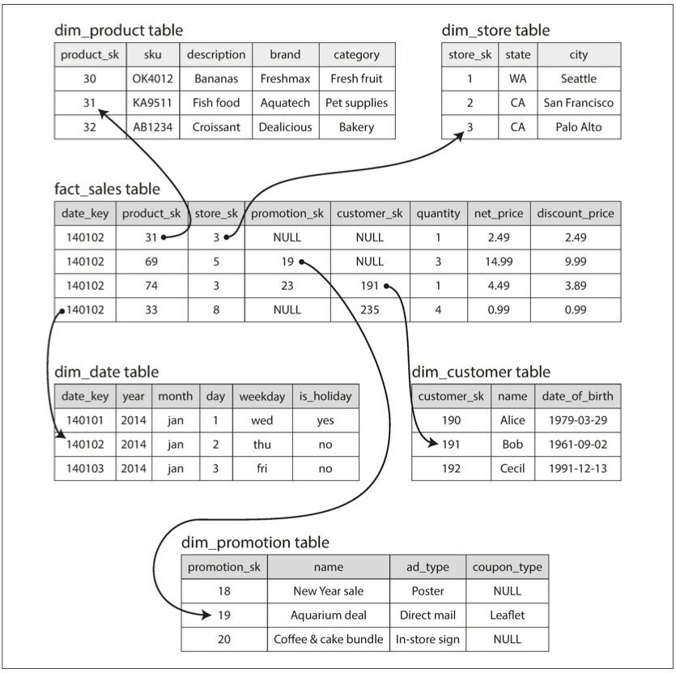

데이터베이스가 데이터를 저장하는 방법과 데이터를 요청했을 때 다시 찾는 방법을 알아보자.
애플리케이션에 적합한 엔진을 선택하려면 저장소 엔진 내부에서 일어나는 일을 대략적으로라도 알아야한다.

## 📖 3.1. 데이터베이스를 강력하게 만드는 데이터 구조

- 로그(log) : append-only 데이터 파일. 일반적으로 파일 추가 작업은 매우 효율적이다.
  - 로그에서 데이터를 찾으려면 모든 데이터를 뒤져야하므로 검색 비용은 O(n)이다. 데이터가 많아질수록 검색도 오래 걸리므로 바람직 하지 않다. 그래서 필요한 것이 색인이다.
- 색인(index) : 특정 키의 값을 효율적으로 찾기 위한 데이터 구조
  - 색인은 읽기 질의 속도를 향상시키지만 쓰기 속도를 떨어뜨린다.(trade-off)
  - 그래서 데이터베이스가 모든 데이터를 자동으로 색인하지 않고 사람이 질의 패턴을 파악해서 수동으로 가장 효율적인 색인을 지정한다.

### 🔖 3.1.1. 해시 색인

- 키-값 데이터를 색인하기 위한 색인.
- 보통 해시 맵(hash map)(해시테이블(hash table)) 으로 구현함.
- 인메모리에 디스크 상의 데이터를 색인한 데이터 구조를 저장
  - 가장 간단한 전략 : 키를 데이터 파일의 바이트 오프셋에 매핑해 인메모리에 해시 맵을 유지하는 방법
    - 매우 단순해 보이지만 실제로 많이 사용. (Bitcask)
    - Bitcask는 RAM에 모든 키가 저장된다는 조건을 전제로 고성능으로 읽기, 쓰기를 보장함
    - 각 키의 값이 자주 갱신되는 상황에 매우 적합 (ex. key가 동영상URL, value가 동영상 재생된 횟수인 경우)
- 로그에 append만 하면 결국 디스크 공간이 부족해짐
  - 해결 방법 : 로그를 특정 크기의 세그먼트로 나누는 방식
    - 세그먼트가 특정 크기에 도달하면 파일을 닫고 새로운 세그먼트 파일에 이후 쓰기를 수행한다.
    - 파일이 닫힌 세그먼트 파일들에 대해 컴팩션을 수행한다.
    - 컴팩션: 중복된 키를 버리고 키의 최신 값만 유지하는 것을 의미
    - 컴팩션을 통해 세그먼트 파일이 작아지면 여러 세그먼트 파일을 하나의 세그먼트로 병합도 가능함 (세그먼트 크기는 가변적이게 됨)
    - 컴팩션과 병합은 백그라운드 스레드에서 수행할 수 있음
- 각 세그먼트는 키와 바이트 오프셋이 매핑된 자체 인메모리 해시 테이블을 갖는다.
  - 키에 값을 찾을 때 가장 최신 세그먼트 해시 맵을 확인하고 없으면 그 다음 최신 세그먼트의 해시 맵을 뒤진다. 이것을 키가 발견될 때까지 반복한다.
  - 컴팩션와 병합에 의해 세그먼트 수는 적게 유지되므로 뒤져야할 해시 맵도 많지 않다.
  - 구현시 고려할 점
    - 파일 형식 : 텍스트 형식보다 바이너리 형식이 낫다
    - 레코드 삭제 : 툼스톤(tombstone) 이 필요함 툼스톤이란 ? (데이터 파일에 특수한 삭제 래코드)
    - 고장(crash) 복구 : 데이터베이스가 재시작되면 인메모리 해시 맵은 날라가는데 이를 어떻게 복구할 것인가? 다시 해시 맵을 만들려면 오랜 시간이 걸릴 수도 있다. Bitcask는 해시 맵의 스냅숏을 디스크에 저장해 복구 속도를 높인다.
    - 부분적으로 레코드 쓰기 : 데이터베이스는 로그에 레코드를 추가하는 도중 죽을 수도 있음, 비스캐스트 파일은 체크섬을 포함하고 있어 로그의 손상된 부분을 탐지해 무시
    - 동시성 제어
      - 쓰기는 하나의 스레드만 사용(순차적으로 로그를 추가해야하므로)
      - 읽기는 다중 스레드 사용 가능(세그먼트는 추가 전용이거나 불변이므로)
- **추가 전용 로그**의 이점
  - 순차 쓰기 작업이 무작위 쓰기 작업보다 훨씬 빠름
  - 동시성과 고장 복구 간단함 : 세그먼트가 추가 전용이거나 불변이고, 이전 값과 새로운 값을 둘다 가지고 있기 때문
  - 세그먼트 병합을 통해 데이터 파일의 조각화 문제를 피할 수 있음
- 해시 테이블 색인 의 제한 사항
  - 메모리 크기 이상으로 키가 너무 많으면 문제
  - 메모리가 부족해서 디스크에 해시 맵을 저장하게되면 성능이 매우 떨어지게 된다.
  - 해시 테이블은 range query에 효율적이지 않음 : range 내의 모든 키를 조회해야함

### 🔖 3.1.2. SS테이블과 LSM트리

- 여러 SS테이블 세그먼트를 병합해서 각 키의 최신 값만을 유지
- 위의 제한사항을 보완 해주는 방식
  - 세그먼트 파일에 기록된 키-값 쌍을 키로 정렬하자. 키로 정렬된 형식을 SS테이블 (Sorted String Table) 이라고 한다.
  - SS테이블은 순차 쓰기를 사용할 수 없게 만드는 것 같지만 아니다! 여전히 순차 쓰기를 유지할 수 있다.
  - 해시 색인을 가진 로그 세그먼트보다 SS테이블이 나은 점
    - 세그먼트 병합이 효율적 : 머지 소트 알고리즘과 유사
    - 해시 테이블에 모든 키를 유지하지 않아도 됨 : 세그먼트 파일 내부는 정렬되어 있으므로 몇몇 키의 오프셋만 알면 약간의 탐색만으로 키-값을 찾을 수 있다.
    - 세그먼트 내의 레코드들을 블록으로 그룹화하고 디스크에 쓰기 전에 압축할 수 있음. 해시 색인에서는 이 블록의 시작 오프셋을 가리키게 됨. 압축을 통해 디스크 공간 절약이 절약되고 I/O 대역폭 사용도 줄임

- 인메모리 색인을 가진 SS테이블
- 순차 쓰기를 사용하면서 SS테이블을 유지하는 방법은?
  - 쓰기가 들어오면 세그먼트 파일에 기록하는 것이 아니라 인메모리 균형트리 데이터 구조에 추가. 이 인메모리 트리는 멤테이블(memtable)이라고도 함
  - 멤테이블의 크기가 임계값보다 커지면 SS테이블 파일로 디스크에 기록
  - 읽기 요청이 들어오면 먼저 멤테이블에서 키를 찾고 없으면 디스크 상의 가장 최근 세그먼트부터 찾는다.
  - 백그라운드에서는 세그먼트 파일의 컴팩션과 병합이 수행된다.
  - 갑자기 데이터베이스가 고장났을 때 멤테이블이 날아갈 수도 있지 않나? -> 쓰기 요청을 별도의 로그로 디스크에 저장해야함
  - 위의 알고리즘은 LevelDB, RocksDB, 카산드라, HBase 등에서 사용된다.

- LSM 트리 (Log-structured Merge-tree) : “로그 구조화 병합 트리”. 정렬된 파일 형합과 컴팩션 원리를 기반으로 하는 저장소 엔진을 LSM 저장소 엔진이라고 부름
- LSM 저장소 엔진의 성능 최적화
  - 존재하지 않는 키를 찾기 위해 가장 오래된 세그먼트까지 조회해야하는 문제 : 블룸 필터 적용하여 최적화
    - 블룸필터: 데이터베이스에 존재하지 않음을 알려주므로 불필요한 디스크 읽기를 많이 절약할 수 있다.
  - SS테이블을 컴팩션하고 병합하는 전략
    - 크기 계층
    - 레벨 컴팩션
- LSM 트리의 장점
  - 범위 질의를 효율적으로 할 수 있음
  - 여전히 디스크 순차 쓰기 가능하여 높은 쓰기 성능

### 🔖 3.1.3. B 트리

- 가장 널리 사용되는 색인구조
- LSM 트리와 설계 철학이 매우 다름
- LSM과 달리 고정 크기의 블록이나 페이지 단위로 읽고 쓴다. 디스크도 고정 크기 블록으로 배열되어 있기 때문에 하드웨어와 조금 더 밀접하다고 할 수 있음
- n개의 키를 가진 B트리는 깊이가 항상 O(log n)이다.

#### 🛠 3.1.3.1. 신뢰할 수 있는 B 트리 만들기

- LSM 트리와 다르게 새로운 데이터를 디스크 상의 페이지에 덮어 쓴다.
  - 덮어 쓰기를 하면 이 페이지를 참조하는 위치 값을 바꿀 필요 없음
- 덮어쓰기하다가 데이터베이스가 고장나면 고아 페이지가 생길 수도 있다.
- 쓰기 전 로그(write-ahead log, WAL) 혹은 재실행 로그(redo log)를 유지하여 해결한다. 이를 이용해 고장 이후 복구한다.
- 동시성 제어 : LSM 트리보다 까다롭다. 같은 자리의 페이지를 갱신하는 작업이 다중 스레드로 동시에 이루어질 수 있는 위험이 있다. 보통 latch로 트리의 데이터 구조를 보호한다.

#### 🛠 3.1.3.2. B 트리 최적화

- WAL 대신에 copy-on-write 사용
- 페이지에 키 전체를 저장하는 대신 키를 추적해서 저장 (B+ 트리)
- 리프 페이지를 디스크 상에 연속된 순서로 나타나게끔 트리를 배치
  - 하지만 트리가 커지면 순서를 유지하기 어려움
- 리프 페이지가 양쪽 형제 페이지의 포인터(참조)를 가지게 하기
  - 상위 페이지로 다시 이동하지 않아도 순서대로 키를 스캔할 수 있음
- 프랙탈 트리 같은 B 트리 변형 사용

### 🔖 3.1.4. B 트리와 LSM 트리 비교

- LSM 트리 장점 (B 트리 단점)
  - **쓰기 증폭** 개념 : 데이터베이스에 쓰기 한 번에 데이터베이스 수명 동안 여러 번의 쓰기를 야기하는 효과
  - B 트리는 한 번 쓰기 작업에 최소한 두 번 기록해야함 (WAL에 한번, 트리 페이지에 한번). 또한 페이지 내에 몇 바이트만 바뀌어도 페이지 전체를 덮어써야함
  - LSM 트리가 상대적으로 쓰기 증폭이 더 낮고 디스크에 순차적으로 쓰기 때문에 보통 B 트리보다 쓰기 처리량이 높음
  - LSM 트리는 압축률도 더 좋음. 파편화도 덜 발생함
  - 낮은 쓰기 증폭과 파편화 감소는 SSD의 경우 훨씬 유리함

- LSM 트리 단점 (B 트리 장점)
  - 컴팩션 과정이 때로 읽기와 쓰기 성능에 영향을 줌
  - 컴팩션이 끝날 때까지 요청을 대기해야 하는 상황이 발생하기 쉬움
  - 반면 B 트리의 성능은 예측하기 쉽다
  - 컴팩션의 높은 쓰기 처리량 때문에 로깅이나 멤테이블을 디스크로 쓰는 작업에 영향을 준다.
  - 컴팩션이 유입 쓰기 속도를 따라가지 못하는 상황이 발생할 수 있음
  - 이런 상황을 감지하기 위한 명시적 모니터링이 필요함

- B 트리의 장점
  - 키가 색인의 한 곳에만 정확하게 존재함
  - 덕분에 강력한 트랜잭션 시멘틱을 제공할 수 있게 됨 (트리에 직접 잠금)
  - 역사가 이미 깊고 많은 작업 부하에 대해 지속적으로 좋은 성능을 제공해왔으므로 곧 사라질 가능성은 거의 없음

### 🔖 3.1.5. 기타 색인 구조

- 키-값 색인의 대표적인 예는 관계형 모델의 기본키(Primary key, PK) 색인
- 기본키로 아래와 같이 각 데이터베이스마다 Row/Document/Vertex 고유하게 식별하고 참조할 수 있다.
- 보조 색인(secondary index)을 사용하기도 한다. 기본키와의 차이점은 키가 고유하지 않는다는 것이다. 즉, 같은 키를 가진 많은 로우(문서, 정점)가 있을 수 있다.
- 이를 해결할 방법으로 색인의 각 값에 일치하는 row 식별자 목록을 만드는 방법 또는 row 식별자를 추가해서 각 키를 고유하게 만드는 방법이 있다.(대리키)
- 어느 쪽이든 보조 색인으로 B 트리와 로그 구조화 색인(LSM) 둘 다 사용할 수 있다.

#### 🛠 3.1.5.1. 색인 안에 값 저장하기

- 값은 질문의 실제 Row(document, vertex)이다.
- 다른 곳에 저장된 Row를 가리키는 참조(reference)이다. -> 참조가 가리키는 곳을 힙 파일(heap file) 이라 하는데 특정 순서 없이 데이터를 저장한다(tombstone을 기록할 수도 있다).
- 색인에서 힙 파일로 다시 이동하는 일은 읽기 성능에 불이익이 너무 많기 때문에, 어떤 상황에서는 색인 안에 바로 색인된 로우를 저장하는 편이 바람직하다. 이를 클러스터드 색인(clustered index) 이라고 한다.

클러스터드 색인과 비-클러스터드 색인(non-clustered index) 사이의 절충안을 커버링 색인(covering index) 혹은 포괄열이 있는 색인(index with included column) 이라고 한다.

#### 🛠 3.1.5.2. 다중 컬럼 색인

- 다중 컬럼에 동시에 질의할 때 결합 색인(concatenated index) 을 사용한다. 하나의 컬럼에 다른 컬럼을 추가하는 방식으로 하나의 키에 여러 필드를 결합하는 것이다.

#### 🛠 3.1.5.3. 전문 검색과 퍼지 색인

- 지금까지는 키의 정환한 값이나 정렬된 키의 값의 범위를 질의할 수 있다고 가정한다. 하지만, 철자가 틀린 단어와 같이 유사한 혹은 애매모호한(fuzzy) 질의에는 다른 기술이 필요하다.
- 예를 들어, 전문 검색 엔진은 단어를 검색할 때 단어의 동의어로 질의를 확장한다.
- 단어의 문법적 활용을 무시하고 동일한 문서에서 서로 인접해 나타난 단어를 검색
- 언어학적으로 텍스트를 분석해 사용하는 등 다양한 기능을 제공
- 루씬은 문서나 질의의 오타에 대처하기 위해 특정 편집 거리(edit distance) 내 단어를 검색할 수 있는 기능이 있다. 앞서 설명 했듯 루씬은 SS 테이블 같은 구조를 사용한다.
- SS테이블은 인메모리 색인이 필요한데 루씬에서 인메모리 색인은 여러 키 내 문자에 대한 유한 상태 오토마톤으로 트라이(trie)와 유사한 메모리 색인을 사용한다.

#### 🛠 3.1.5.4. 모든 것을 메모리에 보관

지금까지는 설명한 데이터 구조는 디스크 한계에 대한 해결책이었다. 디스크는 메인 메모리보다 비교해 다루기 어렵다. 디스크와 SSD를 사용할 때 읽기 쓰기에 좋은 성능을 원한다면, 주의해서 데이터를 디스크(HDD, SSD)에 배치해야 한다.

이러한 불편함에도 불구하고 디스크를 선택하는 이유는 지속성과 가격 때문이다.

램(ram)이 점점 저렴해지기 때문에 가격 논쟁은 약해졌다. 데이터셋 대부분은 충분히 크지 않기 때문에 메모리에 전체를 보관하는 방식도 꽤 현실적이고, 여러 장비간 분산해서 보관할 수도 있다.

이런 이유로 인메모리 데이터베이스가 개발되었다.

## 📖 3.2. 트랜잭션 처리나 분석?

- 온라인 트랜잭션 처리(OnLine Transaction Processing, OLTP)
  - 레코드가 사용자 입력을 기반으로 삽입되거나 갱신됨
- 온라인 분석 처리(OnLine Analytic Processing, OLAP)
  - 데이터 분석 용도
  - 많은 수의 레코드를 스캔해 레코드당 일부 칼럼만 읽어 집계 통계를 계산
  - 비즈니스 분석가가 작성하고 회사 경영진에게 제공해 의사결정을 돕는다.
  - 비즈니스 인텔리전스(business intelligence)
- 처음에는 트랜잭션 처리와 분석 질의를 위해 동일한 데이터베이스를 사용했다.
- 개별 데이터베이스를 데이터 웨어하우징(Data warehouse)라고 불렸다.

|특성|트랜잭션 처리 시스템(OLTP)|분석 시스템(OLAP)
|:--:|:----------:|:----------:
|주요 읽기 패턴|질의당 적은 record, 키 기준 fetch|많은 record 에 대한 집계
|주요 쓰기 패턴|임의 접근, 사용자 입력을 낮은 지연 시간|대규모 불려오기(bulk import, ETL), 이벤트 스트림(event stream)
|주요 사용처|웹 앱, 사용자, 소비자|의사 결정을 위한 내부 분석가
|데이터 표현|데이터의 최신 상태(현재 시점, 실시간)|시간이 지나며 발생된 이력(과거)
|데이터셋 크기|기가바이트에서 테라바이트|테라바이트에서 페타바이트
|데이터의 특성|트랜잭션 중심|정보 중심

### 🔖 3.2.1. 데이터 웨어 하우징

- OLTP 작업에 영향을 주지 않고 마음껏 질의할 수 있는 개별 데이터베이스
- 회사 내의 모든 다양한 OLTP 시스템에 있는 데이터의 읽기 전용 복사본
- 개별 데이터 웨어하우스를 사용하면 분석 접근 패턴에 맞게 최적화 가능
- 데이터는 OLTP 데이터베이스에서 추출하고 분석 친화적인 스키마로 변환하고 깨끗하게 정리한 다음 데이터 웨어하우스에 적재한다. 데이터 웨어하우스로 가져오는 과정을 ETL(Extract-Transform-Load)이라 한다.

#### 🛠 3.2.1.1. OLTP 데이터베이스와 데이터 웨어하우스의 차이점

표면적으로 데이터 웨어하우스와 관계형 OLTP 데이터베이스는 둘 다 SQL 질의 인터페이스를 지원하기 떄문에 비슷해보인다.

하지만 각각 매우 다른 질의 패턴에 맞게 최적화됐기 때문에 시스템의 내부는 완전히 다르다.
공통 SQL 인터페이스로 접근할 수 있는 저장소와 질의 엔진으로 점점 분리되고 있다.

- 상용 라이선스 데이터 웨어하우스 벤더
  - 테라데이터(Teradata)
  - 버티카(Vertica)
  - SAP 하나
  - 파르에이셀(ParAccel)  
- 오픈소스 SQL 온 하둡(SQL-on-Hadoop)
  - 아파치 하이브(Apache Hive)
  - 스파크 SQL(Spark SQL)
  - 클라우데라 임팔라(Cloudera Impala)
  - 페이스북 프레스토(Facebook Presto)
  - 아파치 타조(Apache Tajo)
  - 아파치 드릴(Apache Drill)

### 🔖 3.2.2. 분석용 스키마: 별모양 스키마와 눈꽃송이 모양 스키마

데이터 모델은 트랜잭션 처리 영역에서 애플리케이션의 필요에 의해 광범위하고 다양하게 사용하는 반변, 분석에서는 별 모양 스키마 - 차원모델링 이라고 알려진 정형화 된 방식을 사용한다.

- 사실 테이블(fact table)이 가운데에 있고 차원 테이블로 둘러싸고 있는 모양
- 차원 테이블이란 다른 테이블을 가리키는 외래 키 참조.

- 데이터 웨어하우스에서 사용하는 별 모양 스키마 예제
- 눈꽃송이 모양 스키마
  - 별 모양 스키마의 변형이다.
  - 차원이 하위차원으로 더 세분화된다.
  - 질의를 수행하기 위해서 더 많은 조인을 필요 → 검색의 효과를 감소 → 시스템의 성능에 악영향을 끼칠 수 있다.
  - 데이터웨어하우스는 설계에 있어서 스타스키마 만큼 널리 쓰이지 않는다.

## 📖 3.3. 칼럼 지향 저장소

데이터 웨어하우스의 사실 테이블에는 엄청난 개수의 로우의 페타바이트 데이터가 있다면 효율적으로 저장하고 질의하기에는 어려운 문제가 있다.

- 대부분의 OLTP 데이터베이스에서 저장소
  - 로우 지향 방식으로 데이터를 배치한다.
  - 테이블에 한 로우의 모든 값은 서로 인접하게 저장된다.
  - 문서 데이터베이스와 유사하다. 문서 데이터베이스는 전체 문서를 보통 하나의 연속된 바이트 열로 저장한다.
- 이러한 방식은 모든 로우를 메모리로 적재한 다음 구문을 해석해서 필요한 조건을 충족하지 않은 로우를 필터링 해야하는데 작업 시간이 오래 걸릴 수 있음.

컬럼 지향 저장소의 개념은 모든 값을 하나의 로우에 저장하지 않고 모든 값(column)을 함께 저장한다.
> 각 칼럼은 개별 파일에 저장하면 질의에 필요한 칼럼만 읽고 구문 분석할 수 있다.
>
> 각 칼럼 파일에 포함된 로우가 모두 순서가 같아야 한다.

### 🔖 3.3.1. 칼럼 압축

- 데이터를 압축하면 디스크 처리량을 줄일 수 있다.
- 컬럼 저장소는 대개 압축에 적합하다.
- 컬럼의 데이터에 따라 다양한 압축 기법을 사용할 수 있다.
- 데이터 웨어하우스에 효과적인 압축 중 비트맵 부호화(bitmap encoding)이다.

#### 🛠 3.3.1.1. 메모리 대역폭과 벡터화 처리

- 백만 로우를 스캔해야 하는 데이터 웨어하우스 질의는 디스크로부터 메모리로 데이터를 가져오는 대역폭이 큰 병목이다.
- CPU 명령 처리 파이프라인에서 분기 예측 실패(branch misprediction)와 버블(bubble)을 피해야 한다.

분석용 데이터베이스 개발자는 메인 메모리에서 CPU 캐시로 가는 대역폭을 효율적으로 사용한다.

- 벡터화 처리
  - 한 번에 처리하는 데이터의 양을 늘려서 CPU 사용률을 높이고 처리속도를 빠르게 하는 기법 비트 AND와 OR같은 연산자는 압축된 칼럼 데이터 덩어리를 바로 연산할 수 있게 설계할 수 있다.

### 🔖 3.3.2. 칼럼 저장소의 순서 정렬

- 로우가 저장되는 순서가 중요하지는 않다.
- 하지만 각 칼럼은 독립적으로 정렬하면 안되고 한 칼럼의 k번째 항목이 다른 칼럼 k번째 항목과 같은 로우에 속해야 한다.
- 장점
  - 그룹화, 필터링 용이
  - 칼럼 압축에 도움

#### 🛠 3.3.1.2. 다양한 순서 정렬

- 데이터 복원력을 위해 데이터를 여러 장비에 복제
  - 데이터마다 서로 다른 방식으로 정렬해서 저장 → 질의를 처리할 때 패턴에 적합한 버전 사용 가능
  - 컬럼 지향 저장에서 여러 정렬 순서를 갖는 것은 로우 지향 저장에서 2차 색인을 갖는 것과 약간 비슷하다.
- 로우 지향 저장
  - 한 곳(힙 파일이나 클러스터 색인)에 모든 로우를 유지하고 2차 색인은 일치하는 로우를 가리키는 포인터만 포함한다.
- 컬럼 저장 지장
  - 일반적인 데이터를 가리키는 포인터가 없고, 단지 값을 포함한 컬럼만 존재한다.

### 🔖 3.3.3. 컬럼 지향 저장소에 쓰기

- 컬럼 지향 저장소, 압축, 정렬은 모두 읽기에 더 빠르다.
- 쓰기를 위한 해결책은 LSM 트리 구조가 적절하다.
- 쓰기 → 인메모리 저장소로 이동해 정렬된 구조에 추가 → 디스크에 쓸 준비
- 디스크의 칼럼 파일에 병합하고 → 대량으로 새로운 파일에 기록
- ex) 버티카

### 🔖 3.3.4. 집계: 데이터 큐브와 구체화 뷰

- 구체화 집계
  - 동일한 집계를 많은 질의에서 사용한다면 매번 원시 데이터를 처리하는 일은 낭비다.
  - 질의 자주 사용하는 일부 카운트(count)나 합(sum)을 캐시하는 하는 방법중 하나는 구체화 뷰(materialized view)이다.
  - 구체화 뷰는 원본데이터의 복사본
    - 원본 데이터를 변경하면 구체화 뷰를 갱신해야 함 → DB가 자동으로 수행
    - 비용이 비싸기 때문에 OLTP에서는 사용하지 않음
    - 데이터 웨어하우스는 읽기 비중이 크기 때문에 합리적
  - 데이터 큐브(data cube) 또는 OLAP 큐브라고 알려려진 구체화 뷰는 일반화된 구체화 뷰의 특별한 사례이다.
- 구체화 데이터 큐브
  - 장점
    - 특정 질의를 효과적으로 미리 계산했기 때문에 해당 질의를 수행할 때 매우 빠르다.
      - ex) 어제 매장별 총 판매량(풀스캔 X, 차원을 따라 합계를 살펴본다)
  - 단점
    - 원시 데이터의 질의하는 것과 동일한 유연성이 없다.
    - 포함되지 않은 차원을 기준으로 집계를 할 수 없다.
    - 데이터 재적재해야 함
