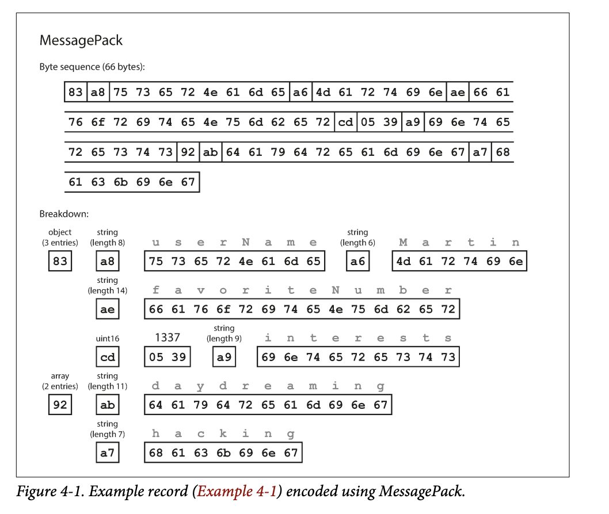
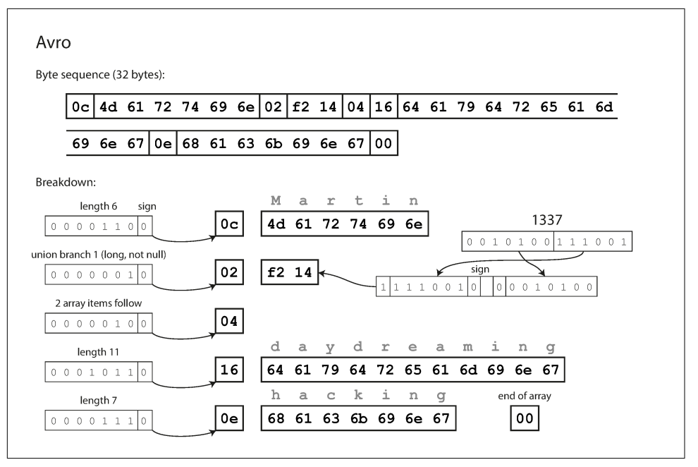

> 만물은 변한다. 그대로 있는 것은 아무것도 없다.

시스템의 원활한 실행을 위해선 양방향으로 호환성을 유지해야함.

- 하위 호환성 : 새로운 코드는 예전 코드가 기록한 데이터를 읽을 수 있어야 함.
- 상위 호환성 : 좀더 어려움. 예전 코드는 새로운 코드가 기록한 데이터를 읽을 수 있어야 함.

## 📖 4.1. 데이터 부호화 형싱

___

프로그램은 보통 두가지 형태로 표현된 데이터를 사용해 동작.

1. 메모리에 객체, 구조체, 목록(list), 배열, 해시테이블, 트리 등으로 데이터가 유지됨. 이런 데이터 구조는 CPU에서 효율적으로 접근하고 조작할수 있게 포인터를 이용해 최적화
2. 데이터를 파일에 쓰거나 네트워크를 통해 전송하려면 스스로를 포함한 일련의 바이트열(ex. JSON)의 형태로 부호화해야함.
즉, 부호화(직렬화, 마샬링)는 위에서 설명한 인메모리 표현에서 바이트열로의 전환을 뜻하고, 그 반대를 복호화(파싱, 역직렬화, 언마샬링)이라 한다.

### 🔖 4.1.1. 언어별 형식

많은 프로그래밍 언어는 인메모리 객체를 바이트열로 부호화하는 기능을 내장.

- ex) java.io.Serializable, 루비 Marshal, 파이썬 pickle

언어에 내장된 부호화 라이브러리는 최소한의 추가 코드로 인메모리 객체를 저장, 복원가능하다. 편리하지만 내장된 부호화를 사용하는 방식은 일반적으로 좋지않다.

- 특정 프로그래밍 언어와 묶여 있어, 다른언어에서 읽기 어려움. 다른 시스템과 통합에 방해
- 동일한 객체 유형의 데이터를 복원하려면 복호화 과정이 임의 클래스를 인스턴스화할 수 있어야함.
  - 보안 문제의 원인
- 데이터 버전 관리는 보통 부호화 라이브러리에서는 나중에 생각
  - 양방향(상위, 하위) 호환성의 불편한 문제가 등한시
- 효율성(부호화/복호화에 소요되는 CPU 시간, 부호화된 구조체의 크기)도 종종 나중에 생각.

### 🔖 4.1.2. JSON 과 XML 이진 변형

- XML은 너무 장황하고 불필요하게 복잡하다고 비판받음.
- JSON은 웹 브라우저에 내장된 지원, XML 대비 단순. CSV도 인기 있음.
- JSON, XML, CSV 어느정도 가시성이 있음. 아래와 같은 문제가 존재
  - 수(number)의 부호화에 애매함이 존재. XML, CSV는 수와 숫자의 구분이 없다. JSON은 문자열과 수를 구분하지만, 정수/부동소수점 수를 구별하지 않고 정밀도를 지정하지 않음.
  - JSON, XML은 유니코드 문자열(사람이 읽을 수 있는 텍스트)을 지원하지만 이진문자열을 지원하지 않음. 이를 활용하기 위해 Base64를 사용해 텍스트로 부호화하여 이 제한을 피함. Base64로 부호화하여 해석해야한다는 사실을 스키마로 표시. 정공법은 아님. 또 데이터 크기가 33% 증가.
  - XML, JSON 모두 스키마 지원. 스키마 언어는 강력하지만 익히고 구현하기 난해함. 스키마의 정보에 따라 데이터의 올바른 해석이 결정되므로 XML/JSON 스키마를 사용하지 않는 애플리케이션은 필요한 부호화/복호화 로직을 하드코딩해야함.
  - CSV는 스키마가 없어 로우/컬럼의 의미를 정의하는 작업은 애플리케이션이 함. 또한 매우 모호하고, 이스케이핑 규칙을 규정했지만 모든 파서가 정확하게 구현하지는 않는다.
- JSON, XML, CSV는 다양한 용도에 사용하기에 충분. 또한 데이터 교환형식(한조직 -> 다른조직 데이터 전송)으로 사용에 좋다.

#### 🛠 이진 부호화

- 부호화 형식 선택으로 얻는 이득은 데이터의 크기가 클수록 그 크기가 커진다.
- JSON은 XML보다 덜 장황하지만 이진 형식과 비교하면 훨씬 많은 공간을 사용. 따라서 다양한 이진 부호화의 개발로 이어짐. 하지만 널리 채택되진 않음.

### 🔖 4.1.3. 스리프트와 프로토콜 버퍼

- Apache Thrift(페이스북), 프로토콜 버퍼(구글) : 같은 원리를 기반으로 한 이진 부호화 라이브러리.
- 부호화할 데이터를 위한 스키마가 필요.
- 스리프트 인터페이스 정의 언어(IDL)로 스키마를 기술해야함. 프로토콜 버퍼도 이와 비슷

#### 🛠 필드 태그와 스키마 발전

- 부호화된 레코드는 부호화된 필드의 연결일 뿐이다. 각 필드는 태그 숫자로 식별하고 데이터타입을 주석으로 표현
- 부호화된 데이터는 필드 이름을 참조하지 않아 스키마에서 필드 이름은 변경 가능. 그러나 필드 태그는 기존 모든 부호화된 데이터를 인식 불가능하게 만들기 때문에 변경 불가
- 필드에 새로운 태그 번호를 부여하는 방식으로 신규 필드 추가 가능
- 데이터타입 주석은 파서가 몇 바이트를 건너뛸 수 있는지 알려줌. 이는 상위 호환성을 유지
- 하위 호환성 유지를 위해서는 초기 배포 후 추가되는 모든 필드는 optional or default값을 가져야함.

#### 🛠 데이터타입과 스키마 발전

- 데이터타입 변경은 불가능하지는 않지만 그 값이 정확하지 않거나 잘릴 위험이 존재
- 프로토콜 버퍼의 repeated 표시자는 단일값인 optional 필드를 다중값인 repeated 필드로 변경해도 문제가 없다.
  - 이전 데이터 읽는 New 코드는 0이나 1개의 Element가 있는 목록을 보고, 새로운 데이터를 읽는 Old 코드는 목록의 마지막 Element만 보게됨.

### 🔖 4.1.4. 아브로

- Apache Avro는 대적할만한 이진 부호화 형식. 2009년 하둡의 하위 프로젝트로 시작.
- 두개의 스키마언어가 존재. 사람이 편집할 수 있는 Avro IDL, 기계가 더 쉽게 읽는 JSON 기반

특징

- 가장 짧은 32바이트. 필드나 데이터타입을 식별하기 위한 정보가 없음. 단순히 연결된 값으로 구성.
  - 즉, 아브로는 이진 데이터를 파싱하기 위해 스키마에 나타난 순서대로 필드를 살피고, 스키마를 이용해 각 필드의 데이터 타입을 미리 파악해야 함을 의미
  - 이는 데이터를 읽는 코드가 데이터를 기록한 코드와 **정확히 같은 스키마** 를 사용해야만 이진 데이터를 올바르게 복호화할 수 있음을 의미
- 쓰기 스키마와 읽기 스키마의 분리
  - 아브로는 부호화를 위한 쓰기 쓰키마(writer's schema)와 복호화를 위한 읽기 스키마(reader's schema)를 구분해서 사용
  - 쓰기 스키마와 읽기 스키마가 동일하지 않아도 되며 단지 호환 가능하면 됨.
  - 데이터를 복호화할 때, 아브로 라이브러리는 쓰기와 읽기 스키마를 함께 살펴본 다음 쓰기 스키마에서 읽기 스키마로 데이터를 변환해 그 차이를 해소.
  - 필드의 순서가 달라도 상관 없음
    - 필드 이름으로 구분
  - 데이터를 읽는 코드가 읽기 스키마에는 없고 쓰기 스키마에 존재하면 해당 필드 무시
    - 반대의 경우 기본값으로 채움
- required, optional 필드가 없다.
  - 대신 union type 사용
  - 예를 들어 union { null, long, string } field; 는 field가 null, long, string일수 있다는 의미.

#### 🛠 쓰기 스키마의 처리

모든 레코드에 쓰기 스키마를 처리하는 것은 공간적 낭비가 심함. 아래는 아브로를 사용하는 상황이다.

- 많은 레코드가 있는 대용량 파일
  - 일반적인 용도(하둡)에서는 모두 동일한 스키마로 수백만 개의 레코드를 포함한 파일을 저장함. 따라서 쓰기 스키마를 파일의 시작 부분에 한 번만 씀
- 개별적으로 기록된 레코드를 가진 데이터베이스
  - 서로 다른 시점에 쓰여질 수 있기 때문에 모든 레코드는 동일한 레코드를 가진다고 가정할 수 없다. 이를 해결하기 위해 모든 부호화된 레코드의 시작 부분에 버전 번호를 포함하고 데이터베이스에는 스키마 버전 목록을 유지해서 필요한 스키마 버전을 가져오는 형태로 해결 가능.
- 네트워크 연결을 통해 레코드 보내기
  - 두 프로세스가 양방향 네트워크를 통해 통신할 때 연결 설정에서 스키마 버전 합의하고 이후 합의된 스키마를 사용. ex) 아브로 RPC 프로토콜

#### 🛠 동적 생성 스키마

- 아브로의 장점 : 동적 생성 스키마에 더 친숙하다.
- 앞서 얘기한 프로토콜 버퍼, 스리프트는 태그번호가 포함되므로 변경시 이를 신경써야함.

### 🔖 4.1.5. 스키마의 장점

- 아브로 스키마는 XML, JSON 스키마보다 훨씬 간단하며 더 자세한 유효성 검사 규칙을 지원
- 부호화된 데이터에서 필드 이름을 생략할 수 있기 때문에 다양한 **이진 JSON** 변형보다 크기가 훨씬 작을 수 있음.
- 스키마 데이터베이스를 유지하면 스키마 변경이 적용되기 전에 상위 호환성과 하위 호환성을 확인할 수 있다.
- 정적 타입 프로그래밍 언어 사용자에게 스키마로부터 코드를 생성. 컴파일 시점에 타입 체크 가능.
- 스키마의 발전은 스키마리스 or 읽기 스키마 JSON 데이터베이스가 제공하는 것과 동일한 유연성 제공, 데이터나 도구 지원도 더 잘 보장.

## 📖 4.2. 데이터플로 모드(Modes of Dataflow)

___

- 데이터플로는 매우 추상적인 개념
- 하나의 프로세스에서 다른 프로세스로 데이터를 전달하는 방법은 아주 많다.

아래는 프로세스간 데이터를 전달하는 가장 보편적인 방법이다.

- 데이터베이스를 통해
- 서비스 호출을 통해
- 비동기 메시지 전달을 통해

### 🔖 4.2.1. 데이터베이스를 통한 데이터플로

- 데이터베이스에 기록(부호화)하고 읽는(복호화) 프로세스가 존재.
- 저장(기록)하는 일 : 미래의 자신에게 메시지를 보내는 일

#### 🛠 다양한 시점에 기록된 다양한 값

- 애플리케이션에 비해 데이터베이스는 예전 버전에 대해 명시적으로 다시 기록하지 않는 한 원래의 부호화상태로 그대로 있다.
  - **data outlives code(데이터가 코드보다 더 오래산다.)**
- 즉, 다시 기록(rewriting)하는 작업은 분명 가능하지만, 이는 대용량 데이터셋 대상으로 수행시 값비싼 작업이기에 이런 상황을 피한다.
- 이를 해결하기위해 대부분의 관계형 데이터베이스는 기존 데이터에 대한 마이그레이션 없이 null을 기본값으로 갖는 새로운 컬럼을 추가하는 간단한 스키마 변경을 허용.

#### 🛠 보관 저장소

- 백업 또는 데이터 웨어하우스 적재를 위해 데이터베이스 스냅숏을 수시로 만든다.
  - 이 경우 최신 스키마를 이용해 부호화한다.
- 데이터 덤프는 한 번에 기록하고 이후에는 변하지 않으므로 아브로 객체 컨테이너 파일 형식이 적합

### 🔖 4.2.2. 서비스를 통한 데이터플로: REST와 RPC

- 네트워크를 통해 통신해야하는 프로세스가 있을 때 가장 일반적인 방법은 클라이언트, 서버 두 역할로 배치
- 서버는 네트워크를 통해 API를 공개하고, 클라이언트는 이 API로 요청을 만들어 서버에 연결
  - 서비스 : 서버가 공개한 API

#### 🛠 웹의 동작방식

- 클라이언트(웹 브라우저)는 웹 서버로 요청을 보냄
  - HTML, CSS, 자바스크립트, 이미지 등을 다운로드 -> GET 요청
  - 서버로 데이터를 전송 -> POST 요청
- API는 표준화된 프로토콜과 데이터타입으로 구성. 이로 인해 모든 웹 브라우저로 모든 웹사이트 접근이 가능.
- 웹 브라우저가 유일한 클라이언트는 아님.
  - 모바일 디바이스, 데스크톱 컴퓨터에서 실행하는 기본 앱도 서버에 네트워크 요청할 수 있음.
- 서버 자체가 다른 서비스의 클라이언트일 수 있음.
  - 하나의 서비스가 다른 서비스의 일부 기능이나 데이터가 필요하다면 해당 서비스에 요청을 보냄.
  - 이런 방식을 서비스 지향 설계(service-oriented architecture, SOA)라 부르며, 최근에는 이를 개선해 마이크로서비스(microservices) 설계로 불림.

서비스와 데이터베이스는 유사하다. 차이는 데이터베이스에서는 임의 질의를 허용하지만, 서비스는 서비스의 비즈니스 로직(애플리케이션 코드)로 미리 정해진 입출력만을 허용해 API를 공개하는 것이다.

#### 🛠 웹서비스

- 서비스와 통신하기 위한 기본 프로토콜로 HTTP를 사용할때 이를 웹 서비스라 한다.
- 웹서비스에 대중적인 방법 REST, SOAP

REST

- 프로토콜이 아닌 HTTP의 원칙을 토대로 한 설계 철학
- 간단한 데이터 타입을 강조, URL을 사용해 리소스를 식별하고 캐시 제어, 인증, 콘텐츠 유형 협상에 HTTP 기능 사용
  - RESTful API

SOAP

- 네트워크 API 요청을 위한 XML 기반 프로토콜
- HTTP 상에서 가장 일반적으로 사용되지만 HTTP와 독립적이며 대부분의 HTTP 기능을 사용하지 않음. 대신 다양한 기능을 추가한 광범위하고 복잡한 여러 관련 표준(WS-웹서비스프레임워크)을 제공
- WSDL(Web Services Description Language)라는 XML기반 언어를 사용해 기술
- 클라이언트가 로콜 클래스와 메서드 호출을 사용해 원격 서비스에 접근하는 코등생성이 가능하여, 정적 타입 프로그래밍 언어에 유용하지만 동적 타입 언어에는 좋지 않다.
- 사람이 읽을 수 없는 설계, 복잡한 구성으로 IDE에 크게 의존
- SOAP과 다양한 확장이 표면상으로는 표준이 됐지만 상호운용성에 문제가 종종 발생

#### 🛠 원격 프로시저 호출(RPC) 문제

- 프로시저 : 프로그램을 여러개의 단위로 분해한 것
- RPC모델은 원격 네트워크 서비스 요청을 같은 프로세스 안에서 특정 프로그래밍 언어의 함수나 메서드를 호출하는 것과 동일하게 사용 가능하게 해줌.
- RPC 접근 방식은 근본적으로 결함이 존재
  - 네트워크 요청은 로컬 함수 호출과는 매우 다르다.
  - 로컬함수는 예측 가능. 제어 가능한 매개변수에 따라 성공하거나 실패
  - 네트워크 요청은 예측이 어렵다. 네트워크 문제로 요청과 응답이 유실되거나 원격 장비가 느려지거나 요청에 응답하지 않을 수 있다.
  - 프로토콜에 중복 제거 기법(멱등성)을 적용하지 않으면 재시도는 작업이 여러번 수행되는 원인이 된다.
  - 네트워크 요청은 로컬 함수 호출에 비해 훨씬 시간이 많이 소요되고 그 소요시간을 예측할 수 없다.
- 로컬함수는 pointer를 효율적으로 전달할 수 있다. 네트워크 요청은 부호화 하여 매개변수로 보내야 한다.
  - 만약 큰 객체를 보내야 하는 상황이라면 큰 문제가 된다.
- client와 서비스는 다른 언어로 구현할 수 있다. 따라서 RPC 프레임워크는 하나의 언어에서 다른 언어로 데이터 타입을 변환해야 한다.

이런 한계와 문제가 있더라도 네트워크 통신을 로컬 함수처럼 사용하려는 수고는 비효율적인 것이 아니다.

#### 🛠 RPC의 현재 방향(Current directions for RPC)

- 스리프트(Thrift)와 아브로(Avro)는 RPC 지원 기능을 내장
- gRPC는 프로토콜 버퍼(protocol buffer)를 이용한 RPC 구현
- Rest.li는 실패할지도 모를 비동기 작업을 캡슐화하기 위해 퓨처(futre)를 사용
- JSON 같은 프로토콜보다 이진 부호화 형식을 사용하는 사용자 정의 RPC 프로토콜이 우수한 성능을 제공할 수 있다.
- RESTful API
  - 코드 생성이나 소프트웨어 설치 없이 웹 브라우저나 커맨드 라인 도구인 curl을 사용해 간단한 요청 보낼수 있다.
  - 모든 주요 프로그래밍 언어와 플랫폼이 지원하고 사용 가능한 다양한 도구 생태계(서버, 캐시 로드 밸런서, 프락시, 방화벽, 모니터링, 디버깅 도구, 테스팅 도구 등)가 존재

#### 🛠 데이터 부호화와 RPC의 발전(Data encoding and evolution for RPC)

발전성이 있으려면 RPC 클라이언트와 서버를 독립적으로 변경/배포할 수 있어야한다. 모든 서버를 먼저 갱신하고 모든 클라이언트를 갱신해도 문제가 없다 가정한다.

- RPC 스키마의 상하위 호환 속성은 사용된 모든 부호화로부터 상속
  - 스리프트, gRPC, Avro RPC는 각 부호화 형식의 호환성 규칙에 따라 발전
  - SOAP에서 요청과 응답은 XML 스키마로 지정. 발전 가능하지만, 문제가 존재
  - RESTful API는 응답에 JSON을 일반적으로 사용(공식 지정 스키마는 없음)
- API 버전 관리가 반드시 어떤 방식으로 동작해야 한다는 합의는 없다.
- 일반적으로 URL이나 HTTP Accept 헤더에 버전 번호를 사용.
- 특정 클라이언트를 식별하는 데 API 키를 사용하는 서비스는 클라이언트의 요청 API 버전을 서버에 저장한 뒤 버전 선택을 별도 관리 인터페이스를 통해 갱신할 수 있게 하는 것이 한 가지 방식

### 🔖 4.2.3. 메시지 전달 데이터 플로

RPC와 데이터베이스 간 비동기 메시지 전달 시스템

- 클라이언트 요청(보통 메시지)을 낮은 지연 시간으로 다른 프로세스에 전달하는 점이 RPC와 동일
- 요청(메시지)을 직접 네트워크 연결로 전송하지 않고 임시로 메시지를 저장하는 메시지 브로커나 메시지 지향 미들웨어라는 중간 단계를 저쳐 전송한다는 점은 DB와 동일
- 메시지 브로커를 사용하는 방식의 장점
  - 수신자가 사용 불가능하거나 과부하 상태라면 메시지 브로커가 버퍼처럼 동작하여 시스템 안정성 향상
  - 죽었던 프로세스에 메시지를 다시 전달할 수 있어 메시지 유실 방지 가능
  - 송신자가 수신자의 IP 주소나 포트를 알 필요가 없다(주로 가상 장비를 사용하는 클라우드 배포 시스템에 유용)
  - 하나의 메시지를 여러 수신자로 전송할 수 있다.
  - 논리적으로 송신자는 수신자와 분리
- 송신 프로세스는 메시지에 대한 응답을 기대하지 않고, 메시지가 전달될 때까지 기다리지 않는다. 그저 보낸 후 잊는다.

#### 🛠 메시지 브로커

최근에는 RabbitMQ, ActiveMQ, NATS, Apache Kafka 같은 오픈소스 구현이 대중화됨. 세부적 전달 시맨특은 구현과 설정에 따라 다양하나, 일반적으로는 아래와 같다.

- 프로세스 하나가 메시지를 이름이 지정된 큐나 토픽으로 전송
- 브로커는 해당 큐나 토픽 하나 이상의 Consumer(소비자) 또는 Subscriber(구독자)에게 메시지를 전달.
- 동일한 토픽에 여러 생산자와 소비자 존재할 수 있다.
- 토픽은 단반향 데이터플로만 제공
  - 소비자 스스로 메시지를 다른 토픽으로 게시 가능
  - 원본 메시지의 송신자가 소비하는 응답 큐로 게시 가능
- 특정 데이터 모델을 강요하지 않음
- 메시지는 모든 부호화 형식을 사용할 수 있도록 설계됨.
- 부호화가 상하위 호환성을 모두 가진다면 메시지 브로커에서 게시자와 소비자를 독립적으로 변경해 임의순서로 배포할 수 있는 유연성을 얻게 됨.

#### 🛠 분산 액터 프레임 워크

actor model(액터 모델)은 단일 프로세스 안에 동시성을 위한 프로그래밍 모델

- 스레드를 직접 처리하는 대신 로직이 액터에 캡슐화
- 액터는 로컬 상태를 가질 수 있고, 비동기 메시지의 송수신으로 다른 액터와 통신
- 액터는 메시지 전달을 보장하지 않으므로 메시지는 유실될 수 있다.
- 액터는 하나의 메시지만 처리, 스레드에 대해 걱정할 필요 없고 액터는 프레임워크와 독립적으로 실행
- 분산 액터 프레임워크는 여러 node간의 애플리케이션 확장에 사용. 송신자, 수신자가 어떤 노드에 있는지를 떠나 동일한 메시지 전달 구조를 사용
- 액터 모델은 단일 프로세스 안에서도 메시지가 유실될 수 있다고 가정하기에 위치 투명성(데이터가 어느 위치에 있는지 몰라도 접근할 수 있다는 것)은 RPC보다 액터 모델에서 더 잘 동작
  - 로컬과 원격통신간 불일치를 줄여줌
