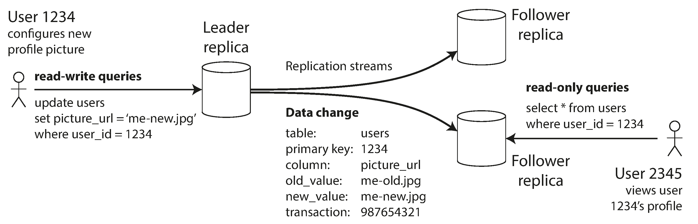
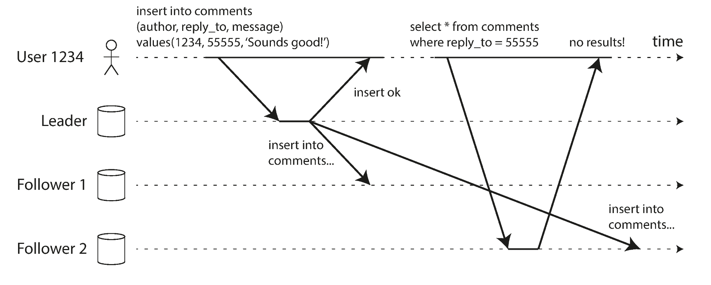
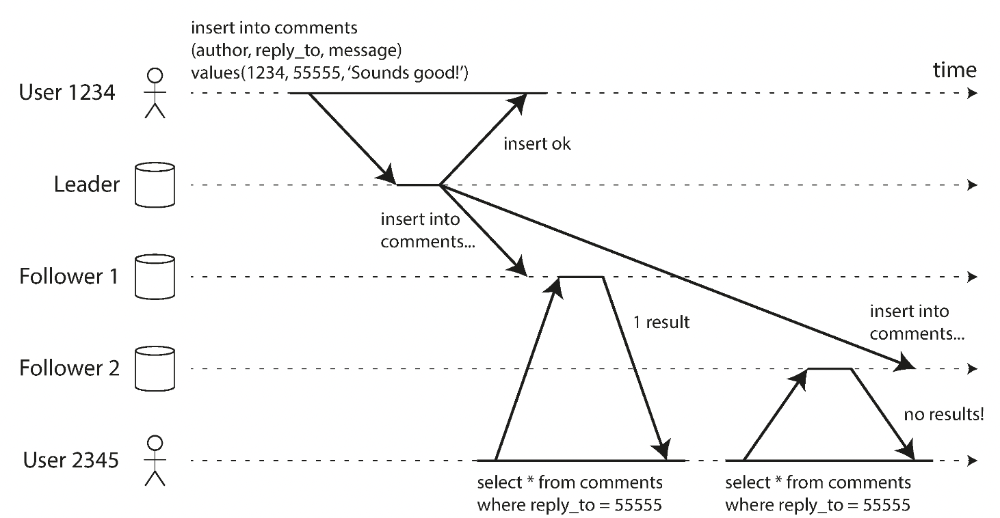
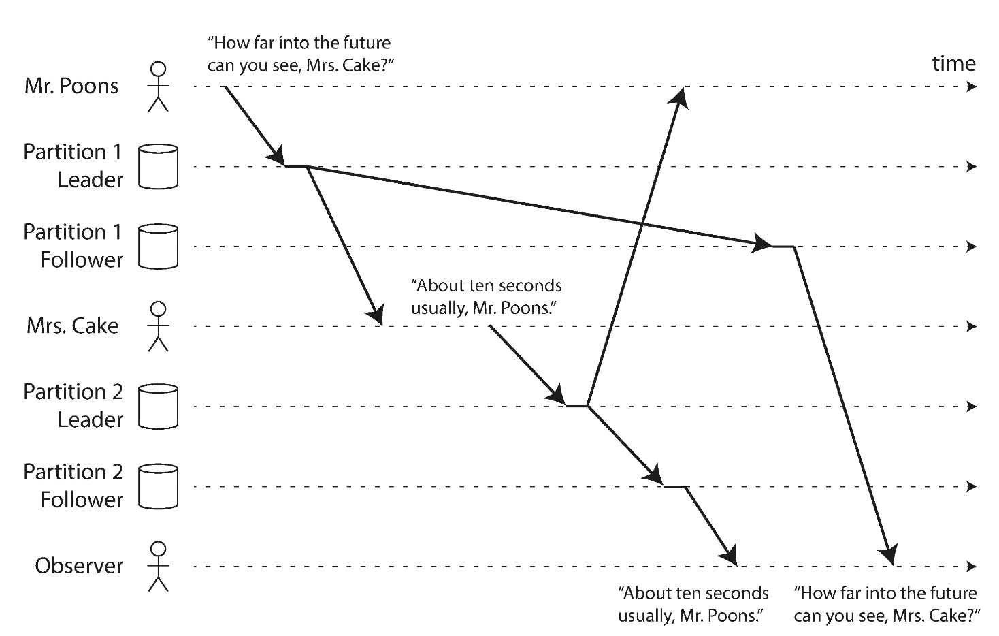
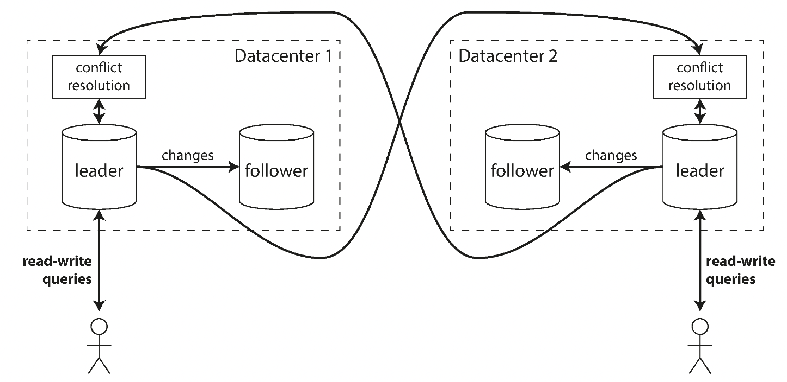
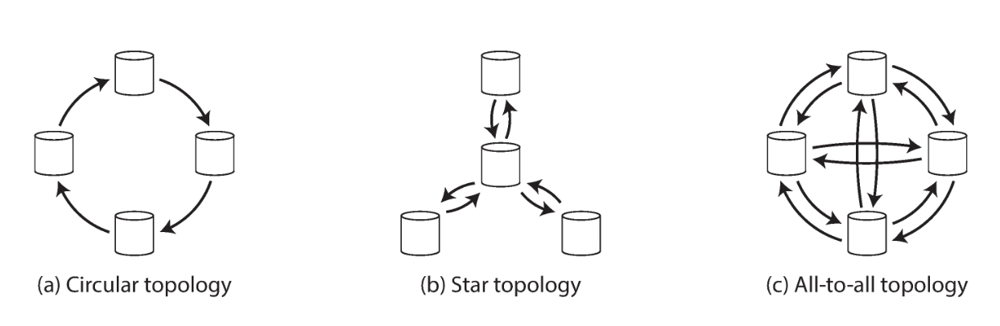

## 📖 5.0. Part2. 분산 데이터

- 분산 데이터베이스 필요한 이유
  - 확장성
  - 내결함성/고가용성
  - 지연 시간
- 스케일업, 수직 확장, 용량 확장
  - **공유 메모리 아키텍처** : CPU, 메모리, 디스크를 하나의 운영체제로 결합.
  - 단점
    - 가파른 비용 증가. 병목 현상으로 업그레이드만큼의 효용성 보장 못 함.
    - 제한적인 내결함성
    - 하나의 지리적인 위치 제한
- 스케일 아웃, 수평 확장, 규모 확장
  - **비공유 아키텍처** : 노드로 구성. 각 노드는 CPU, RAM, 디스크 독립적 사용. 노드 간 코디네이션은 일반적인 네트워크 사용 소프트웨어 수준에서 수행
  - 장점
    - 가격 대비 성능 좋은 시스템 사용 가능
    - 데이터베이스 지리적 분산 -> 지연 시간 감소
  - 단점
    - 애플리케이션 레벨에서 주의해서 사용해야 함.
    - 애플리케이션 복잡도 증가
- 복제 & 파티셔팅
  - 복제 : 같은 데이터의 복사본을 다른 위치에 있는 여러 노드에 유지.
    - 지연 시간 감소 : 사용자와 가까운 지리적 위치
    - 가용성 : 시스템 일부 장애 발생해도 지속적 동작 가능
    - 읽기 처리량 증가 : 읽기 질의 제공 장비 수 확장
  - 파티셔닝 : 큰 데이터베이스를 파티션이라는 작은 서브셋으로 나눔. 각 파티션은 각기 다른 노드에 할당(샤딩)

## 📖 5.1. 리더와 팔로워

> DB의 모든 쓰기는 모든 복제 서버에서 처리돼야 한다.

- 복제 서버 : 데이터베이스의 복사본을 저장하는 노드
- 리더 기반 복제 : master-slave 복제.
  - 리더(마스터, 프라이머리) : 클라이언트의 쓰기 처리 서버
  - 팔로워(읽기 복제 서버, 슬레이브, secondary, hot standby)
    - 리더가 데이터 변경을 복제 로그 or 변경 스트림의 일부로 팔로워에게 전송
    - 각 팔로워는 로그를 순서에 맞게 DB 로컬 복사본 갱신
  - 쓰기는 리더에게만 허용
  - 관계형 데이터베이스 내장 기능. 몽고 DB 등 일부 비관계형 데이터베이스에서도 사용. 분산 메시지 브로커(카프카, 래빗MQ)도 사용

### 🔖 5.1.1. 동기식 대 비동기식 복제

동기식

- 팔로워 변경 완료까지 리더 대기
- 장점 : 팔로워-리더 간 데이터 일관성. 리더 장애 시 팔로워 데이터 신뢰로 사용 가능.
- 단점 : 팔로워 장애 영향을 받는 리더

비동기식

- 팔로워 응답 대기 X
- 장점 : 팔로워-리더 간 장애 격리
- 단점 : 리더 장애 시 데이터 유실 가능성 존재.
- *리더 기반 복제의 일반적인 복제 방식* : 내구성 약하나, 많은 팔로워 또는 지리직 분산 시 비동기식 복제 사용.

반동기식

- 팔로워 구성 : 동기식-1 & 비동기식-그 외
- 적어도 두 노드(리더 & 동기식 팔로워)에 데이터 최신 복사본 보장.

### 🔖 5.1.2. 새로운 팔로워 설정

리더의 데이터베이스는 지속적으로 추가/변경/삭제 등이 일어나고 있음. 팔로워를 새롭게 추가하고자 하는 경우 어떻게 데이터 복제본을 정확하게 일치시킬 것인가의 문제. DB를 잠깐 잠그는 것은 가용성을 떨어뜨림.

1. 리더의 데이터베이스 일정 시점 스냅숏 저장
2. 스냅숏을 새로운 팔로워 노드에 복사
3. 팔로워는 리더에 연결해 스냅숏 이후 변경분 요청. (로그의 정확한 위치 필요. eg. MySQL의 binlog coordinate, PostgresQL의 log sequence number)
4. 팔로워가 스냅숏 이후 데이터 변경의 미처리분(backlog)를 모두 처리했을 때 따라잡은 것으로 보고, 리더에 발생하는 데이터 변화 처리 가능.

### 🔖 5.1.3. 노드 중단 처리

리더 기반 복제에서의 고가용성 달성 방식

팔로워 장애

- 따라잡기 복구
- 팔로워 장애 시 마지막으로 처리한 트랜잭션 조회. 이 후 변경분에 대해 팔로워는 리더에 요청.

리더 장애

- 장애 복구
- 장애 복구 과정 : 새로운 리더 선출 -> 클라이언트 쓰기 요청을 새로운 리더 라우팅 설정 -> 그 외 팔로워들 새로운 리더 설정

자동 장애 복구 과정

- 리더 장애 여부 판단 : 일반적으로 타임아웃 사용
- 새로운 리더 선택
- 새로운 리더 사용 위해 시스템 재설정 : 클라이언트 요청 라우팅, 이전 리더가 팔로워되도록 처리.

장애 복구 문제점

- 비동기식 복제 사용 시 새로운 리더는 이전 리더가 실패하기 전에 이전 리더의 쓰기를 일부 수신 못할 수 있음
  - 이전 리더 복구 시 해당 데이터는 일반적으로 폐기
- 자동 증가 카운터와 같은 것을 외부에서 저장해 사용할 경우 문제 발생
  - 기존에 사용했던 자동 증가 숫자 vs 새로운 자동 증가 숫자 간의 충돌
- split brain : 두 노드가 모두 자신이 리더라고 믿는 문제
- 적절한 타임아웃 설정 문제

### 🔖 5.1.4. 복제 로그 구현

리더 기반 복제의 다양한 복제 방법

1. 구문 기반 복제

   - 리더는 모든 쓰기 요청(statement) 기록 -> 쓰기 실행 -> 구문 로그 팔로워에 전송
   - INSERT, UPDATE, DELETE 구문 팔로워에게 전달. 팔로워는 SQL 구문 파싱, 실행
   - MySQL 5.1 이전 버전에서 사용
   - 구분 기반 복제 문제 발생 경우
     - 서버 간의 비결정적 함수 결과값 차이 : RAND(), NOW() 등
     - 자동증가 칼럼 또는 DB의 데이터에 의존(update .. where ...) 시 정확히 같은 순서 실행 보장되어야 함.
     - 부수 효과 존재 구문(트리거, 스토어드 프로시저, 사용자 정의 함수) : 다른 결과 발생 가능성 존재

2. 쓰기 전 로그

   - 로그 구조화 저장소 엔진의 경우 로그 자체가 저장소의 주요 부분. 로그 세그먼트는 작게 유지되고 백그라운드로 가비지 컬렉션
   - 개별 디스크 블록에 덮어쓰는 B 트리의 경우 모든 변경은 쓰기 전 로그(Write-ahead log, WAL)에 쓰기 때문에 고장 이후 일관성 있는 상태로 색인 복원 가능
     - MySQL Inno DB 엔진에서의 WAL은 **Redo Log**
   - 리더는 디스크에 로그 기록 + 팔로워에게 네트워크로 로그 전송. 팔로워는 해당 로그 처리 통해 리더와 동일한 복제본 생성
   - 단점 : 로그가 제일 저수준의 데이터를 기술. 저장소 엔진에 의존적. 저장소 형식 변경 시 문제 발생.

3. 논리적(로우 기반) 로그

   - 저장소 엔진 내부와 분리하기 위한 대안
   - RDB 용 논리적 로그 : 대개 **로우 단위**로 데이터베이스 테이블에 쓰기를 기술한 레코드 열.
     - INSERT 로그 : 모든 칼럼의 새로운 값 포함
     - DELETE 로그 : 로우 고유 식별 정보. 일반적으로 기본 키. 기본 키 없는 경우 모든 칼럼의 예전 값 로깅
     - UPDATE 로그 : 로우 고유 식별 정보 + 모든 칼럼의 새로운 값
   - MySQL의 이진 로그
     - 여러 로우 수정 트랜잭션 -> 여러 레코드 생성 후 트랜잭션 커밋됐음을 레코드에 표시
   - 장점
     - 하위 호환성 : 논리적 로그를 저장소 엔진 내부와 분리
     - 파싱 용이 : 외부 시스템에 DB 내용 전송 시 유용(Change Data Capture, CDC)

4. 트리거 기반

   - 사용자 정의 애플리케이션 코드 등록 기능 제공.
   - 데이터베이스 시스템에서 데이터 변경 시 애플리케이션 코드가 자동 실행 됨.
   - eg. 오라클용 데이터버스, PostgresQL용 부카르도
   - 단점 : 다른 복제 방식보다 많은 오버헤드 존재. DB 내장 복제보다 버그, 제한 사항 더 많이 발생.
   - 장점 : 유연성

## 📖 5.2. 복제 지연 문제

단일 노드에 쓰기 & 복제 노드에서 읽기 : 읽기 확장 아키텍처.
읽기 처리량을 증가시키는 방법. 사실상 **비동기 팔로워**에서만 동작 가능한 방법. 수많은 팔로워 노드 복제를 기다릴 수 없기 때문.
리더에서 팔로워 데이터 반영까지 지연이 있을 수 있음(복제 지연). 하지만 결국에는 일치. => `최종적 일관성`

복제 지연 발생 사례 세 가지

- 자신이 쓴 내용 읽기
- 단조 읽기
- 일관된 순서 읽기

### 🔖 5.2.1. 자신이 쓴 내용 읽기

> 사용자가 쓰기를 수행한 직후 데이터 조회 시 새로운 데이터는 여전히 복제 서버 미반영

쓰기 후 읽기 일관성

- 자신이 제출한 모든 갱신 볼 수 있음 보장. 다른 사용자에 대해서는 보장❌
- 리더 기반 복제에서 구현 방법
  - 사용자가 수정한 내용 조회하는 경우 리더에서 읽기 & 그 외 팔로워 읽기
    - 사용자가 대부분의 내용 편집 가능한 경우 전부 리더에서 읽는 것은 비효율적
  - 마지막 갱신 시각 찾아서 마지막 갱신 후 1분 동안은 리더에서 모든 읽기 수행. 팔로워에서 복제 지연 모니터링해 리더보다 1분 이상 늦은 모든 팔로워에 대한 질의 금지.
  - 타임스탬프 활용 : 클라이언트는 가장 최근 쓰기 타임스탬프 기억. 복제 서버가 아직 최신 아닌 경우 다른 복제 서버가 읽기 처리 or 복제까지 질의 대기.
    - eg. 논리적 타임스탬프(쓰기 순서 지정), 실제 시스템 시간(동기화 중요) 등
- 여러 디바이스 서비스 접근 시 **디바이스 간 쓰기 후 읽기 일관성 제공**
  - 마지막 갱신 타임스탬프 사용 불가. 각 디바이스 발생 갱신 서로 알 수 없음. 메타데이터는 중앙집중식 관리
  - 서로 다른 디바이스의 요청을 동일 데이터센터로 라우팅

### 🔖 5.2.2. 단조 읽기

> 사용자가 시간이 거꾸로 흐르는 현상 목격

- 최종적 일관성 < 단조 읽기 보장 < 강한 일관성
- 이전에 새로운 데이터를 읽은 후에는 예전 데이터를 읽지 않도록 함.
- 해결책
  - 각 사용자의 읽기가 항상 동일한 복제 서버에서 수행
  - eg. 사용자 ID의 해시 기반 복제 서버 선택 : 복제 서버 고장 시 사용자 질의 다른 복제 서버로 재라우팅

### 🔖 5.2.3. 일관된 순서로 읽기

> 복제 지연으로 인한 인과성의 문제

- 일련의 쓰기가 특정 순서로 발생한 경우 이 쓰기를 읽는 모든 사용자는 같은 순서로 쓰여진 내용 읽기 보장
- 파티셔닝, 샤딩된 데이터베이스에서 발생하는 특징
- 해결책
  - 서로 인과성이 있는 쓰기가 동일 파티션에 기록되도록 함

### 🔖 5.2.4. 복제 지연을 위한 해결책

- 복제가 비동기식으로 동작하지만, 동기식으로 동작하는 척이 문제 해결 방안
- 트랜잭션을 통해 해결 가능. 대부분은 포기하고 최종적 일관성 사용

## 📖 5.3. 다중 리더 복제

- 리더 기반 복제 단점은 리더 연결 불가 시 쓰기 작업이 불가
- 다중 리더 복제는 쓰기를 허용하는 노드를 하나 이상 둠.
  - 쓰기 처리를 하는 각 노드는 데이터 변경을 다른 모든 노드에 전달해야 함.
  - 리더이면서, 동시에 다른 리더의 팔로워

### 🔖 5.3.1. 다중 리더 복제의 사용 사례

단일 데이터센터 내 다중 리더 설정은 복잡도에 비해 효용성이 떨어짐.

#### 🛠 다중 데이터센터 운영

- 각 데이터센터마다 리더 존재
- 단점
  - 동일 데이터를 다른 두 개의 데이터센터에서 동일 변경 가능
    - 쓰기 충돌 반드시 해소해야하는 문제
  - 자동 증가 키, 트리거, 무결성 제약 등 문제 소지 가능성 부분 존재
- 다중 데이터센터에서의 단일 리더 설정과 다중 리더 설정

||단일리더|다중리더|
|----|----------|------------------------|
성능|쓰기 지연 ⬆ | 지연 ⬇ (성능 Good)|
|데이터센터 중단내성|다른 데이터센터 팔로워의 리더 승진 | 데이터센터 리더 간 독립성으로 상호 영향 X |
|네트워크 | 데이터센터 내 연결에 민감(동기식 사용) | 네트워크 민감성 떨어짐(비동기 사용) |

#### 🛠 오프라인 작업 클라이언트

- 인터넷 연결이 끊어진 동안 애플리케이션이 계속 동작해야 하는 경우 다중 리더 복제 적절
- 여러 디바이스 간 오프라인 작업. 각 디바이스가 `데이터센터` 역할.

### 🔖 5.3.2. 쓰기 충돌 다루기

- 다중 리더 복제에서 제일 큰 문제는 **쓰기 충돌** 발생
  - 단일 리더인 경우 충돌 발생❌
- 다중 리더의 경우 각자 쓰기가 성공하며, 특정 시점에 비동기로만 감지. 충돌 감지를 동기 방식으로 할 수 있지만 이는 다중 리더 복제 장점을 포기하는 것

#### 🛠 충돌 회피

> 특정 레코드에 대한 모든 쓰기 요청을 동일 리더에 할당하도록 애플리케이션이 보장하는 방식

- 주의점 : 다른 데이터센터로 라우팅 하는 경우(데이터센터 장애, 사용자의 지역 이동으로 인한 라우팅 변경 등) 충돌 회피 실패. 다른 리더에서 동시 기록 가능성을 대처해야 함

#### 🛠 일관된 상태 수렴

> 데이터베이스를 하나로 수렴하는 방식

- 다중 리더 설정에서는 쓰기 순서가 명확하지 않아 최종값 확인 불가.

수렴 충돌 해소 방법

1. 최종 쓰기 승리 : 각 쓰기에 고유ID(타임스탬프, UUID 등) 부여. 가장 높은 ID 쓰기 채택. 대중적이나 쓰기 유실 가능성이 있음.
2. 복제 서버 우선 순위 적용 : 복제 서버에 우선 순위 부여. 높은 숫자의 복제 서버의 쓰기를 우선시함.
3. 병합 : 사전 순 등 특정 규칙에 의해 병합
4. 충돌 기록 후 애플리케이션 해결

#### 🛠 사용자 정의 충돌 해소 로직

- 애플리케이션마다 처리 로직이 다르기 때문에 코드로 해결.
- 충돌 해소는 보통 트랜잭션이 아니라 개별 로우, 문서 수준에 적용됨.

쓰기 수행 중

- 충돌 감지하자마자 충돌 핸들러 호출
- 핸들러는 사용자에게 충돌 내용 제공 ❌
- 백그라운드에서 처리
- eg. 부카르도

읽기 수행 중

- 충돌 감지 시 모든 충돌 쓰기 저장
- 사용자에게 충돌 내용 보여주거나 자동으로 충돌 해소
- eg. 카우치DB

### 🔖 5.3.3. 다중 리더 복제 토폴로지

**복제 토폴로지** : 쓰기를 한 노드에서 다른 노드로 전달하는 통신 경로

- 원형 토폴로지(circular topology)
  - 각 노드가 하나의 노드로부터 쓰기를 받고, 이 쓰기(+해당 노드의 쓰기 추가)를 다른 한 노드에 전달
  - MySQL의 기본 토폴로지.
- 별 토폴로지(star topology)
  - 루트 노드 하나가 다른 모든 노드에 쓰기 전달
- 전체 연결(all-to-all topology)
  - 모든 리더가 각자의 쓰기를 다른 모든 리더에 전송
  - 문제점 : 일부 네트워크 연결이 다른 연결보다 빠른 경우 일부 복제 메시지가 다른 메시지를 추월 가능.
  - 해결 방법 : 타임 스탬프는 불충분(노드 간 시간 동기화 보장 못하기 때문). 버전 백터 기법 사용.
- 원 & 별 토폴로지
  - 모든 복제 서버에 도달하기 전에 여러 노드를 거쳐야 함.
  - 문제점 : 하나의 노드에 장애 발생 시 다른 노드 간 복제 메시지 흐름에 방해. 노드 복구 때까지 통신 불가.

## 📖 5.4. 리더 없는 복제

> 모든 복제 서버가 클라이언트 쓰기 직접 허용

- 클라이언트가 여러 복제 서버에 쓰기 직접 전송 방식이 있으며, 그 외에 코디네이터 노드가 클라이언트 대신 수행하는 방식이 있음(쓰기 순서 없이 수행)

### 🔖 5.4.1. 노드가 다운됐을 때 데이터베이스에 쓰기

> 세 개의 복제 서버 & 서버 하나 사용 불가 상태

- 리더 기반 설정
  - 서버의 유형(팔로워/리더)에 따라 장애 복구 실행 필요
- 리더 없는 설정
  - 장애 복구 불필요
  - 클라이언트는 쓰기 요청 병렬로 전송 -> 3개 중 2개 ok 응답 수신 후 쓰기 성공 간주
  - 장애 복구 후 장애 발생 노드는 오래된 값 조회 가능. 해결하기 위해 **읽기 요청을 병렬로 여러 노드에 전송**. 버전 숫자 사용해 최신 내용 결정.

노드 복구 후 누락된 쓰기 따라잡기 위한 다이나모 스타일에서 사용하는 메커니즘 2가지

1. 읽기 복구

   - 병렬 읽기 통해 오래된 응답 감지. 최신 값을 복제 서버에 다시 기록
   - 값을 자주 읽는 상황에 적합

2. 안티 엔트로피 처리

   - 백그라운드 프로세스가 지속적으로 데이터 불일치 감지, 동기화 작업 수행
   - 특성 순서로 쓰기 복사하기 때문에 상당한 지연 가능성 존재

#### 🛠 읽기와 쓰기를 위한 정족수

n개의 복제 서버. 모든 쓰기는 w개의 노드에서 성공해야 쓰기 확정. 모든 읽기는 최소한 r개의 노드에 질의.
정족수 읽기와 쓰기 : w + r > n이면 읽을 때 최신 값을 얻을 것으로 기대.

- 일반적으로 n은 홀수
- w = r = (n + 1)/2 반올림
  - 쓰기가 적고 읽기가 많은 작업부하 : w = n, r = 1 설정 적합.
  - 트레이드 오프 : 읽기 성능 향상. 노드 하나 고장 시 모든 쓰기 실패
- w < n 경우 노드 하나 사용 불가해도 쓰기 처리 가능
- r < n 경우 노드 하나 사용 불가해도 읽기 처리 가능
- 일반적으로 읽기/쓰기는 항상 모든 n개의 복제 서버에 병렬로 전송. w, r은 얼마나 많은 노드를 기다릴지 설정하는 것

### 🔖 5.4.2. 정족수 일관성의 한계

- 읽기와 쓰기 동작에서 사용하는 노드 중 적어도 하나의 노드만 겹치면 됨.
- w, r 작을수록 오래된 값일 확률 높음.
- w + r > n이더라도 오래된 값을 반환하는 엣지 케이스 존재
- 다이나모 스타일 DB는 일반적으로 최종적 일관성 허용 사례에 최적화
- 견고한 보장을 위해서는 트랜잭션, 합의 필요
- DB에 최신 결과 반환 여부 + 복제 상태 모니터링은 운영상 중요 지점.
- 리더 기반 복제는 일반적으로 복제 지연 지표 노출. 리더 없는 복제는 쓰기 적용 순서 고정 불가하여 모니터링 어려움.

### 🔖 5.4.3. 느슨한 정족수와 암시된 핸드오프

- 느슨한 정족수 : 일단 쓰기를 받아들이고 값이 보통 저장되는 n개 노드에 속하지는 않지만 연결 가능 노드에 기록
- 암시된 핸드오프 : 네트워크 장애 상황 해제 후 한 노드가 다른 노드를 위해 일시적으로 수용한 모든 쓰기를 해당 "홈" 노드에 전송
- 쓰기 가용성을 높여주는 방식
- 다만, w +r > n인 경우에도 키의 최신 값을 읽는다고 보장 불가
- 느슨한 정족수는 일반적인 다이나모 구현에서 선택 사항

다중 데이터센터 운영

- 리더 없는 복제도 동시 쓰기 충돌, 네트워크 중단, 지연 시간 급증 허용
  - 다중 데이터센터 운영에 적합
- n개의 복제 서버 수에는 모든 데이터센터의 노드가 포함. 설정에서 각 데이터센터마다 n개의 복제 서버 중 몇 개를 보유할지 지정
- 클라이언트는 보통 로컬 데이터센터 안에서 정족수 노드의 확인 응답을 기다림
  - 데이터센터 간 연결의 지연/중단 영향❌

### 🔖 5.4.4. 동시 쓰기 감지

이벤트가 다른 노드에 다른 순서로 도착할 수 있음. 각 노드의 데이터가 불일치. 이러한 결과를 막기 위해 쓰기 충돌 해소가 필요함.

1. 최종 쓰기 승리(동시 쓰기 버리기, LWW)

   - 각 복제본이 가진 "예전" 값을 버리고 가장 "최신" 값으로 덮어쓰는 방법
   - 카산드라에서 제공하는 충돌 해소 방법
     - 리악에서는 선택적 기능
   - 지속성 낮다는 단점
     - 쓰기 중 하나만 남고 다른 쓰기는 무시
     - 손실 데이터 미허용 시 LWW는 부적합
   - 데이터베이스 안전 사용법
     - 키를 한번만 쓰고 이후에는 불변 값으로 다룸.
     - eg. 모든 쓰기 작업에 고유 키 부여
   - 쓰기에 타임스탬프를 붙여 "최신" 기준에 따라 예전 쓰기는 무시

2. "이전 발생" 관계와 동시성

   - `이전 발생`
     - 특정 작업이 먼저 발생
     - 선행 작업에 대해 다른 작업이 알고 있음
   - `동시성`
     - 어느 작업도 다른 작업에 대해 알지 못함
     - 충돌 해소 필수
   - 서버는 버전 번호를 보고 두 작업이 동시에 수행됐는지 여부 결정

3. 동시에 쓴 값 병합

   - 어떤 데이터도 자동으로 삭제되지 않음 보장
   - 하지만 클라이언트가 동시에 쓴 값을 합치는 추가 작업 수행 필요
   - 간단한 방식은 버전 번호, 타임스탬프 기반 최종 쓰기 승리
     - 데이터 손실 가능성이 있음
   - 합집합 방식
     - 삭제 경우 단순히 DB에서 삭제 처리하면 안됨
     - 제거를 위한 해당 버전에 표시 마킹(`툼스톤`)

4. 버전 벡터

- 모든 복제본의 버전 번호 모음.
- 다중 복제본 + 리더 없는 경우 충돌 해소 알고리즘은 버전 벡터 사용
- 단일 복제본과 달리 키당 버전 번호 + 복제본단 버전 번호도 사용
- 리악에서는 도티드 버전 벡터 사용
