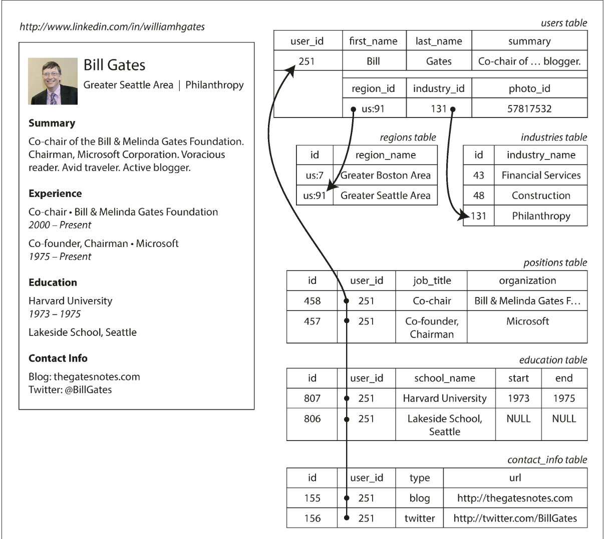
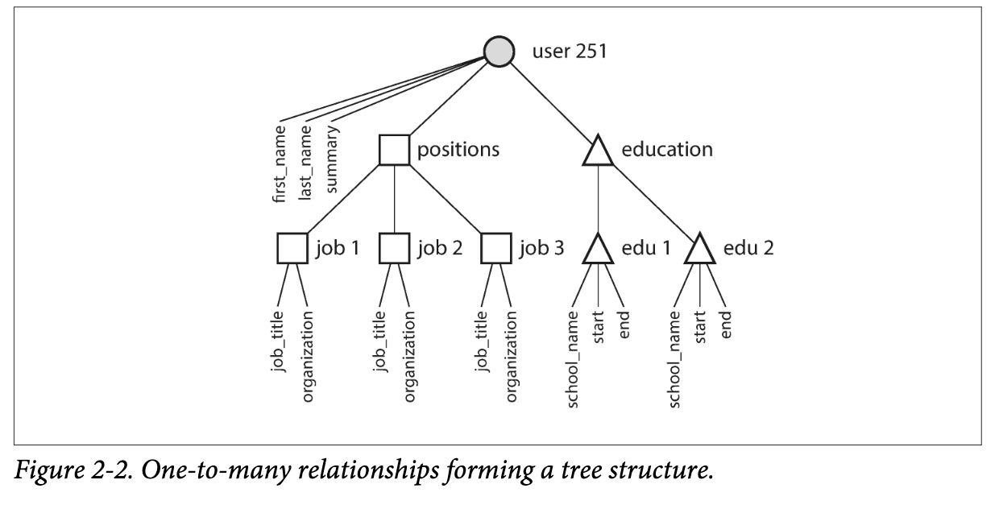
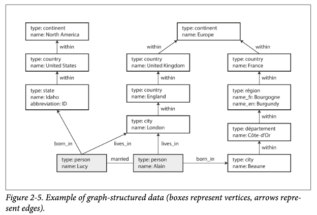
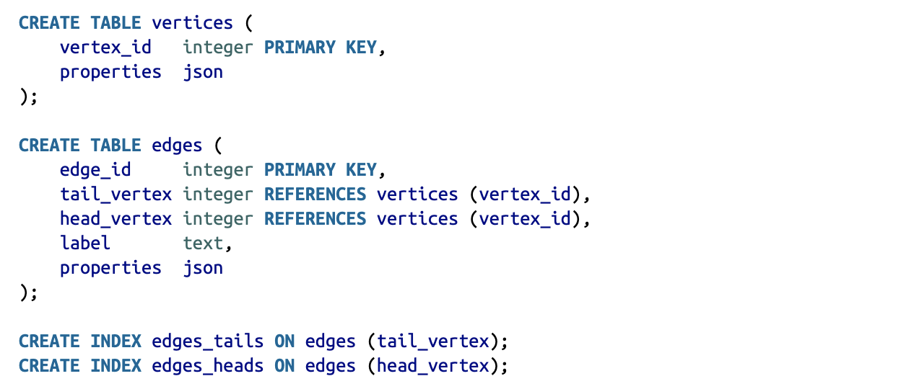
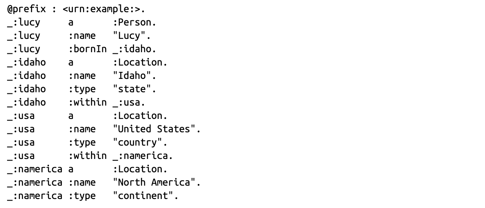

## 📖 2.1. 관계형 모델과 문서 모델

___

관계형 데이터모델

- 데이터는(SQL의 테이블) 관계(relation)로 구성
- 각 관계는 순서없는 튜플(tuple)의 모음

### 🔖 2.1.1. NoSQL의 탄생

- JSON 유사 형식의 문서로 데이터를 저장 및 쿼리하도록 설계된 비관계형 데이터베이스
- 대규모 데이터셋이나 높으 쓰기 처리량 달성이 관계형에 비해 유리함
- 무료 오픈 소프트웨어
- 관계형 모델에서는 지원되지 않는 특수 질의 동작
- 관계형 모델의 엄격한 스키마 제한에 대한 불만과 동적인 데이터 표현이 유리한 특징

### 🔖 2.1.2. 객체 관계형 불일치

- 오늘날 대부분의 애플리케이션은 객체지향 프로그래밍
- 객체지향의 객체와 관계형 데이터 모델의 테이블간의 전환계층이 필요함
- 객체지향의 추상화, 상속, 다형성등을 관계형 데이터베이스는 표현하지 못함.
- 이런 모델사이의 차이를 **임피던스 불일치(Impedance mismatch)** 또는 패러다임 불일치라 한다.
- 예를 들어 다음과 같은 데이터 구조를 보자(이력서)

- 관계형 데이터모델에서는 이력서에서 education이나 contact_info 와의 일대다 관계를 해결하기 위해 새로운 테이블을 구성하였다.
- Json 표현은 관계형 모델에 비해서 더 나은 지역성을 가지게 된다(연관된 데이터들이 모여있음)
- 일종의 의미상 데이터 트리구조로 표현됨

### 🔖 2.1.3. 다대일 다대다 관계

- 앞의 이력서 모델에서 region_id, industry_id를 평문이 아닌 ID로 매핑하였음
- 평문이 아닌 ID를 사용하며 매핑할 경우 데이터 중복을 해결을 할 수 있음(정규화)
- 이 다대일 관계는 조인을 지원하는 관계형에는 유리하나 문서형 모델에는 적합하지 않음
- 문서형 모델에서 조인을 지원하지 않을경우 애플리케이션에서 구현을 해야함
- 애플리케이션 초기버전이 문서모델에 적합하더라도, 기능이 추가되며 데이터들은 상호연결되는 경향이 있음
- 예를 들어 위의 이력서 모델에 organiztion(회사)과 school_name(학교)을 문자열이 아닌 엔티티참조로 변경하게 된다면? 추천서 기능이 추가된다면? 이러한 경우들에는 결국 질의할 떄 조인이 필요하게 된다.

### 🔖 2.1.4. 문서 데이터베이스는 역사를 반복하고 있나?

#### 🛠 2.1.4.1. 계층 모델

- 일대다 모델은 표현하기 쉬우나 다대일 관계를 표현하기 어려움
- 다대일 관계를 해결하기 위해 중복을 사용할지 참조를 수동으로 해결할지 고민해야함

#### 🛠 2.1.4.2. 네트워크 모델

- 계층 모델의 다대일 관계 표현 개선을 위해 제안됨
- 다대일과 다대다 관계를 모델링 할 수 있다.
- 하지만 다중부모를 가지는 레코드를 추적할 경우 모든 **접근경로**를 따져야 하는 어려움이 있음

#### 🛠 2.1.4.3. 관계형 모델

- 위에서 지역아이디 테이블에서 보듯 관계형 모델에서 다대일 관계(테이블)은 단순 튜플(로우)의 모음이 전부이다.
- 조건에 일치하는 로우를 선택해 읽기만 하면 됨.
- 관계형 모델에서는 질의 최적화기(query optimizer)를 통해 자동으로 접근경로를 결정
- 개발자가 따로 생각할 필요가 없음

#### 🛠 2.1.4.4. 문서 데이터베이스와의 비교

- 관계형 모델에서 다대일 관계를 해결한 외래키처럼 문서모델에서는 문서 참조(document referenece)를 통해 다대일 관계 해결
- 다대다 관계가 많아지고, 중첩이 깊어진다면 문제가 될 수 있다.

### 🔖 2.1.5. 관계형 데이터베이스와 오늘날의 문서 데이터베이스

#### 🛠 2.1.5.1. 어떤 모델이 애플리케이션 코드를 더 간단하게 할까?

- 다대다 관계를 사용할수록 문서 모델은 관계형 모델에 비해 매력이 떨어짐
- 비정규화로 필요성을 줄일 수 있지만, 애플리케이션 코드는 데이터 일관성을 유지하기 위한 작업을 별도로 수행해주어야 함

#### 🛠 2.1.5.2. 문서 모델에서의 스키마 유연성

- 관계형 모델
  - 쓰기 스키마(schema-on-write)
  - 프로그램의 정적 타입확인(컴파일 타임)과 유사
  - 타입 변경시 마이그레이션 작업 수행(alter table)
- 문서형 모델
  - 읽기 스키마(schema-on-read)
  - 프로그램의 동적 타입확인(런타임)과 유사
  - 타입 변경시 예전 문서를 읽은 경우를 처리하는 코드를 추가

#### 🛠 2.1.5.3. 질의를 위한 데이터 지역성

- 일반적으로 저장소 지역성(storage locality)를 활용하면 성능 이점이 있다.
- 관계형 모델에서처럼 테이블이 나눠져 다중 색인 검색이 필요할 경우 더 많은 탐색과 시간이 필요하다.
- 관계형 모델에서도 문서모델처럼 지역성 특성을 제공한다.
- 오라클의 경우 다중 테이블 색인 클러스터 테이블(multi-table index cluster table)기능을 통해 제공

#### 🛠 2.1.5.4. 문서 데이터베이스와 관계형 데이터베이스의 통합

- 많은 관계형 데이터베이스에서 JSON 기능을 지원함
- 많은 문서형 모델에서는 관계형 조인을 지원함(물론 관계형 데이터베이스보다는 성능이 떨어질 수 있음)
- 시간이 지남에 따라 점점 더 비슷해지고 있음

## 📖 2.2. 데이터를 위한 질의 언어

___

- 일반적으로 프로그래밍 언어는 명령형 언어이다
- 특정 순서로 특정 연산을 수행하게끔 컴퓨터에 지시
- 정해진 순서로 연산을 수행하기에 병렬처리가 매우 어려움

### 🔖 2.2.1 웹에서의 선언형 질의

- 관계형 모델에서 사용하는 SQL이 선언형 질의언어임
- 목표를 위한 방법이 아니라 알고자 하는 데이터의 패턴, 즉 조건과 데이터를 어떻게 변환할지만 결정
- 데이터베이스 엔진의 상세 구현이 숨겨져있어 질의를 변경하지 않고도 성능 향상가능
- 알고리즘 지정이 아니라 결과의 패턴만 지정하기에 병렬처리에 유리함
- 웹에서 CSS 선택자나 Xpath 표현식도 선헌형 언어의 한 종류

### 🔖 2.2.2 맵리듀스 질의

- 맵 리듀스를 쉽게 말하면 1)큰 덩어리를 작게 나누어서 2)여러명의 사람이 각각 처리한 후 3)처리된 것을 모아 결과를 내는 방식을 말한다
- 맵 리듀스는 크게 map(collect라고도 함) 작업과 reduce(fold나 inject라고도 함) 작업으로 나누어짐
- map은 전체 데이터를 작은 단위로 나눈 청크에 대해 수행할 로직을 말함
- reduce는 분산되어 처리된 결과들을 하나로 합쳐주는 과정이며, 분산환경에서 병렬로 처리됨.
- 두 함수는 순수함수여야 한다는 제약사항이 존재(입력데이터만 사용, 부수효과가 없어야함)
  - 두 함수 작성에 어려움을 해결하기 위해 몽고DB 2.2는 집계 파이프라인이라는 질의언어 추가

## 📖 2.3. 그래프형 데이터 모델

___

일반적으로 다대다 관계는 관계형 모델로 표현이 가능하다. 하지만 관계가 더 복잡해질수록 그래프 모델이 데이터를 모델링하기 수월해진다.

그래프는 일반적으로 우리가 자료구조로 알고있는 그 그래프가 맞다. 정점(Vertex)과 간선(Edge)로 이루어져있다. 여기서 정점은 노드나 엔티티, 간선은 관계나 호로 표현된다.

### 🔖 2.3.1  속성 그래프

#### 속성 그래프의 요소

- Vertext
  - 고유한 식별자
  - 유출(Outgoing) 간선 집합
  - 유입(Incoming) 간선 집합
  - 속성 컬렉션(Key - value 쌍)
- Edge
  - 고유한 식별자
  - 간선이 시작하는 정점(tail vertex)
  - 간선이 끝나는 정점(head vertex)
  - 두 정점간의 관계 유형을 설명하는 레이블
  - 속성 컬렉션(key - value 쌍)

### 🔖 2.3.2 사이퍼 질의언어

- 속성 그래프를 위한 선언형 질의 언어
- 네오포제이(neo4j)용으로 만들어짐

### 🔖 2.3.3 SQL의 그래프 질의

관계형 데이터베이스에서도 그래프로 데이터를 표현할 수 있음

- 위와 같이 테이블로 그래프 모델을 표현했을 때, 사이퍼에서 표현된 질의는 `() -> [:WITHIN*0..] -> ()` 에서 문제가 생긴다.
- 이를 SQL에서 구현하려면 재귀 공통 테이블 식을 사용해서 표현할 수 있으나 사이퍼 질의에 비해 문법이 매우 어려워진다.

### 🔖 2.3.4 트리플 저장소와 스파클

거의 동일한 개념을 용어만 다르게 사용해 설명할 뿐, 속성 그래프 모델과 거의 동일한 모델이다.

#### 트리플 저장소의 요소

- 모든 정보를 세 부문 구문(three-part statement) 형식으로 저장한다.
- 주어(subject) + 서술어(predicate) + 목적어(object)
  - ex) 루시 + 좋아한다 + 바나나 에서 루시는 주어, 좋아한다는 서술어, 바나나는 목적어이다.
- 주어는 그래프의 정점(vertex)
- 서술어와 목적어는 다음 두가지로 나누어진다.
  - 목적어가 문자열이나 숫자같은 원시데이터일 경우 서술어와 목적어는 각각 vertex 속성의 key와 value이다. 예를 들어 (루시,나이,33)은 {”age”:33} 속성을 가진 lucy와 같다.
  - 목적어가 다른 그래프의 정점일 경우 서술어는 간선과 같다. 예를 들어 (루시,결혼하다,알랭)에서 루시와 알랭은 모두 vertex이고 결혼하다는 edge이다.
- turtle 형식으로 트리플 작성할 수 있다.(Turtle 은 Notation3(N3)의 부분집합)

#### 🛠 2.3.4.1 스파클 질의 언어

- SPARQL Protocol and RDF Query Language
- 줄임말에서 알 수 있듯이, RDF 데이터 모델을 사용한 트리플 저장소 질의언어이다.
  - RDF : Resource Description Framework(자원 기술 프레임워크)
  - 시멘틱 웹에서 유래되었다
  - 서로 다른 웹 사이트가 일관된 형식으로 데이터를 게시하기 위한 방법
  - 터틀 언어는 RDF데이터를 사람이 읽을 수 있는 형식으로 표현함
- 사이퍼보다 먼저 만들어졌고, 사이퍼에서 일부 차용함

#### 🛠 2.3.4.2 초석:데이터로그

- 1980년대부터 광범위하게 연구된 언어
- 서술어(주어,목적어) 로 작성됨
- 사이퍼나 스파클은 바로 Select로 질의를 하지만 데이터로그는 단계를 나눠 조금씩 질의를 함
- 서술어를 데이터베이스에 전달하는 규칙을 세우고, 이 규칙들을 활용하여 질의를 진행
