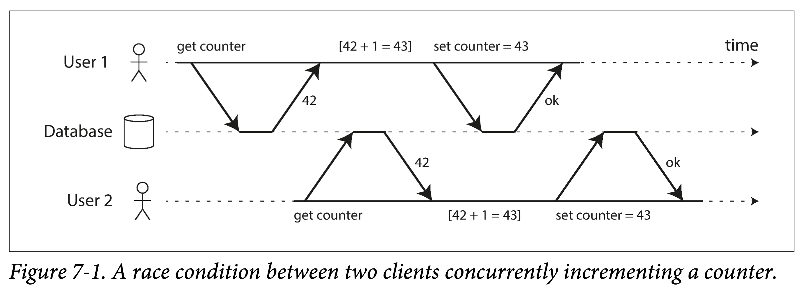
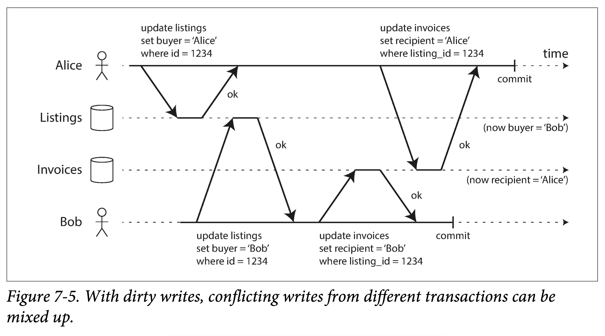
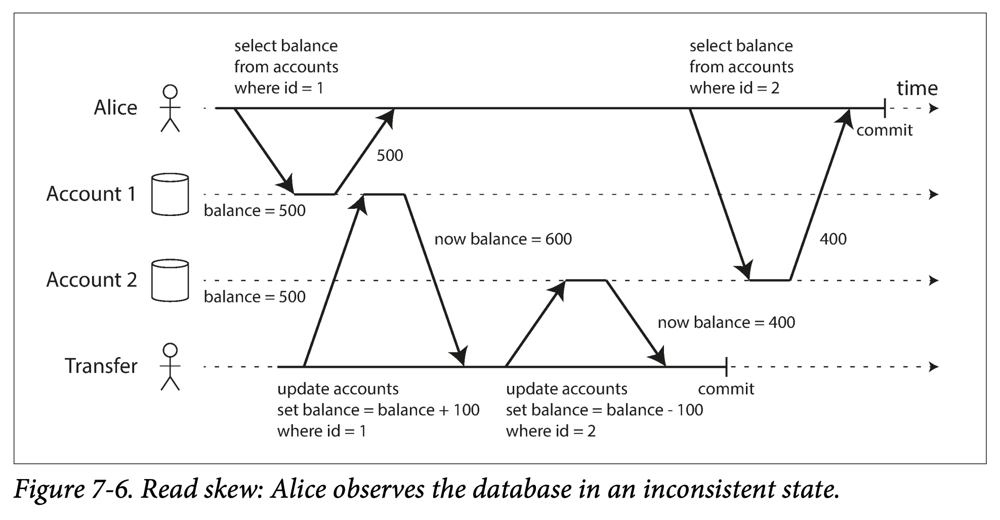
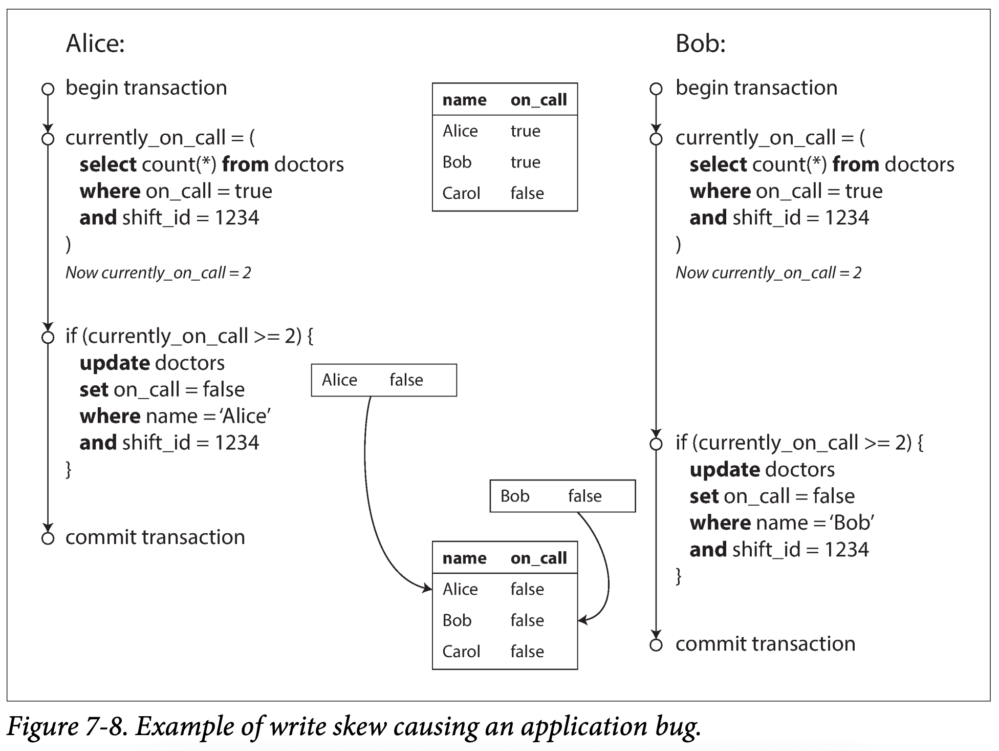
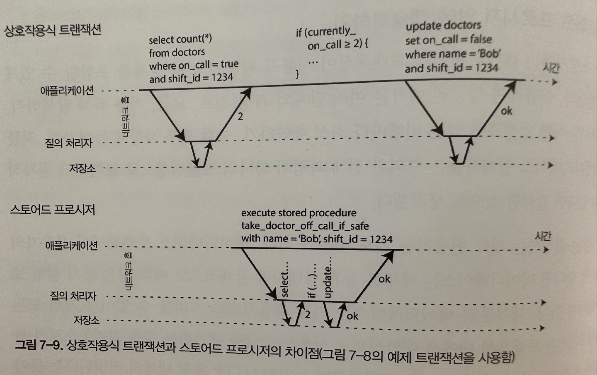
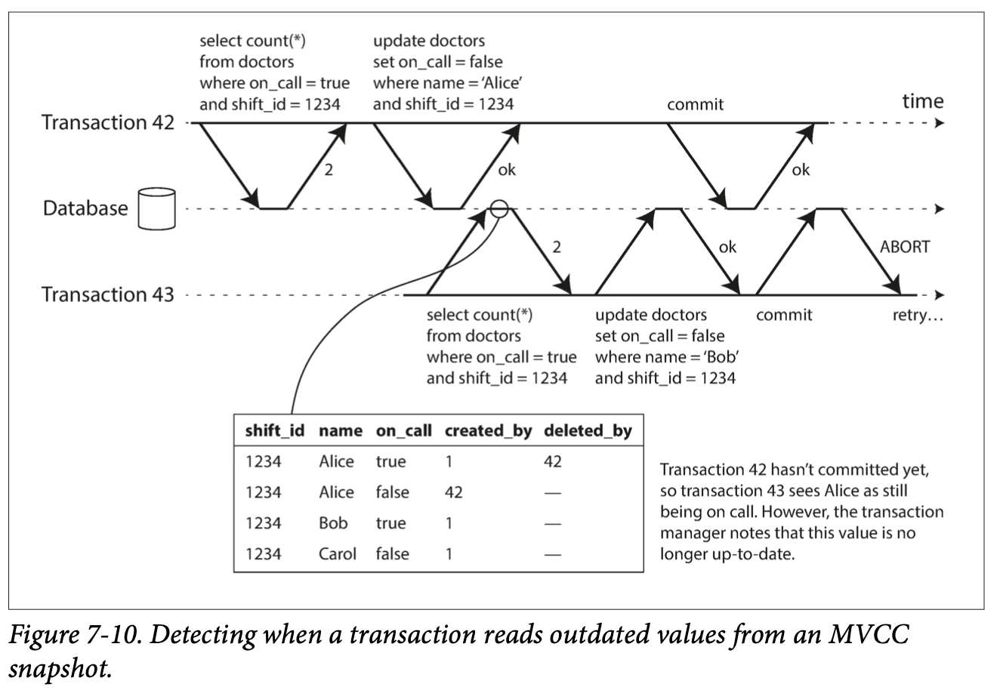
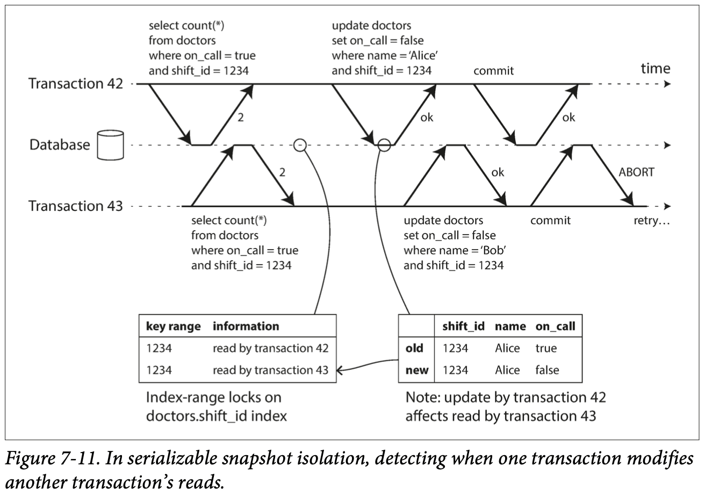

> 어떤 저자들은 2단계 커밋에서 유발되는 성능이나 가용성 문제 때문에 생기는 비용이 너무 커서 이를 지원할 수 없다고 주장했다. 우리는 항상 트랜잭션 없이 코딩하는 것보다 트랜잭션을 과용해서 병목지점이 생기는 성능 문제를 애플리케이션 프로그래머가 처리하게 하는 게 낫다고 생각한다. - 제임스 코벳 외, 스패너: 구글의 전역 분산 데이터베이스(2012)

트랜잭션이란❓

- Application에서 몇 개의 읽기와 쓰기를 하나의 논리적 단위로 묶는 방법
- 개념적으로 한 트랜잭션 내의 모든 읽기와 쓰기는 한 연산으로 실행
- 트랜잭션은 전체가 성공(commit), 실패(abort)한다.
  - application에서 retry가 가능하며, 부분적인 실패를 걱정할 필요가 없기 때문에, error handling이 손쉬워진다.
- Application에서 프로그래밍 모델을 단순화**하려는 목적으로 만든 것
- Application에서 잠재적인 오류 시나리오와 동시성 문제를 무시할 수 있다.
  - **안전성 보장(safety guarantee)
- 성능향상 혹은 가용성을 높이기 위해 트랜잭션을 쓰지 않는 것이 이득일 수 있다.
  - 이에 대한 판단을 하기 위해 트랜잭션이 제공하는 안전성 보장과 비용이 무엇인지 정확이 이해해야 한다.

## 📖 7.1 애매모호한 트랜잭션의 개념

___

트랜잭션은 이점과 한계가 있다. 이 trade-off를 이해하기 위해 정상적인 운영 상황과 다양한 극단적인 환경에서 트랜잭션이 제공하는 보장의 세부 사항을 알아야 한다.

### 🔖 7.1.1 ACID의 의미

트랜잭션이 제공하는 안전성 보장은 흔히 원자성(Atomicity), 일관성(Consistency), 격리성(Isolation), 지속성(Durability)을 의미하는 약어인 ACID로 잘 알려져 있다. 데이터베이스에서 내결함성 메커니즘을 나타내는 정확한 용어를 확립하기 위해 만들어짐.

- 내결함성: 시스템의 일부 구성 요소가 작동하지 않더라도 계속 작동할 수 있도록 하는 기능

#### 🛠 7.1.1.1 원자성

일반적으로 원자적**이란 더 작은 부분으로 쪼갤 수 없는 것을 가리킨다. 다만 여기서 쓰이는 원자성은 연산을 실행하기 전이나 실행한 후의 상태에만 있을 수 있으며 그 중간 상태에는 머물 수 없다.

- 예를 들어, 여러 쓰기 작업이 하나의 트랜잭션으로 묶여 있는데 결함 때문에 commit될 수 없다면 abort되고 데이터베이스는 이 트랜잭션에서 지금까지 실행한 쓰기를 무시하거나 쥐소해야 한다.
- Application에서 트랜잭션이 어떤 것도 변경하지 않았음을 알 수 있으므로 **안전하게 재시도**할 수 있다.
- 어보트능력(abortability)이 원자성(Atomicity)보다 나은 단어일 수 있다.

#### 🛠 7.1.1.2 일관성

일관성이란 단어는 굉장히 여러 의미로 쓰인다.

- [5장의 복제일관성과 최종적일관성](https://github.com/Study-Br/Study-Designing-Data-Intensive-Applications/issues/5)
- [6장의 일관적 해싱](https://github.com/Study-Br/Study-Designing-Data-Intensive-Applications/issues/6)
- 9장의 선형성
- ACID에서 일관성은 데이터베이스가 **좋은상태 에 있어야 한다는 것의 Application에 특화된 개념
  - 데이터에 관한 **불변식**이 있다는 것
  - ex) 회계의 모든 계좌에 걸친 대변과 차변은 동일하다.

일관성을 유지하도록 트랜잭션을 올바르게 정의하는 것은 Application의 책임이다❗️

- 데이터베이스에서 불변식을 위반하는 잘못된 데이터를 쓰지 못하도록 막을 수 없다.
- 실제로 ACID의 C는 약어를 만들기 위해 끼어들었다고 표현되며, Application 속성으로 취급한다.

#### 🛠 7.1.1.3 격리성



위 그림을 보면 두 Client의 경합으로 인해, count가 44가 아닌 43이 된 것을 볼 수 있다.

격리성은 동시에 실행되는 트랜잭션은 서로 격리된다는 것을 의미한다.
즉, 실제로는 여러 트랜잭션이 동시에 실행됐더라도 순차적으로 실행됐을 때의 결과와 동일하도록 보장한다.

- 격리성을 직렬성이라는 용어로 사용하기도 했다.
- 직렬성 격리는 성능 이슈가 있어 현실에서는 거의 사용하지 않는다.
  - Oracle의 직렬성 격리는 실제로는 직렬성보다 보장이 약한 **스냅숏 격리**를 구현한 것

#### 🛠 7.1.1.4 지속성

지속성은 트랜잭션이 성공적으로 commit됐다면 하드웨어 결함이 발생하거나 데이터베이스가 죽더라도 트랜잭션에서 기록한 모든 데이터는 손실되지 않는다는 보장이다.

- 단일 노드 데이터베이스에서 지속성은 일반적으로 데이터가 비휘발성 저장소에 기록됐다는 뜻
- 복제 기능이 있는 데이터베이스에서 지속성은 데이터가 성공적으로 다른 노드에 복사 됐다는 것을 의미할 수 있음.
- 완벽하고 절대적인 지속성은 없다.
  - SSD 오염, 전원 차단, 리더가 죽은 경우 등

##### 시대에 따른 지속성의 의미

아카이브 테이프에 기록 ▶️ 디스크나 SSD에 기록 ▶️ 복제

### 🔖 7.1.2 단일 객체 연산과 다중 객체 연산

ACID에서 원자성과 격리성은 Client가 한 트랜잭션 내에서 여러 번의 쓰기를 하면 데이터베이스가 어떻게 해야 하는지를 설명함.

- 원자성: 부분 실패를 없애줌.
- 격리성: 동시에 실행되는 트랜잭션들은 서로를 방해하지 말아야 한다.

RDB의 다중 객체 트랜잭션

- Client와 DB Server 사이의 TCP 연결을 기반으로 함.
- begin과 commit 사이의 모든 것은 같은 트랜잭션에 속하는 것으로 여겨짐.
- 이 방식은 Client가 commit 요청을 보내고 Server가 commit 응답을 하기 전에 연결이 끊긴다면 Client는 트랜잭션이 commit됐는지 알 수 없다.

NoSQL의 다중 객체 트랜잭션

- NoSQL은 RDB와 다르게 다중 객체 API가 있더라도 부분 성공이 될 수 있다.

#### 🛠 7.1.2.1 단일 객체 쓰기

원자성과 격리성은 단일 객체를 변경하는 경우에도 적용된다.

> 20KB 중 10KB를 보낸 후에 네트워크 연결이 끊기면?
> DB Table Update 중에 전원이 나가면?
> 문서를 쓰고 있을 때, 그 문서를 읽으면?

위와 같은 문제로 인해, 대부분의 저장소 엔진들은 한 노드에 존재하는 단일 객체 수준에서 우너자성과 격리성을 제공하는 것을 목표로 함.

- 원자성은 장애 복구용 로그로 구현
- 격리성은 객체 잠금을 사용

#### 🛠 7.1.2.2 오류와 어보트 처리

abort된 트랜잭션을 재시도하는 것은 간단하고 효과적인 오류 처리 메커니즘이지만 완벽하지는 않다.

- server가 client에게 commit 성공을 알리는 도중 네트워크가 끊겼을 때 -> 재시도하면 트랜잭션 두 번 실행
- 과부하로 인한 트랜잭션 실패 -> 재시도하면 상황 악화
- 영구적인 오류는 재시도해도 의미 없음.
- 트랜잭션이 외부에도 영향이 있다면(email 발송) 재시도를 하기 부담스럽다.
- client가 재시도 중에 죽어버리면 쓰려던 데이터가 손실됨.

## 📖 7.2 완화된 격리 수준

___

동시성 버그는 발견하기도, 추론하기도, 재현하기도 어렵다.
이에 따라, 데이터베이스는 트랜잭션 격리를 제공함으로써 동시성 문제를 감추고자 한다.

### 🔖 7.2.1 커밋 후 읽기(read committed)

1. 데이터베이스에서 읽을 때 커밋된 데이터만 보게 된다.(더티 읽기 방지)
2. 데이터베이스에서 쓸 때 커밋된 데이터만 덮어쓰게 된다.(더티 쓰기 방지)

#### 🛠 7.2.1.1 더티 읽기 방지

더티 읽기란 다른 트랜잭션에서 커밋되지 않은 데이터를 볼 수 있는 것

- 더티 읽기를 방지하지 않으면 부분적으로 갱신된 데이터베이스를 볼 수 있는 등 혼란스러워진다.

#### 🛠 7.2.1.2 더티 쓰기 방지



더티 쓰기란 커밋되지 않은 트랜잭션에서 쓴 것을 나중에 실행된 쓰기 작업이 덮어써버리는 것

- 먼저 쓴 트랜잭션이 커밋이나 어보트될 때까지 두 번째 쓰기를 지연시켜 해결한다.

#### 🛠 7.2.1.3 커밋 후 읽기 구현

row level lock을 사용해 더티 쓰기를 방지함.

- 문서 변경을 위해 해당 객체에 대한 잠금 획득이 필요
- MySQL: X Lock, PostgreSQL: RowExclusiveLock, Oracle: TX Lock

읽기 잠금 또한 있지만 현실에서는 잘 동작하지도, 쓰지도 않는다.

- 성능, 서비스 전체 영향도 등

### 🔖 7.2.2 스냅숏 격리와 반복 읽기



- 비반복읽기(읽기 스큐)
  - 트랜잭션이 처리되고 있는 순간에 계좌 잔고를 보게 되면 돈이 증발한 것 처럼 보임
  - 일관성이 깨진 상태의 데이터베이스를 봄
  - 대부분의 경우 지속적인 문제는 아님(새로고침 등)
  - 다만 백업을 하고있는 상황이나, 중요한 분석 질의, 무결성 모니터링에 좋지 않은 영향을 끼침
- 스냅숏 격리
  - 각 트랜잭션은 데이터베이스의 일관된 스냅숏으로부터 읽는 것
  - 트랜잭션이 특정 시점에 고정된 데이터베이스의 일관된 스냅숏만 본다면 분석에 추론하기 용이

#### 🛠 7.2.2.1 스냅숏 격리 구현

스냅숏 격리의 핵심 원리

- 읽는 쪽에서 쓰는 쪽을 결코 차단하지 않고 쓰는 쪽에서 읽는 쪽을 결코 차단하지 않는다
- 다중 버전 동시성 제어(MVCC)
  - 객체마다 커밋된 버전 여러 개를 유지할 수 있어야 함
  - 진행 중인 서로 다른 시점의 데이터베이스 상태를 봐야할 수 있기 때문
  - 커밋 후 읽기 격리의 경우는 버전 2개(커밋된 버전, 커밋되지 않은 버전)만으로 충분하지만 대부분의 스냅숏 격리를 지원하는 저장소 엔진은 MVCC를 사용한다.

#### 🛠 7.2.2.2 일관된 스냅숏을 보는 가시성 규칙

```text
1. 데이터베이스는 각 트랜잭션을 시작할 때 그 시점에 진행 중인(아직 커밋이나 어보트가 되지 않은) 모든 트랜잭션의 목록을 만든다.
2. 어보트된 트랜잭션이 쓴 데이터는 모두 무시된다.
3. 트랜잭션 ID가 더 큰(즉 현재 트랜잭션이 시작한 후에 시작한) 트랜잭션이 쓴 데이터는 그 트랜잭션의 커밋 여부에 관계 없이 모두 무시된다.
4. 그 밖의 모든 데이터는 Application의 질의로 볼 수 있다.
```

- 위 규칙들은 객체 생성과 삭제 모두에 적용
- 이로 인해 일관된 스냅숏을 Application에 제공
- 데이터베이스는 갱신할 때 값을 교체하지 않고 값이 바뀔 때마다 새 버전을 생성함

#### 🛠 7.2.2.3 색인과 스냅숏 격리

- PostgreSQL
  - 동일한 객체의 다른 버전들이 같은 페이지에 저장될 수 있다면 색인 갱신을 회피
- 카우치DB, LMDB, 데이토믹
  - 트리의 페이지가 갱신될 때 각 변경된 페이지의 복사본을 생성
  - append-only/copy-on-write
- oracle
  - 동일한 객체의 다른 버전들이 같은 페이지에 저장될 수 있다면 색인 갱신을 회피
  - PostgreSQL와 다른 점은 SCN(System Change Number)를 사용하여 인덱스의 상태를 판단

#### 🛠 7.2.2.4 반복 읽기와 혼란스러운 이름

스냅숏 격리는 여러 명칭이 혼재되어 사용

- 직렬성
  - oracle
- 반복읽기(repeatable read)
  - MySQL, PostgreSQL

SQL 표준의 격리 수준 정의에는 결함이 있고, 스냅숏 격리의 개념이 없기 때문

### 🔖 7.2.3 갱신 손실 방지

#### 갱신 손실

- Application이 데이터베이스에서 값을 읽고 변경한 후 변경된 값을 다시 쓸 때(read-modify-write) 발생
- 두 트랜잭션이 동시에 read-modify-write를 하면 두 번째 쓰기 작업이 첫 번째 변경을 포함하지 않아 손실

#### 🛠 7.2.3.1 원자적 쓰기 연산

```sql
UPDATE counters
SET value = value + 1
WHERE key = 'foo';
```

- read-modify-write 주기를 구현할 필요 없음
- 대부분의 RDB에서 동시성 안전(concurrency-safe)
- 커서 안전성(cursor stability)
  - 객체를 읽을 때 독점적인(exclusive) 잠금을 획득하여 갱신이 적용될 때까지 다른 트랜잭션에서 읽지 못하게 함.

#### 🛠 7.2.3.2 명시적인 잠금

```sql
SELECT /* 명시적인 잠금 */ * 
FROM FIGURES
WHERE NAME = 'ROBOT'
AND GAME_ID = 222
FOR UPDATE;

UPDATE FIGURES
SET POSITION = 'C4'
WHERE ID = 1234;
```

- Application 에서 갱신할 객체를 명시적으로 잠금

#### 🛠 7.2.3.3 갱신 손실 자동 감지

- 갱신 손실을 발견하면 트랜잭션을 어보트시키고 read-modify-write 주기를 재시도하도록 강제하는 방법
  - Oracle, PostgreSQL 제공
  - MySQL 미제공
- Application code에서 DB 기능을 쓰지 않아도 되므로 좋음

#### 🛠 7.2.3.4 Compare-and-set

```sql
UPDATE /* 위키페이지가 이전 값과 동일한 경우 갱신 허용 */ WIKI_PAGES
SET CONTENT = 'NEW CONTENT'
WHERE ID = 1234
AND CONTENT = 'OLD CONTENT'
```

- 값을 마지막으로 읽은 후로 변경되지 않았을 때만 갱신을 허용하여 갱신 손실 방지
- 다만 where 절이 오래된 스냅숏으로부터 읽는다면 갱신 손실이 일어날 수 있다.

#### 🛠 7.2.3.5 충돌 해소와 복제

- 복제가 적용된 데이터베이스에서는 쓰기가 동시에 실행될 때 한 값에 대해 여러 개의 충돌된 버전(sibling)을 생성하는 것을 허용하고 사후에 충돌 해소 후 병합한다.
- 최종 쓰기 승리(last write wins, LWW) 충돌 해소 방법은 갱신 손실이 발생하기 쉽다.

### 🔖 7.2.4 쓰기 스큐와 팬텀

#### 🛠 7.2.4.1 쓰기 스큐를 특징짓기



- on-call 담당이 1명이 있어야 하는데 0명이 되어버림.
- 두 트랜잭션이 같은 객체를 읽어 그 중 일부를 갱신할 때 나타날 수 있는 정책적인 위반 사항

##### 쓰기 스큐 방지

1. 다중 객체가 연관되므로 원자적 단일 객체 연산은 도움이 되지 않는다.
2. 직렬성 격리가 필요
3. 여러 객체와 연관된 제약 조건 설정
4. 명시적인 잠금

```sql
SELECT /* 명시적인 잠금 */ * 
FROM DOCTORS
WHERE ON_CALL = TRUE
AND SHIFT_ID = 1234
FOR UPDATE;

UPDATE DOCTORS
SET ON_CALL = FALSE
WHERE NAME = 'ALICE'
AND SHIFT_ID = 1234;
```

#### 🛠 7.2.4.2 추가적인 쓰기 스큐의 예

##### 회의실 예약 시스템

```sql
-- 정오에서 오후 1시까지의 시간과 겹치는 예약이 존재하는지 확인
SELECT COUNT(*)
FROM BOOKINGS
WHERE ROOM_ID = 123
AND END_TIME > '2015-01-01 12:00' AND START_TIME < '2015-01-01 13:00'

-- 이전 질의가 0을 반환했다면
INSERT INTO BOOKINGS
(ROOM_ID, START_TIME, END_TIME, USER_ID)
VALUES (123, '2015-01-01 12:00', '2015-01-01 13:00', 666)
```

- 동시에 같은 회의실을 중복 예약할 수 없게 하고 싶다. 누군가 예약을 하려고 할 때 먼저 충돌하는 예약이 있는지 확인하고, 없다면 회의를 예약한다.

##### 사용자명 획득

- 각 사용자가 유일한 사용자명을 가져야 하는 웹사이트에서 두 명의 사용자가 동시에 같은 사용자명으로 계정 생성을 시도할 수 있다.
  - 이 경우는 유일성 제약 조건이 간단한 해결책

#### 🛠 7.2.4.3 쓰기 스큐를 유발하는 팬텀

##### 팬텀

- 어떤 트랜잭션에서 실행한 쓰기가 다른 트랜잭션의 검색 질의 결과를 바꾸는 효과
- 예를들어, 한 트랜잭션내에서 두 번 조회했는데 각각의 결과가 다른 경우
  - 다른 트랜잭션에서 CUD 트랜잭션을 커밋하여 중간에 질의 결과가 달라짐

#### 🛠 7.2.4.4 충돌 구체화

- 팬텀의 문제는 결국 잠글 수 있는 객체가 없다는 것에 착안해 인위적으로 데이터베이스에 잠금 객체를 추가하는 것
- 회의실 예약의 경우 회의실과 시간에 대한 모든 조합을 미리 만들어 잠금에 사용
- 충돌 구체화 방법은 알아내기 어렵고 오류 발생확률이 높다.

## 📖 7.3 직렬성(Serializable)

- 가장 강력한 격리 수준
- 여러 트랜잭션이 병렬로 실행되더라도 최종 결과는 동시성 없이 한 번에 하나씩 **직렬**로 실행될 때와 같도록 보장
- 데이터베이스가 발생할 수 있는 **모든** 경쟁 조건을 막아줌

### 🔖 7.3.1 실제적인 직렬 실행

동시성 문제를 피하는 가장 간단한 방법은 한 번에 트랜잭션 하나씩만 직렬로 단일 스레드에서 실행하면 된다.

의외로 단일 스레드에서 실행되도록 설계된 시스템이 동시성을 지원하는 시스템보다 성능이 나을 때도 있다.

- 잠금을 코디네이션하는 오버헤드를 피할 수 있기 때문
- 다만 처리량이 CPU 코어 하나의 처리량으로 제한되어있으므로 트랜잭션이 전통적인 형태와는 다르게 구조화돼야 한다.

#### 🛠 7.3.1.1 트랜잭션을 스토어드 프로시저 안에 캡슐화하기

초창기에는 데이터베이스 트랜잭션이 사용자 활동의 전체 흐름을 포함할 수 있게 하려는 의도가 있었다.(항공권 예약의 전체과정 등)

- 이 경우, 트랜잭션이 사용자의 입력을 기다리게 되고 매우 많은 동시 실행 트랜잭션을 지원해야 함.

결국, 대부분의 OLTP Application은 트랜잭션 내에서 대화식으로 사용자 응답을 대기하는 것을 회피함으로써 트랜잭션을 짧게 유지한다.

- 사람이 주요 경로(critical path)에서 제외됐음에도 트랜잭션은 계속 상호작용하는 client/server 스타일로 실행돼 왔다.
  - ex) Application <-> DB 간에 질의 실행 및 결과 응답하는 구조
- 이러한 상호작용식 트랜잭션은 애플리케이션과 데이터베이스 사이의 네트워크 통신에 많은 시간을 소비함. 만약 동시성을 허용하지 않는다면 성능은 최악이 될 것이다.
  - 따라서, 직렬성 격리를 사용하는 시스템들은 상호작용하는 다중 구문 트랜잭션을 허용하지 않는다. 대신 Application은 트랜잭션 코드 전체를 **스토어드 프로시저** 형태로 데이터베이스에 미리 제출해야 한다.



#### 🛠 7.3.1.2 스토어드 프로시저의 장단점

##### 스토어드 프로시저의 단점

- 데이터베이스 벤더마다 각각의 스토어드 프로시저용 언어가 있는데 매우 낡고 생태계가 빈약하다.
  - oracle: PL/SQL 등
- 데이터베이스에서 실행되는 코드는 관리하기 어렵다.
  - 형상 관리, 배포, 모니터링 지표 수집 등
- 데이터베이스는 서버보다 훨씬 더 성능에 민감할 때가 많다.

##### 스토어드 프로시저의 장점

- 현대의 스토어드 프로시저 구현은 기존의 범용 프로그래밍 언어(java, groovy 등)
- I/O 대기가 필요 없고 단일 스레드로 상당히 좋은 처리량을 얻을 수 있다.
- 스토어드 프로시저는 서버에서 실행되기 때문에, 데이터베이스에 접근하기 위한 네트워크 부하⬇️ 보안성 ⬆️
- Application에서 자주 로직이나 쿼리를 스토어드 프로시저로 작성하여 관리하면, 성능 향상과 유지보수가 용이함.

#### 🛠 7.3.1.3 파티셔닝

직렬성 격리의 경우 결국 단일 CPU 코어의 속도로 제한된다. 이를 위해 여러 CPU 코어와 여러 노드로 확장하기 위해 데이터를 파티셔닝할 수도 있다.

- 여러 파티션에 접근해야 하는 트랜잭션이 있다면 데이터베이스가 해당 트랜잭션이 접근하는 모든 파티션에 걸쳐서 코디네이션을 해야한다. 이는 단일 파티션 트랜잭션보다 엄청나게 느리다.

#### 🛠 7.3.1.4 직렬 실행 요약

1. 모든 트랜잭션은 작고 빨라야한다. 느린 트랜잭션 하나가 모든 트랜잭션 처리를 지연시킬 수 있기 때문이다.
2. 활성화된 데이터셋이 메모리에 적재될 수 있는 경우로 사용이 제한된다.
3. 쓰기 처리량이 단일 CPU 코어에서 처리할 수 있을 정도로 충분히 낮아야 한다.
4. 여러 파티션에 걸친 트랜잭션도 쓸 수 있지만 이것을 사용할 수 있는 정도에는 엄격한 제한이 있다.

### 🔖 7.3.2 2단계 잠금(2PL)

2PL은 2단계로 나뉜다.

- 1단계(Growing Phase): 이 단계에서는 오직 잠금을 획득할 수 있고, 해제할 수는 없다.
- 2단계(Shrinking Phase): 이 단계에서는 트랜잭션이 잠금을 해제할 수는 있지만 새로운 잠금을 획득하지는 못한다.

스냅숏 격리는 읽는 쪽은 쓰는 쪽을 막지 않으며 쓰는 쪽도 읽는 쪽을 막지 않는다.
반면, 2PL은 쓰기 트랜잭션은 다른 쓰기 트랜잭션 뿐 아니라 읽기 트랜잭션도 진행하지 못하게 막으며, 직렬성을 제공하여 모든 경쟁 조건으로부터 보호해준다.

#### 🛠 7.3.2.1 2단계 잠금 구현

1. 트랜잭션이 객체를 읽기를 원한다면 먼저 공유 모드로 잠금을 획득해야 함. 다만 독점 모드로 잠금을 획득한 트랜잭션이 있으면 이 트랜잭션이 완료될 때까지 기다려야 한다. 동시에 공유 모드로 잠금을 획득하는 것은 허용
2. 트랜잭션이 객체에 쓰기를 원한다면 독점 모드로 잠금을 획득해야 함.
3. 트랜잭션이 읽다가 쓰기를 실행할 때는 공유 잠금을 독점 잠금으로 업그레이드 해야 한다.
4. 트랜잭션이 잠금을 획득한 후에는 트랜잭션이 종료(commit or abort)될 때까지 잠금을 갖고 있어야 한다.

서로 다른 트랜잭션이 잠금을 획득하기 위해 대기하는 상태를 **교착상태**라고 한다.

#### 🛠 7.3.2.2 2단계 잠금의 성능

2PL의 가장 큰 약점은 성능이다.

- 잠금을 획득하고 해제하는 오버헤드
- 대부분의 RDB들은 트랜잭션의 실행 시간을 제한하지 않음. 따라서 얼마나 오래 기다려야하는지 모름.
- 교착 상태로 인해 abort 되어 재시도하면 작업을 전부 재시도해야함.

#### 🛠 7.3.2.3 서술 잠금

팬텀을 막기 위해 서술 잠금(predicate lock)이 필요하다.

```sql
SELECT /* 서술잠금 가능한 객체 */*
FROM BOOKINGS
WHERE ROOM_ID = 123
AND END_TIME > '2018-01-01 12:00'
AND START_TIME < '2018-01-01 13:00';
```

- 공유/독점 잠금과 비슷하지만 특정 객체에 속하지 않고 위 쿼리와 같이 어떤 검색조건에 부합하는 모든 객체에 속한다.
- 서술 잠금은 아직 존재하지 않지만 미래에 추가될 수 있는 객체(팬텀)에도 적용할 수 있다는 것이 핵심 아이디어다.
- 2PL이 서술 잠금을 포함하면 비로소 직렬성 격리가 된다.
서술 잠금은 트랜잭션들이 획득한 잠금이 많으면 조건 확인에 시간이 오래 걸린다.

#### 🛠 7.3.2.3 색인 범위 잠금

대부분의 2PL을 지원하는 DB는 색인 범위 잠금(index-range locking, 다음 키 잠금(next-key locking))을 구현한다.

- 이는 서술 잠금을 근사화 한 것이다.
  - 예를 들어, 위의 쿼리에서 123번 방만 잠금하는 것이아닌 시간대에 속한 모든 방을 잠금
- 이 방법은 서술 잠금보다 정밀하진 않지만 오버헤드가 훨씬 낮다.
- 적합한 index가 없다면 테이블 전체에 공유 잠금을 잡는 것으로 대체할 수 있다.

### 🔖 7.3.3 직렬성 스냅숏 격리(SSI)

- 직렬성 격리와 좋은 성능의 공존을 위해 나타남.
- 완전한 직렬성을 제공하지만 스냅숏 격리에 비해 약간의 성능 손해만 있음.

#### 🛠 7.3.3.1 비관적 동시성 제어 대 낙관적 동시성 제어

##### 비관적 동시성 제어

- 잘못될 가능성이 있으면 뭔가를 하기 전에 상황이 다시 안전해질 때까지 기다림
- 상호 배제(mutual exclusion)와 비슷함
- 2PL

##### 낙관적 동시성 제어

- 위험한 상황이 발생할 가능성이 있어도 트랜잭션을 막지 않고 계속 진행
- 트랜잭션이 커밋되기를 원할 때 데이터베이스는 나쁜 상황이 발생했다면 abort한다.
- 트랜잭션 간의 경쟁이 심하면 abort시켜야 할 트랜잭션의 비율이 높아지므로 성능이 떨어진다.
- 예비 용량이 충분하고 경쟁이 심하지 않으면 비관적 동시성 제어보다 성능이 좋다.
- SSI
  - 스냅숏 격리 위에 알고리즘(쓰기 작업 사이의 직렬성 충돌 감지 및 abort할 트랜잭션을 결정)을 추가

#### 🛠 7.3.3.2 뒤처진 전제에 기반한 결정

트랜잭션은 어떤 전제(트랜잭션을 시작할 때 참이었던 사실(on-call 대기 의사는 2명이다))를 기반으로 어떤 동작을 한다. 나중에 해당 트랜잭션이 커밋하려고 할 때 원래 데이터가 바뀌어서 그 전제가 더 이상 참이 아닐 수 있다.

직렬성 격리를 제공하려면 뒤처진 전제를 기반으로 동작하는 상황을 감지하여야 한다. 그 방법은 아래와 같다.

- 오래된(stable) MVCC 객체 버전을 읽었는지 감지하기
- 과거의 읽기에 영향을 미치는 쓰기 감지하기

#### 🛠 7.3.3.3 오래된 MVCC 읽기 감지하기



- 트랜잭션이 MVCC 스냅숏에서 뒤처진 값을 읽었는지 감지하고 커밋된 게 있다면 어보트한다.
  - 감지된 트랜잭션이 abort가 되었는지 알 수 없고, 감지하는 트랜잭션이 읽기 전용일 수도 있다. 따라서 불필요한 abort를 피하기 위해 커밋될 때까지 기다린다.

#### 🛠 7.3.3.4 과거의 읽기에 영향을 미치는 쓰기 감지하기



- shift_id에 index가 있다면 트랜잭션 42, 43이 이 데이터를 읽었다는 사실을 기록할 수 있다.
- 트랜잭션이 읽은 데이터가 더 이상 최신이 아니라고 트랜잭션에게 알려준다.

#### 🛠 7.3.3.5 직렬성 스냅숏 격리의 성능

- 다른 트랜잭션들이 잡고 있는 잠금을 기다리느라 차단될 필요가 없다.
  - 질의 지연 시간 예측이 쉽고, 변동이 적음.
- 단일 CPU 코어의 처리량에 제한되지 않는다.
- abort의 비율이 SSI의 전체적인 성능에 큰 영향을 미친다.
  - 오랜 시간 데이터를 쓰는 트랜잭션은 abort나기 쉬우므로, SSI는 쓰기 트랜잭션이 상당히 짧기를 요구한다.

## 📖 7.4 정리

___

트랜잭션은 Application이 어떤 동시성 문제와 어떤 종류의 하드웨어와 소프트웨어 결함이 존재하지 않는 것처럼 동작할 수 있게 도와주는 추상층이다.

### 완화된 격리수준

- 더티 읽기
  - 한 Client가 다른 Client가 썼지만 아직 커밋되지 않은 데이터를 읽는다.
  - read committed 이상 수준에서 방지
- 더티 쓰기
  - 한 Client이 다른 Client가 썼지만 아직 커밋되지 않은 데이터를 덮어쓴다.
  - 거의 모든 트랜잭션 구현은 더티 쓰기를 방지
- 읽기 스큐(비반복 읽기)
  - Client는 다른 시점에 데이터베이스의 다른 부분을 본다.
  - 스냅숏 격리(Repeatable Read)를 많이 사용한다.
    - MVCC로 구현
- 갱신 손실
  - 두 Client가 read-modify-write 주기를 실행하여, 데이터가 손실된다.
  - 스냅숏 격리 중 일부는 이를 자동으로 막아주지만 그 외에는 수동 잠금(`SELECT FOR UPDATE`) 필요
- 쓰기 스큐
  - 무언가 읽고, 읽은 값을 기반으로 어떤 결정을 하고 그 결정을 데이터베이스에 쓴다. 그러나 쓰기를 실행할 때는 결정의 전제가 참이 아니다.
  - 직렬성 격리만 방지 가능
- 팬텀 읽기
  - 한 트랜잭션이 검색 조건에 부합하는 객체를 읽는다. 다른 트랜잭션이 그 검색 결과에 영향을 주는 쓰기를 실행한다.
  - 스냅숏 격리는 간단한 팬텀 읽기는 막아주지만, 쓰기 스큐의 팬텀은 색인 범위 잠금처럼 특별한 처리가 필요하다.

### 직렬성 격리

- 말 그대로 트랜잭션을 순서대로 실행하기
  - 트랜잭션의 실행 시간이 짧고 단일 CPU 코어에서 처리할 수 있을 정도로 트랜잭션 처리량이 낮다면 아주 간단하고 효과적인 선택
- 2단계 잠금
  - 수십년 동안 직렬성을 구현하는 표준적인 방법이지만 성능이 낮다.
- 직렬성 스냅숏 격리(SSI)
  - 낙관적 동시성 제어를 사용해서 트랜잭션이 차단되지 않고 진행할 수 있게 한다.
  - 트랜잭션이 커밋을 원할 때 트랜잭션을 확인해서 실행이 직렬적이지 않으면 어보트시킨다.
  