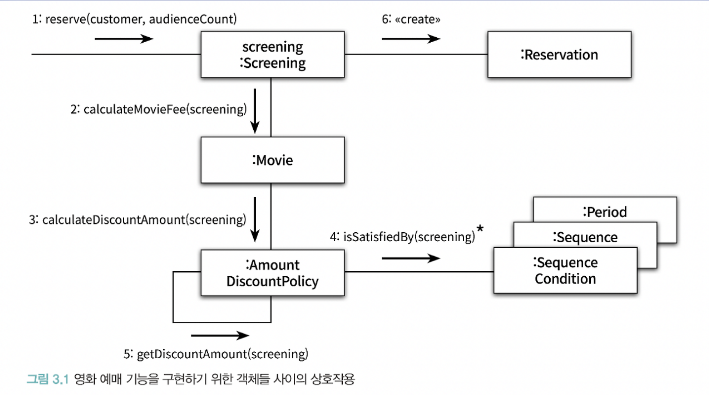

객체지향 패러다임 관점에서 핵심은 역할(role), 책임(responsibility), 협력(collaboration) 이다.

- 애플리케이션의 기능을 구현하기 위해 어떤 협력이 필요하고 협력을 위해 어떤 역할과 책임이 필요한지를 고민하지 않은 채 너무 이른 시기에 구현에 초점을 맞추는 것은 변경하기 어렵고 유연하지 못한 코드를 낳는 원인이 된다.

## 📖 3.1 협력

### 🔖 3.1.1 영화 예매 시스템 돌아보기

- 객체지향 원칙을 따르는 애플리케이션의 제어 흐름은 어떤 하나의 객체에 의해 통제되지 않고 다양한 객체들 사이에 균형 있게 분배되는 것이 일반적
- 객체들이 애플리케이션의 기능을 구현하기 위해 수행하는 상호작용을 협력 이라고 한다.
- 객체가 협력에 참여하기 위해 수행하는 로직은 책임 이라고 한다.
- 객체들이 협력 안에서 수행하는 책임들이 모여 객체가 수행하는 역할 을 구성한다.

### 🔖 3.1.2 협력

- 협력은 객체지향의 세계에서 기능을 구현할 수 있는 유일한 방법
- 메시지 전송 은 객체 사이의 협력을 위해 사용할 수 있는 유일한 커뮤니케이션 수단
  - 객체는 다른 객체의 상세한 내부 구현에 직접 접근할 수 없기 때문에 오직 메시지 전송을 통해서만 자신의 요청을 전달할 수 있다.

> 협력이란 어떤 객체가 다른 객체에게 무엇인가를 요청하는 것이다. 한 객체는 어떤 것이 필요할 때 다른 객체에게 전적으로 위임하거나 서로 협력한다. 즉, 두 객체가 상호작용을 통해 더 큰 책임을 수행하는 것이다. 객체 사이의 협력을 설계할 때는 객체를 서로 분리된 인스턴스가 아닌 협력하는 파트너로 인식해야 한다.

- 메시지를 수신한 객체는 메서드 를 실행해 요청에 응답한다.
  - 메시지를 어떻게 처리할지는 메시지를 수신한 객체가 직접 결정
- 객체를 자율적으로 만드는 가장 기본적인 방법은 내부 구현을 캡슐화 하는 것

### 🔖 3.1.3 협력이 설계를 위한 문맥을 결정한다

- 협력은 객체가 필요한 이유와 객체가 수행하는 행동의 동기를 제공
- Movie 객체가 *상영* 이라는 행동이 아닌 요금을 계산하는 행동을 하는 이유는 영화를 예매하기 위한 협력에 참여하고 있고, 그 안에서 요금을 계산하는 책임을 지고 있기 때문
- 객체가 참여하는 협력이 객체를 구성하는 행동과 상태 모두를 결정
- 협력은 객체를 설계하는 데 필요한 일종의 문맥(context) 을 제공

## 📖 3.2 책임

### 🔖 3.2.1 책임이란 무엇인가

협력에 참여하기 위해 객체가 수행하는 행동을 책임 이라고 부른다.

- 객체에 의해 정의되는 응집도 있는 행위의 집합
- 객체가 유지해야 하는 정보와 수행할 수 있는 행동에 대해 개략적으로 서술한 문장
- 객체가 무엇을 알고 있는가 와 무엇을 할 수 있는가 로 구성
  - 객체의 책임을 '하는 것(doing)' 과 '아는 것(knowing)' 의 두 가지 범주로 나누어 세분화
- 협력 안에서 객체에게 할당한 책임이 외부의 인터페이스와 내부의 속성을 결정

하는 것(doing)

- 객체를 생성하거나 계산을 수행하는 등의 스스로 하는 것
- 다른 객체의 행동을 시작시키는 것
- 다른 객체의 활동을 제어하고 조절하는 것

아는 것(knowing)

- 사적인 정보에 관해 아는 것
- 관련된 객체에 관해 아는 것
- 자신이 유도하거나 계산할 수 있는 것에 관해 아는 것

❗️ 책임은 메시지보다 추상적이고 개념적으로도 더 크다.

### 🔖 3.2.2 책임 할당

INFORMATION EXPERT(정보 전문가) 패턴

- 책임을 수행하는 데 필요한 정보를 가장 잘 알고 있는 전문가에게 그 책임을 할당
- 책임을 할당한다는 것은 메시지의 이름을 결정하는 것과 같다.
- 정보 전문가에게 책임을 할당하는 것만으로도 상태와 행동을 함께 가지는 자율적인 객체를 만들 가능성이 높아진다.
- 응집도와 결합도의 관점에서 정보 전문가가 아닌 다른 객체에게 책임을 할당하는 것이 더 적절한 경우도 있다.

### 🔖 3.2.3 책임 주도 설계(Responsibility-Driven Design, RDD)

책임을 찾고 책임을 수행할 적절한 객체를 찾아 책임을 할당하는 방식으로 협력을 설계하는 방법

책임 주도 설계 방법의 과정

- 시스템이 사용자에게 제공해야 하는 기능인 시스템 책임을 파악
- 시스템 책임을 더 작은 책임으로 분할
- 분할된 책임을 수행할 수 있는 적절한 객체 또는 역할을 찾아 책임을 할당
- 객체가 책임을 수행하는 도중 다른 객체의 도움이 필요한 경우 이를 책임질 적절한 객체 또는 역할을 찾는다.
- 해당 객체 또는 역할에게 책임을 할당함으로써 두 객체가 협력하게 한다.

### 🔖 3.2.4 메시지가 객체를 결정한다

❓ 객체가 메시지를 선택하는 것이 아니라 메시지가 객체를 선택하게 해야하는 이유

1. 객체가 최소한의 인터페이스를 가질 수 있게 된다.
    - 필요한 메시지가 식별될 때까지 객체의 퍼블릭 인터페이스에 어떤 것도 추가하지 않기 때문

2. 객체는 충분히 추상적인 인터페이스를 가질 수 있게 된다.
    - 객체의 인터페이스는 무엇을 하는지는 표현해야 하지만 어떻게 수행하는지를 노출해서는 안된다.
    - 메시지는 외부의 객체가 요청하는 무언가를 의미하기 때문에 메시지를 먼저 식별하면 무엇을 수행할지에 초점을 맞추는 인터페이스를 얻을 수 있다.

### 🔖 3.2.5 행동이 상태를 결정한다

객체를 객체답게 만드는 것은 객체의 상태가 아니라 객체가 다른 객체에게 제공하는 행동이다.

❓ 객체의 행동이 아니라 상태에 초점을 맞춘다면

- 객체의 내부 구현이 객체의 퍼블릭 인터페이스에 노출되도록 만들기 때문에 캡슐화를 저해
- 데이터 주도 설계(Data-Driven Design)

협력 관계 속에서 다른 객체에게 무엇을 제공해야 하고 다른 객체로부터 무엇을 얻어야 하는지를 고민해야만 훌륭한 책임을 수확할 수 있다.

객체가 가질 수 있는 상태는 행동을 결정하고 나서야 비로소 결정할 수 있다.

> 협력이 객체의 행동을 결정하고 행동이 상태를 결정한다. 그리고 그 행동이 바로 객체의 책임이 된다.

## 📖 3.3 역할

### 🔖 3.3.1 역할과 협력

- 객체가 어떤 특정한 협력 안에서 수행하는 책임의 집합을 **역할** 이라고 한다.
- 실제로 협력을 모델링할 때는 특정한 객체가 아니라 역할에게 책임을 할당한다고 생각하는 게 좋다.

### 🔖 3.3.2 유연하고 재사용 가능한 협력

역할을 통해 유연하고 재사용 가능한 협력을 얻을 수 있다.

- 책임을 수행하는 역할을 기반으로 여러 개의 협력을 하나로 통합할 수 있다.
- 역할을 이용하면 불필요한 중복 코드를 제거할 수 있다.
- 협력이 더 유연해진다.

책임과 역할을 중심으로 협력을 바라보는 것이 바로 변경과 확장이 용이한 유연한 설계로 나아가는 첫걸음이다.

### 🔖 3.3.3 객체 대 역할

역할은 객체가 참여할 수 있는 일종의 슬롯이다.

레베카 워프스브록은 역할에 대해서 아래와 같이 말했다.

> 협력에 참여하는 후보가 여러 종류의 객체에 의해 수행될 필요가 있다면 그 후보는 역할이 되지만 단지 한 종류의 협력에 참여할 필요가 있다면 후보는 객체가 된다.

또한, 트리그비 린스카우는 역할에 대해서 아래와 같이 말했다.

> 협력 안에서 각자의 위치를 가지는 객체들에 대한 별칭이다. 협력은 역할들의 상호작용으로 구성되고, 협력을 구성하기 위해 역할에 적합한 객체가 선택되며, 객체는 클래스를 이용해 구현되고 생성된다.

설계 초반에는 적절한 책임과 협력의 큰 그림을 탐색하는 것이 가장 중요한 목표여야 하고 역할과 객체를 명확하게 구분하는 것은 그렇게 중요하지 않을 수 있다.

- 다양한 객체들이 협력에 참여한다는 것이 확실하다면 역할로 시작하라.
- 정확한 결정을 내리기 어려운 상황이라면 구체적인 객체로 시작하라.

역할 모델링

- 역할을 설계의 중심 개념으로 봄

중요한 것은 협력을 구체적인 객체가 아니라 추상적인 역할의 관점에서 설계하면 협력이 유연하고 재사용 가능해진다. 즉, 역할의 가장 큰 장점은 설계의 구성 요소를 추상화할 수 있다는 것이다.

### 🔖 3.3.4 역할과 추상화

역할은 공통의 책임을 바탕으로 객체의 종류를 숨기기 때문에 이런 관점에서 역할을 객체의 추상화로 볼 수 있다. 따라서 추상화가 가지는 두 가지 장점은 협력의 관점에서 역할에도 동일하게 적용될 수 있다.

추상화의 첫 번째 장점은 세부 사항에 억눌리지 않고도 상위 수준의 정책을 쉽고 간단하게 표현할 수 있다는 것

- 역할은 협력을 추상화한다.

추상화의 두 번째 장점은 설계를 유연하게 만들 수 있다는 것이다.

- 역할은 다양한 환경에서 다양한 객체들을 수용할 수 있게 해주므로 협력을 유연하게 만든다.

### 🔖 3.3.5 배우와 배역

- 배역은 연극 배우가 특정 연극에서 연기하는 역할이다.
- 배역은 연극이 상영되는 동안에만 존재하는 일시적인 개념이다.
- 연극이 끝나면 연극 배우는 배역이라는 역할을 벗어 버리고 원래의 연극 배우로 돌아온다.
- 서로 다른 배우들이 동일한 배역을 연기할 수 있다.
- 하나의 배우가 다양한 연극 안에서 서로 다른 배역을 연기할 수 있다.

연극 안에서 배역을 연기하는 배우 ↔️ 협력 안에서 역할을 수행하는 객체

- 협력이라는 문맥 안에서 역할은 특정한 협력에 참여해서 책임을 수행하는 객체의 일부
- 역할은 모양이나 구조에 의해 정의될 수 없으며 오직 시스템의 문맥 안에서 무엇을 하는지에 의해서만 정의될 수 있다.
- 역할은 객체의 페르소나
- 역할은 특정한 객체의 종류를 캡슐화하기 때문에 동일한 역할을 수행하고 계약을 준수하는 대체 가능한 객체들은 다형적이다.
