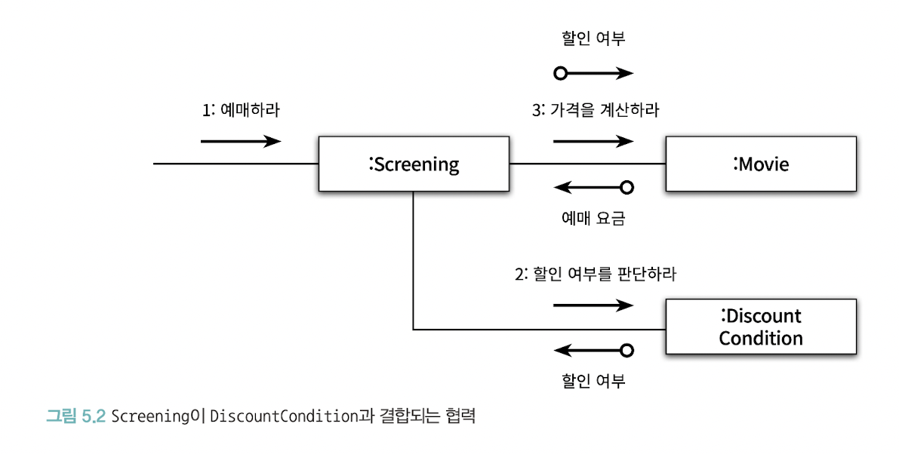
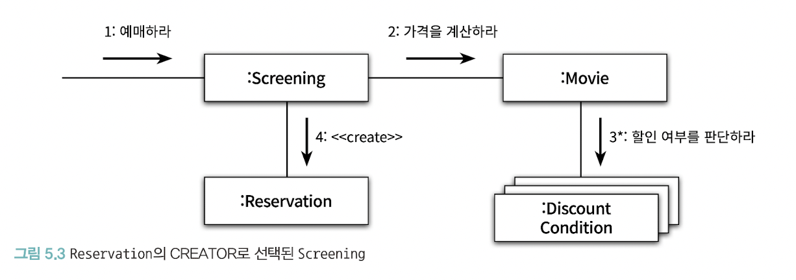

책임 할당 과정은 일종의 trade-off 활동이다.

## 📖 5.1 책임 주도 설계를 향해

- 데이터보다 행동을 먼저 결정하라
- 협력이라는 문맥 안에서 책임을 결정하라

### 🔖 5.1.1 데이터보다 행동을 먼저 결정하라

- 객체에게 중요한 것은 데이터가 아니라 외부에 제공하는 행동
  - 객체가 수행하는 행동이란 곧 책임을 의미
- 데이터는 객체가 책임을 수행하는 데 필요한 재료를 제공
  - 너무 이른 시기에 데이터에 초점을 맞추면 객체의 캡슐화가 약화
- 책임 중심 설계의 순서
  - 첫 번째로 `이 객체가 수행해야 하는 책임은 무엇인가`를 결정
  - 두 번째로 `이 책임을 수행하는 데 필요한 데이터는 무엇인가`를 결정
  - 책임을 먼저 결정한 후에 객체의 상태를 결정해야 한다.

### 🔖 5.1.2 협력이라는 문맥 안에서 책임을 결정하라

- 객체에게 할당된 책임의 품질은 협력에 적합한 정도로 결정
- 책임은 객체의 입장이 아니라 객체가 참여하는 협력에 적합
- 협력에 적합한 책임이란 메시지 수신자가 아니라 메시지 전송자에게 적합한 책임을 의미
  - 협력을 시작한 주체는 메시지 전송자이기 때문
- 메시지를 결정한 후에 객체를 선택해야 한다.

> "메시지를 전송해야 하는데 누구에게 전송해야 하지?"라고 질문하는 것이 메시지 기반 설계로 향하는 첫걸음이다.
>
> 객체를 가지고 있기 때문에 메시지를 보내는 것이 아니다. 메시지를 전송하기 때문에 객체를 갖게 된 것이다.

결론적으로 책임 중심의 설계에서는 협력이라는 문맥 안에서 객체가 수행할 책임에 초점을 맞춘다.

### 🔖 5.1.3 책임 주도 설계

- 시스템이 사용자에게 제공해야 하는 기능인 시스템 책임을 파악
- 시스템 책임을 더 작은 책임으로 분할
- 분할된 책임을 수행할 수 있는 적절한 객체 또는 역할을 찾아 책임을 할당
- 객체가 책임을 수행하는 도중 다른 객체의 도움이 필요한 경우 이를 책임질 적절한 객체 또는 역할을 찾는다.
- 해당 객체 또는 역할에게 책임을 할당함으로써 두 객체가 협력하게 한다.

책임 주도 설계의 핵심은 책임을 결정한 후에 책임을 수행할 객체를 결정하는 것이다. 그리고 협력에 참여하는 객체들의 책임이 어느 정도 정리될 때까지는 객체의 내부 상태에 대해 관심을 가지지 않는 것이다.

## 📖 5.2 책임 할당을 위한 GRASP 패턴

General Responsibility Assignment Software Pattern

- 객체에게 책임을 할당할 때 지침으로 삼을 수 있는 원칙들의 집합을 패턴 형식으로 정리

### 🔖 5.2.1 도메인 개념에서 출발하기

- 어떤 책임을 할당해야 할 때 가장 먼저 고민해야 하는 유력한 후보는 바로 도메인 개념이다.
- 올바른 도메인 모델이란 존재하지 않는다
  - 실용적이면서 유용한 모델이 답이다. 즉, 구현에 도움이 되는 모델

### 🔖 5.2.2 정보 전문가에게 책임을 할당해라

information expert pattern

- 책임을 수행할 정보를 알고 있는 객체에게 책임을 할당하는 것
- 정보와 행동을 최대한 가까운 곳에 위치시키기 때문에 캡슐화 유지 가능
- 객체란 상태와 행동을 함께 가지는 단위라는 객체지향의 가장 기본적인 원리를 책임 할당의 관점에서 표현

### 🔖 5.2.3 높은 응집도와 낮은 결합도

`Movie` 대신 `Screening`이 직접 `DiscountCondition`과 협력하게 하는 것은 어떨까?



- 기능적인 측면에서만 놓고 보면 이전의 설계와 동일
- 응집도와 결합도는 다르다!
- low coupling pattern의 관점에서는 `Movie`가 `DiscountCondition`과 협력하는 것이 더 나은 설계 대안
- high cohesion pattern의 관점에서는 `Movie`가 `DiscountCondition`과 협력하는 것이 더 나은 설계 대안

### 🔖 5.2.4 창조자에게 객체 생성 책임을 할당하라

Creator pattern

- 객체 A를 생성해야 할 때 아래 조건을 최대한 많이 만족하는 B에게 객체 생성 책임을 할당하라
  - B가 A 객체를 포함하거나 참조한다.
  - B가 A 객체를 기록한다.
  - B가 A 객체를 긴밀하게 사용한다.
  - B가 A 객체를 초기화하는 데 필요한 데이터를 가지고 있다.(이 경우 B는 A에 대한 정보 전문가다.)



- `Screening`을 `Reservation`의 Creator로 선택

## 📖 5.3 구현을 통한 검증

```java
/**
 * 상영 Class
 */
public class Screening {

    /**
     * 영화
     */
    private Movie movie;

    /**
     * 순번
     */
    @Getter
    private int sequence;

    /**
     * 상영 시작 시간
     */
    @Getter
    private LocalDateTime whenScreened;

    public Reservation reserve(Customer customer, int audienceCount) {
        return new Reservation(customer, this, calculateFee(audienceCount), audienceCount);
    }
    
    private Money calculateFee(int audienceCount) {
        return movie.calculateMovieFee(this).times(audienceCount);
    }
}
```

- `Movie`에 전송하는 메시지의 시그니처를 `calculateMovieFee`으로 선언
- 메시지가 변경되지 않는 한 `Movie`에 어떤 수정을 가하더라도 `Screening`에는 영향을 미치지 않는다.

```java
public class Movie {

    /**
     * 제목
     */
    private String title;

    /**
     * 상영 시간
     */
    private Duration runningTime;

    /**
     * 기본 요금
     */
    private Money fee;

    /**
     * 할인 조건 목록
     */
    private List<DiscountCondition> discountConditions;

    /**
     * 할인 정책의 종류를 결정하는 변수
     */
    private MovieType movieType;

    /**
     * 할인 금액
     */
    private Money discountAmount;

    /**
     * 할인 비율
     */
    private double discountPercent;

    public Money calculateMovieFee(Screening screening) {
        if (isDiscountable(screening)) {
            return fee.minus(calculateDiscountAmount());
        }
        
        return fee;
    }
    
    private boolean isDiscountable(Screening screening) {
        return discountConditions.stream().anyMatch(condition -> condition.isSatisfiedBy(screening));
    }
    
    private Money calculateDiscountAmount() {
        switch (movieType) {
            case AMOUNT_DISCOUNT -> {
                return calculateAmountDiscountAmount();
            }
            case PERCENT_DISCOUNT -> {
                return calculatePercentDiscountAmount();
            }
            case NONE_DISCOUNT -> {
                return calculateNoneDiscountAmount();
            }
        }
        
        throw new IllegalArgumentException();
    }
    
    private Money calculateAmountDiscountAmount() {
        return discountAmount;
    }
    
    private Money calculatePercentDiscountAmount() {
        return fee.times(discountPercent);
    }
    
    private Money calculateNoneDiscountAmount() {
        return Money.ZERO;
    }
}
```

```java
/**
 * 할인 조건 class
 */
public class DiscountCondition {

    /**
     * 할인 조건 타입
     */
    private DiscountConditionType type;

    /**
     * 상영 순번
     */
    private int sequence;

    /**
     * 요일
     */
    private DayOfWeek dayOfWeek;

    /**
     * 시작 시간
     */
    private LocalTime startTime;

    /**
     * 종료 시간
     */
    private LocalTime endTime;

    public boolean isSatisfiedBy(Screening screening) {
        if (type == DiscountConditionType.PERIOD) {
            return isSatisfiedByPeriod(screening);
        }
        
        return isSatisfiedBySequence(screening);
    }

    private boolean isSatisfiedByPeriod(Screening screening) {
        return dayOfWeek.equals(screening.getWhenScreened().getDayOfWeek()) &&
                !startTime.isAfter(screening.getWhenScreened().toLocalTime()) &&
                !endTime.isBefore(screening.getWhenScreened().toLocalTime());
    }

    private boolean isSatisfiedBySequence(Screening screening) {
        return sequence == screening.getSequence();
    }
}
```

```java
public enum DiscountConditionType {

    /**
     * 순번 조건
     */
    SEQUENCE,

    /**
     * 기간 조건
     */
    PERIOD
}
```

- 위 코드들은 몇 가지 문제점이 숨어있다.

### 🔖 5.3.1 DiscountCondition 개선하기

가장 큰 문제점은 변경에 취약한 클래스를 포함하고 있다는 것

- 변경에 취약한 클래스: 코드를 수정해야 하는 이유를 하나 이상 가지는 클래스

`DiscountCondition`은 세 가지 이유로 변경될 수 있다.

- 새로운 할인 조건 추가
- 순번 조건을 판단하는 로직 변경
- 기간 조건을 판단하는 로직이 변경되는 경우

즉, 변경의 이유에 따라 클래스를 분리해야 한다.

코드를 통해 변경의 이유를 파악할 수 있는 방법

1. **인스턴스 변수가 초기화되는 시점**을 살펴보는 것

   - 응집도가 높은 클래스는 인스턴스를 생성할 때 모든 속성을 함께 초기화
   - 함께 초기화되는 속성을 기준으로 코드를 분리해야 한다.

2. **메서드들이 인스턴스 변수를 사용하는 방식**을 살펴보는 것

   - 응집도가 높은 클래스는 모든 메서드가 객체의 모든 속성을 사용
   - 속성 그룹과 해당 그룹에 접근하는 메서드 그룹을 기준으로 코드를 분리해야 한다.

### 🔖 5.3.2 타입 분리하기

`DiscountCondition`의 가장 큰 문제는 순번 조건과 기간 조건이라는 두 개의 독립적인 타입이 하나의 클래스 안에 공존하고 있다는 점이다.

```java
@AllArgsConstructor
public class PeriodCondition {

    /**
     * 요일
     */
    private DayOfWeek dayOfWeek;

    /**
     * 시작 시간
     */
    private LocalTime startTime;

    /**
     * 종료 시간
     */
    private LocalTime endTime;

    public boolean isSatisfiedBy(Screening screening) {
        return dayOfWeek.equals(screening.getWhenScreened().getDayOfWeek()) &&
                !startTime.isAfter(screening.getWhenScreened().toLocalTime()) &&
                !endTime.isBefore(screening.getWhenScreened().toLocalTime());
    }
}
```

```java
@AllArgsConstructor
public class SequenceCondition {

    /**
     * 상영 순번
     */
    private int sequence;

    private boolean isSatisfiedBy(Screening screening) {
        return sequence == screening.getSequence();
    }
}
```

- Movie 또한 수정되어야 하는 문제가 나타났다!

```java
public class Movie {

    /**
     * 기간 할인 조건 목록
     */
    private List<PeriodCondition> periodConditions;

    /**
     * 순번 할인 조건 목록
     */
    private List<SequenceCondition> sequenceConditions;

    private boolean isDiscountable(Screening screening) {
        return checkPeriodConditions(screening) || checkSequenceConditions(screening);
    }
    
    private boolean checkPeriodConditions(Screening screening) {
        return periodConditions.stream().anyMatch(condition -> condition.isSatisfiedBy(screening));
    }

    private boolean checkSequenceConditions(Screening screening) {
        return sequenceConditions.stream().anyMatch(condition -> condition.isSatisfiedBy(screening));
    }
}
```

- `Movie`가 `PeriodCondition`과 `SequenceCondition` 양쪽 모두에게 결합된다. 즉, 결합도가 높아졌다.
- 새로운 할인 조건을 추가하기가 어려워졌다.

### 🔖 5.3.3 다형성을 통해 분리하기

- 역할을 사용하면 객체의 구체적인 타입을 추상화할 수 있다.
- 역할을 대체할 클래스들 사이에서 구현을 공유해야 할 필요가 있다면 추상클래스 사용
- 구현을 공유할 필요 없이 역할을 대체하는 객체들의 책임만 정의하고 싶다면 인터페이스 사용

```java
public interface DiscountCondition {

    boolean isSatisfiedBy(Screening screening);
}
```

```java
public class PeriodCondition implements DiscountCondition {...}
public class SequenceCondition implements DiscountCondition {...}
```

```java
public class Movie {

    /**
     * 할인 조건 목록
     */
    private List<DiscountCondition> discountConditions;

    public Money calculateMovieFee(Screening screening) {
        if (isDiscountable(screening)) {
            return fee.minus(calculateDiscountAmount());
        }

        return fee;
    }

    private boolean isDiscountable(Screening screening) {
        return discountConditions.stream().anyMatch(condition -> condition.isSatisfiedBy(screening));
    }
}
```

- 객체의 타입에 따라 변하는 행동이 있다면 타입을 분리하고 변화하는 행동을 각 타입의 책임으로 할당한다.
  - polymorphism pattern (다형성 패턴)

### 🔖 5.3.4 변경으로부터 보호하기

protected variations pattern (변경 보호 패턴)

- 변경을 캡슐화하도록 책임을 할당하는 것
- 변하는 것이 무엇인지 고려하고 변하는 개념을 캡슐화하라

### 🔖 5.3.5 Movie 클래스 개선하기

```java
public abstract class Movie {

    /**
     * 제목
     */
    private final String title;

    /**
     * 상영 시간
     */
    private final Duration runningTime;

    /**
     * 기본 요금
     */
    private final Money fee;

    /**
     * 할인 조건 목록
     */
    private final List<DiscountCondition> discountConditions;

    protected Movie(String title, Duration runningTime, Money fee, DiscountCondition... discountConditions) {
        this.title = title;
        this.runningTime = runningTime;
        this.fee = fee;
        this.discountConditions = Arrays.asList(discountConditions);
    }

    public Money calculateMovieFee(Screening screening) {
        if (isDiscountable(screening)) {
            return fee.minus(calculateDiscountAmount());
        }

        return fee;
    }

    private boolean isDiscountable(Screening screening) {
        return discountConditions.stream().anyMatch(condition -> condition.isSatisfiedBy(screening));
    }

    protected abstract Money calculateDiscountAmount();
}
```

- `calculateDiscountAmount`를 추상 메서드로 선언

```java
public class AmountDiscountMovie extends Movie {

    private final Money discountAmount;

    public AmountDiscountMovie(String title, Duration runningTime, Money fee, Money discountAmount, DiscountCondition... discountConditions) {
        super(title, runningTime, fee, discountConditions);
        this.discountAmount = discountAmount;
    }

    @Override
    protected Money calculateDiscountAmount() {
        return discountAmount;
    }
}
```

```java
public class PercentDiscountMovie extends Movie {

    private final double percent;

    public PercentDiscountMovie(String title, Duration runningTime, Money fee, double percent, DiscountCondition... discountConditions) {
        super(title, runningTime, fee, discountConditions);
        this.percent = percent;
    }

    @Override
    protected Money calculateDiscountAmount() {
        return getFee().times(percent);
    }
}
```

```java
    @Getter(AccessLevel.PROTECTED)
    private final Money fee;
```

- 이 메서드는 서브클래스에서만 사용해야 하므로 가시성을 protected로 제한해야 한다.

```java
public class NoneDiscountMovie extends Movie {

    public NoneDiscountMovie(String title, Duration runningTime, Money fee, double percent, DiscountCondition... discountConditions) {
        super(title, runningTime, fee, discountConditions);
    }

    @Override
    protected Money calculateDiscountAmount() {
        return Money.ZERO;
    }
}
```

> 도메인의 구조가 코드의 구조를 이끈다

- 변경 역시 도메인 모델의 일부
- 도메인 모델에는 도메인 안에서 변하는 개념과 이들 사이의 관계가 투영돼 있어야 한다.
- 구현을 가이드할 수 있는 도메인 모델을 선택하라.

### 🔖 5.3.6 변경과 유연성

개발자로서 변경에 대비할 수 있는 두 가지 방법

1. 코드를 이해하고 수정하기 쉽도록 최대한 단순하게 설계
2. 코드를 수정하지 않고도 변경을 수용할 수 있도록 코드를 더 유연하게 만드는 것

   - 유사한 변경이 반복적으로 발생하고 있다면 복잡성이 상승하더라도 유연성을 추가하는 두 번째 방법이 더 좋다.

- 요소들 사이의 의존성의 정도가 유연성의 정도를 결정
- 유연성의 정도에 따라 결합도를 조절할 수 있는 능력은 객체지향 개발자가 갖춰야 하는 중요한 기술 중 하나

## 📖 5.4 책임 주도 설계의 대안

이해하기 쉽고 수정하기 쉬운 소프트웨어로 개선하기 위해 겉으로 보이는 동작은 바꾸지 않은 채 내부 구조를 변경하는 것을 리팩터링(Refactoring)이라고 부른다.

### 🔖 5.4.1 메서드 응집도

```java
/**
 * 영화 예매 절차 구현 Class
 */
public class ReservationAgency {

    public Reservation reserve(Screening screening, Customer customer, int audienceCount) {
        Movie movie = screening.getMovie();

        boolean discountable = false;
        for (DiscountCondition condition : movie.getDiscountConditions()) {
            if (condition.getType() == DiscountConditionType.PERIOD) {
                discountable = screening.getWhenScreened().getDayOfWeek().equals(condition.getDayOfWeek()) &&
                        !condition.getStartTime().isAfter(screening.getWhenScreened().toLocalTime()) &&
                        !condition.getEndTime().isBefore(screening.getWhenScreened().toLocalTime());
            } else {
                discountable = condition.getSequence() == screening.getSequence();
            }

            if (discountable) {
                break;
            }
        }

        Money fee;
        if (discountable) {
            Money discountAmount = Money.ZERO;
            switch (movie.getMovieType()) {
                case AMOUNT_DISCOUNT -> discountAmount = movie.getDiscountAmount();
                case PERCENT_DISCOUNT -> discountAmount = movie.getFee().times(movie.getDiscountPercent());
                case NONE_DISCOUNT -> discountAmount = Money.ZERO;
            }

            fee = movie.getFee().minus(discountAmount);
        } else {
            fee = movie.getFee();
        }

        return new Reservation(customer, screening, fee, audienceCount);
    }
}
```

- reserve 메서드는 길이가 너무 길고 이해하기도 어렵다.
- 긴 메서드는 다양한 측면에서 코드의 유지보수에 부정적인 영향을 미친다.
  - 어떤 일을 수행하는지 한눈에 파악하기 어렵기 때문에 코드를 전체적으로 이해하는 데 너무 많은 시간이 걸린다.
  - 하나의 메서드 안에서 너무 많은 작업을 처리하기 때문에 변경이 필요할 때 수정해야 할 부분을 찾기 어렵다.
  - 메서드 내부의 일부 로직만 수정하더라도 메서드의 나머지 부분에서 버그가 발생할 확률이 높다.
  - 로직의 일부만 재사용하는 것이 불가능하다.
  - 코드를 재사용하는 유일한 방법은 원하는 코드를 복사해서 분여넣는 것뿐이므로 코드 중복을 초래하기 쉽다.
- 이런 메서드를 **몬스터 메서드** 라고 부르기도 한다.
- 작은 메서드들로 조합된 메서드는 마치 주석들을 나열한 것처럼 보이기 때문에 코드를 이해하기도 쉽다.
  - 이름을 잘 지어야 한다!
  - 이름의 길이보다는 의미가 중요하다!

```java
public class ReservationAgency {

    public Reservation reserve(Screening screening, Customer customer, int audienceCount) {
        boolean discountable = checkDiscountable(screening);
        Money fee = calculateFee(screening, discountable, audienceCount);
        return createReservation(screening, customer, audienceCount, fee);
    }

    private boolean checkDiscountable(Screening screening) {
        return screening.getMovie().getDiscountConditions().stream().anyMatch(condition -> isDiscountable(condition, screening));
    }

    private boolean isDiscountable(DiscountCondition condition, Screening screening) {
        if (condition.getType() == DiscountConditionType.PERIOD) {
            return isSatisfiedByPeriod(condition, screening);
        }
        return isSatisfiedBySequence(condition, screening);
    }

    private boolean isSatisfiedByPeriod(DiscountCondition condition, Screening screening) {
        return screening.getWhenScreened().getDayOfWeek().equals(condition.getDayOfWeek()) &&
                !condition.getStartTime().isAfter(screening.getWhenScreened().toLocalTime()) &&
                !condition.getEndTime().isBefore(screening.getWhenScreened().toLocalTime());
    }

    private boolean isSatisfiedBySequence(DiscountCondition condition, Screening screening) {
        return condition.getSequence() == screening.getSequence();
    }

    private Money calculateFee(Screening screening, boolean discountable, int audienceCount) {
        if (discountable) {
            return screening.getMovie().getFee()
                    .minus(calculateDiscountedFee(screening.getMovie()))
                    .times(audienceCount);
        }
        
        return screening.getMovie().getFee().times(audienceCount);
    }

    private Money calculateDiscountedFee(Movie movie) {
        switch (movie.getMovieType()) {
            case AMOUNT_DISCOUNT -> {
                return calculateAmountDiscountedFee(movie);
            }
            case PERCENT_DISCOUNT -> {
                return calculatePercentDiscountedFee(movie);
            }
            case NONE_DISCOUNT -> {
                return calculateNoneDiscountedFee();
            }
        }

        throw new IllegalArgumentException();
    }

    private Money calculateAmountDiscountedFee(Movie movie) {
        return movie.getDiscountAmount();
    }

    private Money calculatePercentDiscountedFee(Movie movie) {
        return movie.getFee().times(movie.getDiscountPercent());
    }

    private Money calculateNoneDiscountedFee() {
        return Money.ZERO;
    }
    
    private Reservation createReservation(Screening screening, Customer customer, int audienceCount, Money fee) {
        return new Reservation(customer, screening, fee, audienceCount);
    }
}
```

- 수정 후 에는 메서드가 어떤 일을 하는지를 한눈에 알아볼 수 있다.
- 하지만 여전히 응집도는 낮다.

### 🔖 5.4.2 객체를 자율적으로 만들자

```java
public class DiscountCondition {

    /**
     * 할인 조건 타입
     */
    private DiscountConditionType type;

    /**
     * 상영 순번
     */
    private int sequence;

    /**
     * 요일
     */
    private DayOfWeek dayOfWeek;

    /**
     * 시작 시간
     */
    private LocalTime startTime;

    /**
     * 종료 시간
     */
    private LocalTime endTime;

    public boolean isDiscountable(Screening screening) {
        if (type == DiscountConditionType.PERIOD) {
            return isSatisfiedByPeriod(screening);
        }
        return isSatisfiedBySequence(screening);
    }

    private boolean isSatisfiedByPeriod(Screening screening) {
        return screening.getWhenScreened().getDayOfWeek().equals(dayOfWeek) &&
                !startTime.isAfter(screening.getWhenScreened().toLocalTime()) &&
                !endTime.isBefore(screening.getWhenScreened().toLocalTime());
    }

    private boolean isSatisfiedBySequence(Screening screening) {
        return sequence == screening.getSequence();
    }
}
```

- `DiscountCondition`으로 이동하고, 접근제어자를 변경했다.

```java
    private boolean checkDiscountable(Screening screening) {
        return screening.getMovie().getDiscountConditions().stream().anyMatch(condition -> condition.isDiscountable(screening));
    }
```

- 결국 데이터 중심으로 구현한 후 이를 리팩터링하더라도 유사한 결과를 얻을 수 있다.
- 처음부터 책임 주도 설계 방법을 따르는 것보다 동작하는 코드를 작성한 후에 리팩터링하는 것이 더 훌륭한 결과물을 낳을 수도 잇다.
