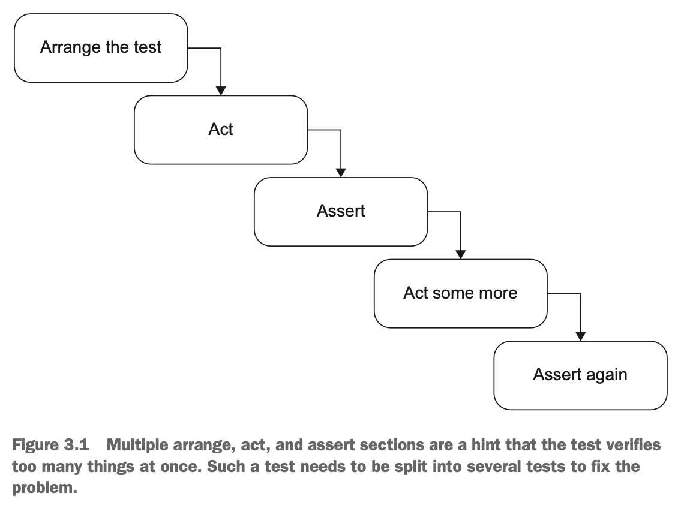

## 📖 3.1 단위 테스트를 구성하는 방법

___

### 🔖 3.1.1 AAA 패턴 사용

준비(Arrange), 실행(act), 검증(assert) 세 부분으로 나눌 수 있다.

- 모든 테스트가 단순하고 균일한 구조를 갖는 데 도움이 된다.
- 일관성이 가장 큰 장점 중 하나다.
  - 유지보수비용 ⬇️

1. 준비
    - 테스트 대상 시스템(SUT)과 해당 의존성을 원하는 상태로 만든다.
    - Given
2. 실행
    - SUT에서 메서드를 호출하고 준비된 의존성을 전달하며 출력 값을 캡처한다.
    - When
3. 검증
    - 결과 검증
    - Then

### 🔖 3.1.2 여러 개의 준비, 실행, 검증 구절 피하기

더 이상 단위 테스트가 아니라 통합 테스트이다. 이러한 테스트 구조는 피하는 것이 좋다.

### 🔖 3.1.3 테스트 내 if문 피하기

분기가 없는 간단한 일련의 단계여야 한다.

- if 문은 테스트가 한 번에 너무 많은 것을 검증한다는 표시다.

### 🔖 3.1.4 각 구절은 얼마나 커야 하는가?

#### 1. 준비 구절

- 가장 크다.
- 과하게 크면 테스트 클래스 내 비공개 메서드 or 별도의 팩토리 클래스로 도출

#### 2. 실행 구절

- 코드 한줄‼️
- 불변 위반을 대비해 항상 encapsulation을 항상 지키자.

### 🔖 3.1.5 검증 구절에는 검증문이 얼마나 있어야 하는가

#### 3. 검증 구절

- 테스트당 하나의 검증을 갖자.
- 너무 커지는 것은 경계해야 한다.

### 🔖 3.1.6 종료 단계는 어떤가

#### 4. 종료구절

- 일반적으로 별도의 메서드로 도출돼, 클래스 내 모든 테스트에서 재사용된다.
  - ex) DB Connection close 등
- 통합 테스트의 영역

### 🔖 3.1.7 테스트 대상 시스템 구별하기

SUT는 호출하고자 하는 동작에 대한 진입점을 제공한다.

- 진입점은 오직 하나만 존재할 수 있다.
- 진입점은 동작을 수행할 하나의 클래스다.
- 테스트 내 sut 명명을 sut로 하자.

### 🔖 3.1.8 준비, 실행, 검증 주석 제거하기

- empty line으로 구절을 구분하자.
- 통합테스트에는 복잡한 설정을 포함하는 경우가 많으므로 구절 주석을 유지해도 좋다.

## 📖 3.2 xUnit 테스트 프레임워크 살펴보기

___

[xUnit Github](https://github.com/xunit/xunit)

## 📖 3.3 테스트 간 테스트 픽스처 재사용

___

### 테스트픽스처

- 테스트 실행 대상 객체
- SUT로 전달되는 인수

테스트 픽스처를 재사용하는 **첫 번째 방법**은 테스트 생성자에서 픽스처를 초기화하는 것이다.

- 결합도 ⬆️
- 가독성 ⬇️

### 🔖 3.3.1 테스트 간의 높은 결합도는 안티 패턴이다

- 테스트 클래스에 공유 상태를 두지 말아야 한다.

### 🔖 3.3.2 테스트 가독성을 떨어뜨리는 생성자 사용

- 준비로직이 별로 없더라도 테스트 메서드로 바로 옮기는 것이 좋다.

### 🔖 3.3.3 더 나은 테스트 픽스처 재사용법

테스트 픽스처를 재사용하는 **두 번째 방법**은 private factory method를 두는 것이다.

- 가독성이 매우 좋다.
- 다만, DB Connection 등 거의 모든 테스트에 사용되는 픽스처는 base class를 둬서 클래스 생성자에서 초기화시키는 것이 합리적이다.

## 📖 3.4 단위 테스트 명명법

___

1. 가장 유명하지만 별로인 방법
    - `[테스트 대상 메서드]_[시나리오]_[예상결과]`
        - 테스트 대상 메서드: 테스트 중인 메서드의 이름
        - 시나리오: 메서드를 테스트하는 조건
        - 예상 결과: 현재 시나리오에서 테스트 대상 메서드에 기대하는 것
    - 이 방법은 동작 대신 구현 세부 사항에 집중하게끔 만든다.
2. 훨씬 더 효과적인 방법
    - 간단하고 쉬운 영어구문 사용

### 🔖 3.4.1 단위 테스트 명명 지침

1. 엄격한 명명 정책을 따르지 않는다.
2. 문제 도메인에 익숙한 비개발자들에게 시나리오를 설명하는 것처럼 테스트 이름을 짓자.
3. 단어를 underscore(_) 표시로 구분한다.(가독성⬆️)
    - 테스트 클래스 이름을 지을 때는 사용하지 않아도 된다.

### 🔖 3.4.2 지침에 따른 테스트 이름 변경

1. 테스트 이름에 SUT의 메서드 이름을 포함하지 말라

## 📖 3.5 매개변수화된 테스트 리팩터링하기

___
동작이 충분히 복잡하면, 이를 설명하는 데 테스트 수가 급격히 증가할 수 있으며 관리하기 어려워질 수 있다. 테스트 코드의 양과 그 코드의 가독성은 서로 상충된다.

- 매개변수만으로 테스트 케이스를 판단할 수 있다면 긍정적인 테스트 케이스와 부정적인 테스트 케이스 모두 하나의 메서드로 두는 것이 좋다.
- 동작이 너무 복잡하면 매개변수화된 테스트를 조금도 사용하지 말라.
긍정적인 테스트 케이스, 부정적인 테스트 케이스 모두 각각 고유의 테스트 메서드로 나타내라.

## 📖 3.6 검증문 라이브러리를 사용한 테스트 가독성 향상

___
주요이점: 검증문을 재구성해 가독성을 높이는 방법
