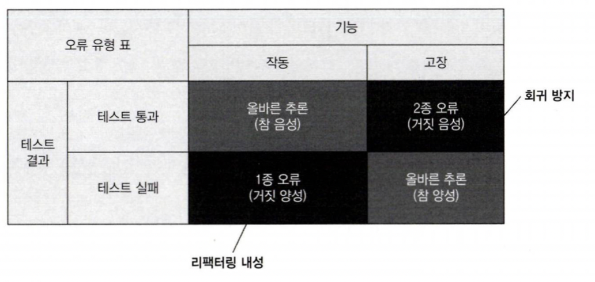
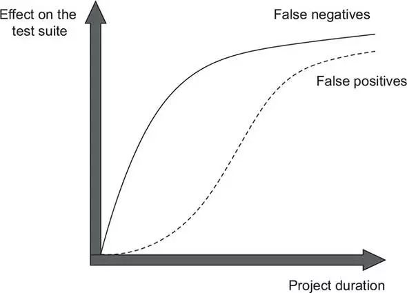

## 📖 4.1 좋은 단위테스트의 4대 요소 자세히 살펴보기

___

1. 회귀 방지
2. 리택터링 내성
3. 빠른 피드백
4. 유지 보수성

### 🔖 4.1.1 첫번째 요소: 회귀 방지

회귀는 소프트웨어 버그다.

- 코드를 수정한 후(일반적으로 새 기능을 출시한 후) 기능이 의도한 대로 작동하지 않는 경우

프로그램의 코드베이스가 커질수록 잠재적인 버그에 더 많이 노출된다. 그렇기 때문에 회귀에 대해 *효과적인 보호*를 개발하는 것이 중요하다.
이러한 보호가 없다면 프로젝트가 오랫동안 성장할 수 없으며 점점 더 많은 버그가 쌓인다.

회귀 방지 지표에 대한 테스트 점수가 얼마나 잘나오는지 평가하려면 다음 사항을 고려해야 한다.

- 테스트 중에 실행되는 코드의 양
  - 일반적으로 실행되는 코드가 많을수록 테스트에서 회귀가 나타날 가능성⬆️
- 코드 복잡도
- 코드의 도메인 유의성

복잡한 비지니스 로직을 나타내는 코드가 보일러플레이트 코드보다 훨씬 더 중요하다. 비지니스에 중요한 기능에서 발생한 버그가 가장 큰 피해를 입기 때문
> 회귀 방지 지표를 극대화하려면 테스트가 가능한 한 많은 코드를 실행하는 것을 목표로 해야 함.

### 🔖 4.1.2 두번째 요소: 리팩터링 내성

#### 거짓 양성(false positive)

- 리팩터링하고 나서 실제 기능은 잘 동작하지만 테스트가 실패하는 경우

리팩터링 내성 지표에서 테스트 점수가 얼마나 잘 나오는지 평가하려면 얼마나 많이 거짓 양성이 발생하는지 살펴봐야 한다.

- 적을수록 좋음.

거짓 양성은 아래와 같은 이유로 좋지 않음.

- 테스트가 타당한 이유 없이 실패하면, 코드 문제에 대응하는 능력과 의지가 희석된다.
- 테스트 스위트에 대한 신뢰⬇️, 허위 경보로 인식이 나빠진다.

### 🔖 4.1.3 무엇이 거짓 양성의 원인인가?

테스트에서 발생하는 거짓 양성의 수는 테스트 구성 방식과 직접적인 관련이 있다.
테스트와 테스트 대상 시스템(SUT)의 구현 세부 사항이 많이 결합할수록 허위 경보가 더 많이 생긴다.

**거짓 양성이 생길 가능성을 줄이는 방법은 해당 구현 세부 사항에서 테스트를 분리하는 것뿐이다.**

테스트는 최종 사용자의 관점에서 SUT를 검증해야하고, 최종 사용자에게 의미 있는 결과만 확인해야 한다.

### 🔖 4.1.4 구현 세부 사항 대신 최종 결과를 목표로 하기

테스트를 깨지지 않게 하고 리팩터링 내성을 높이는 방법은 SUT의 구현 세부 사항과 테스트 간의 결합도를 낮추는 것 뿐이다.

- 즉, 코드의 내부 작업과 테스트 사이를 가능한 한 멀리 떨어뜨리고 최종 결과를 목표로 하는 것이다.

## 📖 4.2 첫 번째 특성과 두 번째 특성 간의 본질적인 관계

프로젝트가 시작된 직후에는 회귀 방지를 훌륭히 갖추는 것이 중요한 데 반해, 리팩터링 내성은 바로 필요하지 않다.

### 🔖 4.2.1 테스트 정확도 극대화

- 회귀방지는 거짓 음성의 수를 최소화하는 데 도움이 된다.
- 리팩터링 내성은 거짓 양성의 수를 최소화하는 데 도움이 된다.

`테스트 정확도 = 신호(발견된 버그 수) / 소음(허위 경보 발생 수)`

테스트 정확도를 향상시키는 방법은 신호⬆️ or 소음⬇️

### 🔖 4.2.2 거짓 양성과 거짓 음성의 중요성: 역학 관계

위와 같이 거짓 양성은 초기에는 중요하지 않지만 추후, 중요해진다.
따라서, 후반까지 가는 중대형 프로젝트에서 작업하면 거짓 양성과 거짓 음성에 대해 똑같이 주의를 기울여야 한다.

## 📖 4.3 세 번째 요소와 네 번째 요소: 빠른 피드백과 유지 보수성

빠른 피드백

- 테스트 속도가 빠를수록 테스트 스위트에서 더 많은 테스트를 수행할 수 있고 더 자주 실행할 수 있다.

유지 보수성

- 테스트가 얼마나 이해하기 어려운가
  - 코드 라인이 적을수록 읽기 쉽다.
  - 테스트 코드를 *일급 시민*으로 취급하라
- 테스트가 얼마나 실행하기 어려운가
  - 외부 종속성⬇️

## 📖 4.4 이상적인 테스트를 찾아서

___

1. 회귀 방지
2. 리택터링 내성
3. 빠른 피드백
4. 유지 보수성

위 4가지 특성을 곱하면 테스트의 가치가 결정된다.

- 즉, 어떤 특성이라도 0이되면 테스트의 가치는 0이다.

테스트를 포함한 모든 코드는 책임이다. 최소한으로 필요한 가치로 임계치를 상당히 높게 설정하고 이 임계치를 충족하는 테스트만 테스트 스위트에 남겨라.

### 🔖 4.4.1 이상적인 테스트를 만들 수 있는가?

회귀 방지, 리팩터링 내성, 빠르 피드백은 상호 배타적이므로 모두 최대로 하는 것은 불가능하다.
즉, 모두 최대의 가치를 지니는 이상적인 테스트를 만드는 것은 불가능하다.

### 🔖 4.4.2 극단적인 사례 1: 엔드 투 엔드 테스트

E2E 테스트의 장점

- 많은 코드를 테스트하므로 회귀 방지⬆️
- 거짓 양성에 면역이 돼 리팩터링 내성⬆️

E2E 테스트의 단점

- 느린속도로 인한 느린 피드백

### 🔖 4.4.3 극단적인 사례 2: 간단한 테스트

간단한 테스트의 장점

- 매우 빠르게 실행되어 빠른 피드백
- 거짓 양성 가능성이 상당히 낮아 리팩터링 내성⬆️

간단한 테스트의 단점

- 기반 코드에 실수할 여지가 많지 않기 때문에 회귀 방지⬇️

### 🔖 4.4.4 극단적인 사례 3: 깨지기 쉬운 테스트

깨지기 쉬운 테스트의 장점

- 빠르게 실행되어 빠른 피드백
- 회귀 방지⬆️

깨지기 쉬운 테스트의 단점

- 리팩터링 내성⬇️

### 🔖 4.4.5 이상적인 테스트를 찾아서: 결론

완벽한 점수를 가진 이상적인 테스트를 만드는 것은 불가능 하다.
유지 보수성은 엔드 투 엔드 테스트를 제외하고 처음 세 가지 특성과 상관관계가 없다.

결론은 리팩터링 내성을 최대한 많이 갖는 것을 목표로 하되, 회귀방지와 빠른 피드백 사이의 선택으로 귀결된다.

- 리팩터링 내성은 중간단계가 없기 때문이다!
- 회귀 방지와, 빠른 피드백은 중간단계가 있다!

## 📖 4.5 대중적인 테스트 자동화 개념 살펴보기

___

### 🔖 4.5.1 테스트 피라미드 분해

테스트 피라미드: 테스트 유형 간의 일정한 비율

- 층의 너비는 테스트 스위트에서 해당 테스트가 얼마나 보편적인지를 나타낸다.
- 층의 높이는 이러한 테스트가 최종 사용자의 동작을 얼마나 유사하게 흉내내는지 나타낸다.
- 피라미드 상단의 테스트는 회귀 방지에 유리하고, 하단은 실행 속도를 강조한다.

### 🔖 4.5.2 블랙박스 테스트와 화이트박스 테스트 간의 선택

#### 블랙박스 테스트

- 시스템의 내부 구조를 몰라도 시스템의 기능을 검사
- 어플리케이션이 어떻게 해야 하는지가 아니라 무엇을 해야 하는지를 중심으로 구축

#### 화이트박스 테스트

- 어플리케이션의 내부 작업을 검증하는 방식
- 테스트가 소스 코드에서 파생됨

||회귀 방지|리팩터링 내성
|:---:|:---:|:---:
|화이트박스 테스트|좋음|나쁨
|블랙박스 테스트|나쁨|좋음

테스트를 작성할 때는 블랙박스 테스트가 바람직(리팩터링 내성⬆️)하지만, 분석할 때는 화이트박스 방법을 사용할 수 있다.
