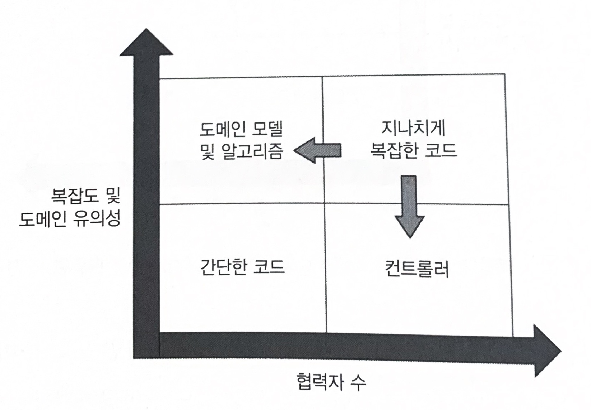
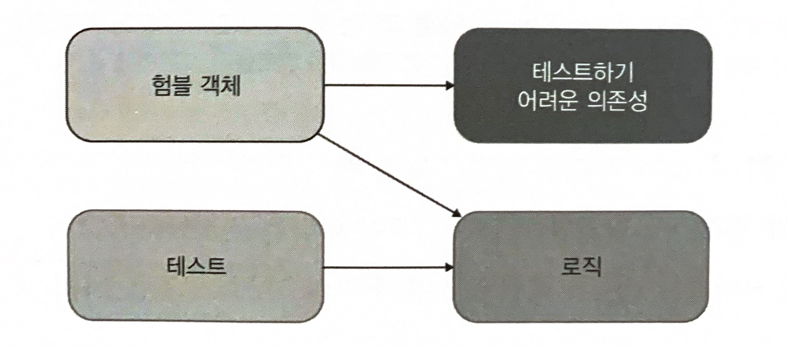
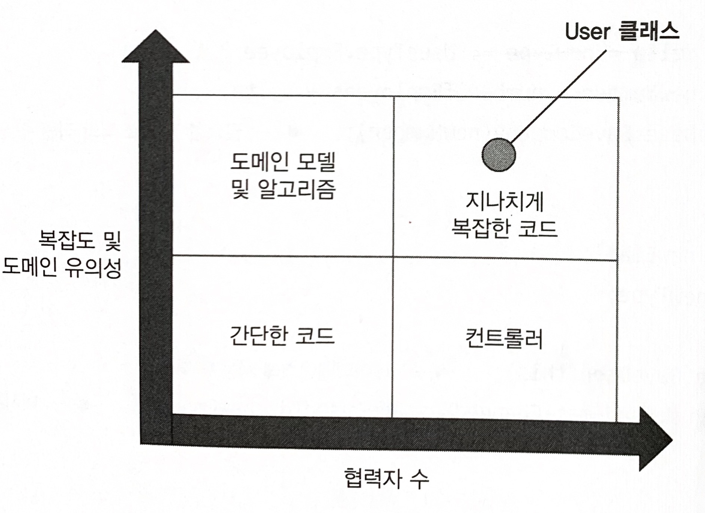
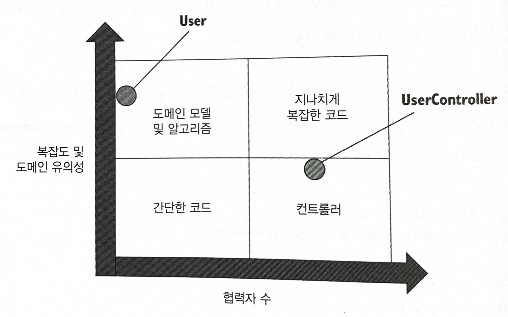
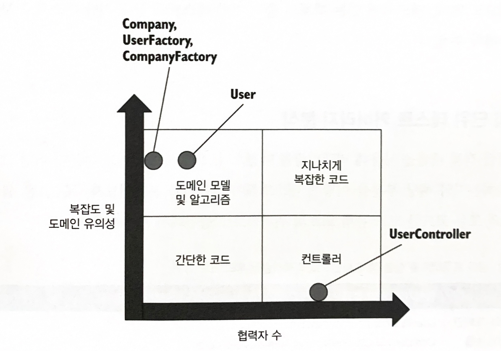
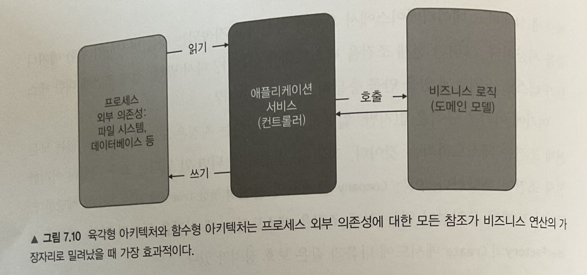
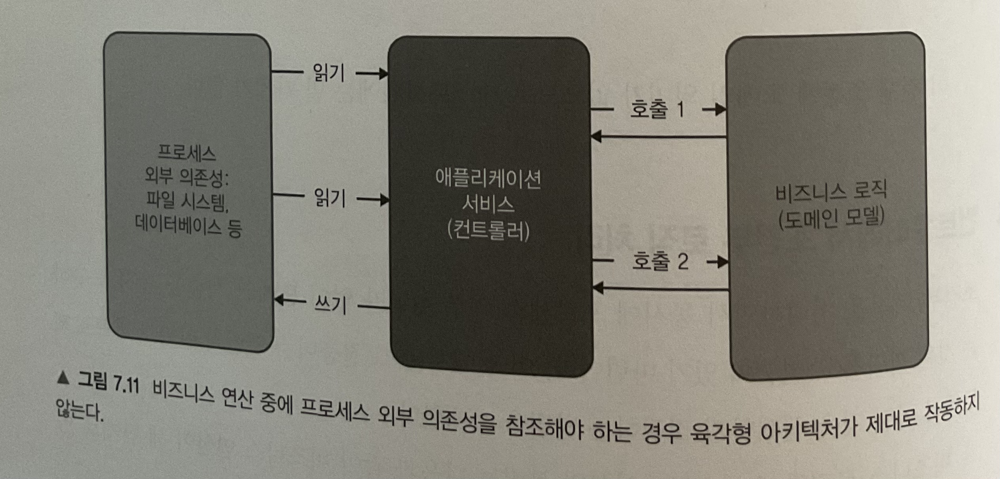

## 📖 7.1 리팩터링할 코드 식별하기

___

기반 코드를 리팩터링하지 않고서는 테스트 스위트를 크게 개선할 수 없다.
리팩터링 방향을 설명하고자 코드를 네 가지 유형으로 분류하는 방법을 소개한다.

### 🔖 7.1.1 코드의 네 가지 유형

모든 제품 코드는 2차원으로 분류할 수 있다.

- 복잡도 또는 도메인 유의성
  - 코드 복잡도(code complexity)
    - 코드 내의 의사 결정(분기) 지점 수로 정의
    - 분기가 많을수록 복잡도 ⬆️
  - 도메인 유의성(domain significance)
    - 코드가 프로젝트의 문제 도메인에 얼마나 의미 있는지를 나타냄.
    - 도메인 계층의 모든 코드는 최종 사용자의 목표와 직접적인 연관성이 있으므로 도메인 유의성 ⬆️
  - **회귀방지**가 뛰어나기 때문에 복잡한 코드와 도메인 유의성을 갖는 코드가 단위 테스트에서 가장 이롭다.
- 협력자 수
  - 협력자: 가변 의존성, 프로세스 외부 의존성
  - 협력자가 많은 코드는 테스트 비용 ⬆️
  - 유지보수비용때문에 도메인 모델이라면 프로세스 외부 협력자를 사용하면 안된다.

코드 복잡도, 도메인 유의성 협력자 수의 조합의 네 가지 코드 유형



- 도메인 모델과 알고리즘
- 간단한 코드
- 컨트롤러
- 지나치게 복잡한 코드

> 코드가 더 중요해지거나 복잡해질수록 협력자는 더 적어야 한다.
> 좋지 않은 테스트를 작성하는 것보다는 테스트를 전혀 작성하지 않는 편이 낫다.

### 🔖 7.1.2 험블 객체 패턴을 사용해 지나치게 복잡한 코드 분할하기



- 테스트 대상 코드의 로직을 테스트하려면, 테스트가 가능한 부분을 추출해야 한다. 결과적으로 코드는 테스트 가능한 부분을 둘러싼 얇은 험블 래퍼(humble wrapper)가 된다.
- 육각형 아키텍처와 함수형 아키텍처 모두 험블 객체 패턴 구현
  - 육각형 아키텍처는 business 로직과 프로세스 외부 의존성과의 통신 분리
  - 함수형 아키텍처는 더 나아가 프로세스 외부 의존성뿐만 아니라 모든 협력자와의 커뮤니케이션에서 비지니스 로직을 분리한다. 따라서, 함수형 코어에는 아무런 협력자도 없다. 함수형 코어의 모든 의존성은 불변
- 험블 객체 패턴을 보는 또 다른 방법은 단일 책임 원칙을 지키는 것
  - 이 패턴을 적용하면 비지니스 로직을 거의 모든 것과 분리할 수 있다.

## 📖 7.2 가치 있는 단위 테스트를 위한 리팩터링하기

___

### 🔖 7.2.1 고객 관리 시스템 소개

아래 세 가지 비지니스 규칙이 있다.

- 사용자 이메일이 회사 도메인에 속한 경우 해당 사용자는 직원으로 표시된다. 그렇기 않으면 고객으로 간주한다.
- 시스템은 회사의 직원 수를 추적해야 한다. 사용자 유형이 직원에서 고객으로, 또는 그 반대로 변경되면 이 숫자도 변경해야 한다.
- 이메일이 변경되면 시스템은 메시지 버스로 메시지를 보내 외부 시스템에 알려야 한다.

User 클래스에는 네 개의 의존성이 있으며, 그중 두개는 명시적(userId와 newEmail 인수)이고 나머지 두개(프로세스 외부 협력자: Database와 MessageBus)는 암시적이다.

- 도메인 유의성이 높은 코드에서 프로세스 외부 협력자는 사용하면 안 된다.



#### 활성 레코드 패턴(Active Record)

- 도메인 클래스가 스스로 데이터베이스를 검색하고, 다시 지정하는 방식
- 단순 프로젝트나 단기 프로젝트에서는 잘 작동하지만 코드베이스가 커지면 확장하지 못하는 경우가 많다. business 로직과 프로세스 외부 의존성과의 통신 사이에 분리가 없기 때문

### 🔖 7.2.2 1단계: 암시적 의존성을 명시적으로 만들기

도메인 모델이 프로세스 외부 의존성을 직접 참조하든 인터페이스를 통해 참조하든 상관없다. 의존성은 여전히 프로세스 외부에 있기 때문이다.

- 테스트 유지비⬆️
- 목을 DB 의존성에 사용하면 테스트 취약성 ⬆️

도메인 모델은 직접적으로든 간접적으로든(인터페이스를 통해) 프로세스 외부 협력자에게 의존하지 않는 것이 훨씬 더 깔끔하다. 도메인 모델은 외부 시스템과의 통신을 책임지지 않아야 한다.

### 🔖 7.2.3 2단계: 애플리케이션 서비스 계층 도입



도메인 모델이 외부 시스템과 직접 통신하는 문제를 극복하려면 다른 클래스인 험블 컨트롤러(육각형 아키텍처 분류상 애플리케이션 서비스)로 책임을 옮겨야 한다.

일반적으로 도메인 클래스는 다른 도메인 클래스나 단순 값과 같은 프로세스 내부 의존성에만 의존해야 한다.

### 🔖 7.2.4 3단계: 애플리케이션 서비스 복잡도 낮추기

UserController가 컨트롤러 사분면에 확실히 있으려면 재구성 로직을 추출해야 한다.

- ORM을 사용해 데이터베이스를 도메인 모델에 매핑하면, 재구성 로직을 옮기기에 적절한 위치가 될 수 있다.
- ORM을 사용하지 않거나 사용할 수 없으면, 도메인 모델에 원시 데이터베이스 데이터로 도메인 클래스를 인스턴스화하는 팩토리 클래스를 작성하라.

### 🔖 7.2.5 4단계: 새 Company 클래스 소개



모든 복잡도가 팩토리로 이동했기 때문에 UserController는 확실히 컨트롤러 사분면에 속한다. 이 클래스가 담당하는 것은 모든 협력자를 한데 모으는 것이다.

함수형 아키텍처와 비슷한 점

- 함수형 코어도 마찬가지로 프로세스 외부 의존성과 통신하지 않는다.

함수형 아키텍처와 차이점

- 부작용 처리
  - 함수형 코어는 어떠한 부작용도 일으키지 않는다.
  - CRM 도메인 모델은 부작용을 일으키지만, 이러한 모든 부작용은 변경된 사용자 이메일과 직원 수의 형태로 도메인 모델 내부에 남아있다.
  - 부작용이 메모리에 남아있다는 사실로 인해 테스트 용이성이 크게 향상된다. 테스트가 프로세스 외부 의존성을 검사할 필요가 없고 통신 기반 테스트에 의존할 필요도 없다. 메모리에 있는 객체의 출력 기반 테스트와 상태 기반 테스트로 모든 검증을 수행할 수 있다.

## 📖 7.3 최적의 단위 테스트 커버리지 분석

___

샘플 프로젝트를 험블 객체 패턴으로 리팩터링한 후의 코드 유형

||협력자가 거의 없음|협력자가 많음|
|------|----------------|----------|
|복잡도와 도메인 유의성이 높음|User의 ChangeEmail(newEmail, company), Company의 ChangeNumberOfEmployees(delta)와 IsEmailCorporate(email), CompanyFactory의 Create(data)||
|복잡도와 도메인 유의성이 낮음|User와 Company의 생성자|UserController의 ChangeEmail(userId, newMail)|

### 🔖 7.3.1 도메인 계층과 유틸리티 코드 테스트하기

위 표의 좌측 상단 테스트 메서드는 비용 편익 측면에서 최상의 결과를 가져다준다.

- 코드의 복잡도나 도메인 유의성이 높으면 회귀 방지가 뛰어나고 협력자가 거의 없어 유지비도 가장 낮다.

### 🔖 7.3.2 나머지 세 사분면에 대한 코드 테스트하기

1. 복잡도가 낮고 협력자가 거의 없는 코드(User와 Company의 생성자)는 단순해서 노력을 들일 필요가 없으며, 테스트는 회귀 방지가 떨어질 것이다.
2. 복잡도가 높고 협력자가 많은 모든 코드를 리팩터링으로 제거(우측 상단 사분면)했으므로 테스트할 것이 없다.
3. UserController(우측 하단 사분면)에 대해서는 7.3.3에서 살펴본다.

### 🔖 7.3.3 전제 조건을 테스트해야 하는가?

전제 조건에 대한 테스트가 테스트 스위트에 있을 만큼 충분히 가치가 있는가?

- 일반적으로 권장하는 지침은 도메인 유의성이 있는 모든 전제 조건을 테스트하는 것
  - 도메인 유의성이 없는 전제조건은 테스트하지 마라

## 📖 7.4 컨트롤러에서 조건부 로직 처리

___

비즈니스 로직과 오케스트레이션의 분리는 비즈니스 연산이 세 단계로 있을 때 가장 효과적이다.

- 저장소에서 데이터 검색
- 비즈니스 로직 실행
- 데이터를 다시 저장소에 저장(아래 그림 참고)



의사 결정 프로세스의 중간 결과를 기반으로 프로세스 외부 의존성에서 추가 데이터를 조회해야 할 수도 있다.(아래 그림 참고)



이러한 상황에서는 세 가지 방법이 있다.

- 외부에 대한 모든 읽기와 쓰기를 비즈니스 연산 가장자리로 밀어내기
  - 컨트롤러 단순성⬆️
  - 도메인 모델 테스트 유의성⬆️
  - 성능⬇️
- 도메인 모델에 프로세스 외부 의존성 주입하기
  - 성능 유지
  - 컨트롤러 단순성⬆️
  - 도메인 모델 테스트 유의성⬇️
- 의사 결정 프로세스 단계를 더 세분화하기
  - 성능⬆️
  - 도메인 모델 테스트 유의성⬆️
  - 컨트롤러 단순성⬇️

위와 같이 모든 특성을 충족하는 해법은 없다. 따라서 세 가지 중 두 가지를 선택해야 한다.

성능과 유지보수성은 실제 프로젝트에서 매우 중요하므로, 의사 결정 프로세스 단계를 더 세분화하기를 선택하는 것이 좋다. 다만, 컨트롤러가 너무 복잡해지기 때문에 이 문제를 완화해야 한다.

### 🔖 7.4.1 CanExecute/Execute 패턴 사용

컨트롤러가 복잡도가 커지는 것을 완화하는 첫 번째 방법은 CanExecute/Execute 패턴을 사용하는 것이다.

- 비즈니스 로직이 도메인 모델에서 컨트롤러로 유출되는 것을 방지하는 것

이메일은 사용자가 확인할 때까지만 변경할 수 있다. 사용자가 확인한 후에 이메일을 변경하려고 하면 오류메시지가 표시된다.

확인할 위치를 정하는 데 두 가지 옵션이 있다.
첫 번째로, User의 ChangeEmail Method에 넣을 수 있다.

```java
public String changeEmail(String newEmail, Company company) {

    if (isEmailConfirmed) {
        return "Can't change a confirmed email";
    }

    /* 메서드의 나머지 부분 */
}
```

- 이 메서드의 툴력에 따라 컨트롤러는 오류를 반환하거나 필요한 모든 부작용을 낼 수 있다.
- 컨트롤러가 의사결정을 하지 않지만, 성능 저하
  - 무조건 DB에서 검색
- 모든 외부 읽기와 쓰기를 비즈니스 연산 끝으로 밀어냄

두 번재로, `isEmailConfirmed`를 User에서 Controller로 옮기는 것이다.

```java
    // 컨트롤러
    if (user.isEmailConfirmed) {
        return "Can't change a confirmed email";
    }
}
```

- 성능은 그대로 유지
  - 무조건 DB 조회하지 않음
- 의사 결정 프로세스는 두 부분으로 나뉨
  - 이메일 변경 진행 여부(Controller에서 수행)
  - 변경 시 해야 할 일(User에서 수행)
- 도메인 모델의 **캡슐화가 떨어져서** 비즈니스 로직과 오케스트레이션 간의 분리가 방해되고 지나치게 복잡한 위험 영역에 더 가까워짐
  - 이를 방지하려면 CanExecute/Execute 패턴을 따르게끔 수정해야 함

```java
public String canChangeEmail() {

    if (emailConfirmed) {
        return "Can't change a confirmed email";
    }
    return null;
}

public void changeEmail(String newEmail, Company company) {

    Preconditions.checkArgument(canChangeEmail() == null);

    /* 메서드의 나머지 부분 */
}
```

- 컨트롤러는 더 이상 이메일 변경 프로세스를 알 필요가 없다.
- `changeEmail`의 전제 조건이 추가돼도 먼저 확인하지 않으면 이메일을 변경할 수 없도록 보장
- 도메인 계층의 모든 결정을 통합할 수 있음

### 🔖 7.4.2 도메인 이벤트를 사용해 도메인 모델 변경 사항 추적

도메인 모델을 현재 상태로 만든 단계를 빼기 어려울 때가 있다. 애플리케이션에서 무슨 일이 일어나는지 외부 시스템에 알려야 하기 때문에 이러한 단계들을 아는 것이 중요할 수도 있다.

도메인 모델에서 중요한 변경 사항을 추적하고 비즈니스 연산이 완료된 후 해당 변경 사항을 프로세스 외부 의존성 호출로 변환

- 도메인 이벤트로 이러한 추적을 구현할 수 있다.

> 도메인 이벤트는 이미 일어난 일들을 나타내기 때문에 항상 과거 시제로 명명

도메인 이벤트는 컨트롤러에서 의사 결정 책임을 제거하고 해당 책임을 도메인 모델에 적용함으로써 외부 시스템과의 통신에 대한 단위 테스트를 간결하게 한다.

## 📖 7.5 결론

> 추상화할 것을 테스트하기보다 추상화를 테스트하는 것이 더 쉽다.
> 즉, 추상화 대상이 되는 실제 구현체(메시지 버스, 데이터베이스, 파일 시스템 등)로 테스트하는 것보다 해당 구현체를 참조하는 추상화된 인터페이스로 테스트하는 것이 더 쉽다.

도메인 이벤트와 CanExecute/Execute 패턴을 사용해 도메인 모델에 모든 의사 결정을 잘 담을 수 있었지만, 항상 그렇게 할 수는 없다.

- 비즈니스 로직 파편화가 불가피한 상황들이 있다.

메서드가 클래스의 식별할 수 있는 동작인지 여부는 클라이언트가 누구인지와 클라이언트의 목표가 무엇인지에 달려 있다. 식별할 수 있는 동작이 되려면 메서드는 다음 두 가지 중 하나를 충족해야 한다.

- 클라이언트 목표 중 하나에 직접적인 연관이 있음
- 외부 애플리케이션에서 볼 수 있는 프로세스 외부 의존성에서 부작용이 발생함

식별할 수 있는 동작과 구현 세부 사항을 양파의 여러 겹으로 생각하자.

- 외부 계층의 관점에서 각 계층을 테스트하고, 해당 계층이 기저 계층과 어떻게 통신하는지는 무시하라.
- 이러한 계층을 하나씩 벗겨가면서 관점을 바꾸게 된다. 이전에 구현 세부 사항이었던 것이 이제는 식별할 수 있는 동작이 되며, 이는 또 다른 테스트로 다루게 된다.
