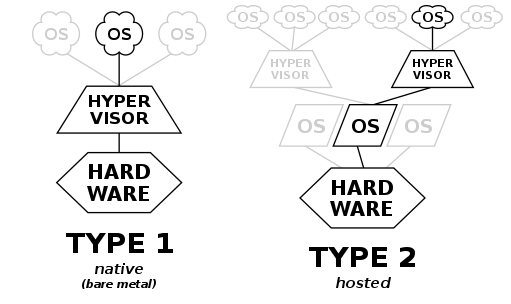

# 02. 도커와 하이퍼바이저
프로젝트를 진행하며 어렴풋이 알고 있었던 도커를 **명확하게** 이해하고자 여름휴가 중에😭 정리해봅니다.

## 1. 하이퍼바이저(Hypervisor)

### 1-1. 가상화 기술이 나오기 전

- 한대의 서버를 하나의 용도로만 사용하고 남는 서버 공간을 그대로 방치함.

- 하나의 서버에 하나의 운영체제, 프로그램만을 운영하여 **안정적**이지만 **비효율적**이었다.

### 1-2. 하이퍼바이저 기반의 가상화 출현

- 논리적으로 공간을 분할하여 Virtual Machines, VM이라는 독립적인 가상 환경의 서버를 이용 가능
- 호스트 시스템에서 다수의 **게스트 OS**를 구동할 수 있게 하는 소프트웨어
- 하드웨어를 가상화하면서 하드웨어와 각각의 VM을 모니터링하는 **중간 관리자**

### 1-3. 하이퍼바이저의 타입

하이퍼

| 네이티브 하이퍼바이저 | 호스트형 하이퍼바이저                                        |
| --------------------- | ------------------------------------------------------------ |
| 하드웨어 직접 제어    | 하드웨어 자원을 게스트OS 위에서 실행                         |
| 호스트OS ❌            | 호스트OS ⭕                                                   |
| 오버헤드 낮음         | 오버헤드 큼                                                  |
| 설치가 어렵다         | 게스트OS 제약이 없고,  구현이 쉬움.  일반적으로 많이 이용함. |

## 2. 도커와 하이퍼바이저

도커는 하이퍼바이저의 기술을 토대로 나온 것이다. 

도커의 컨테이너는 하이퍼바이저의 VM과 같은 역할을 하는데, VM과 달리 게스트OS가 필요하지 않으므로 **더 가볍다.** 

- 공통점: 도커 컨테이너와 VM은 기본 하드웨어에서 격리된 환경 내에 어플리케이션을 배치함.
- 차이점: 격리 수준에 따른 차이가 있다.

자 그렇다면 도커에서 컨테이너를 어떻게 격리를 시킬까?

바로, **리눅스의 Cgroup과 namespaces**를 이용한다.

- **Cgroup**(Control Group): Cgroup은 CPU, Network, Memory 등 하드웨어 자원을 그룹별로 관리 할 수 있는 리눅스의 모듈이다. 하나 또는 복수의 장치를 묶어서 하나의 그룹을 만들 수 있으며 개별 그룹은 시스템에서 설정한 값만큼 하드웨어를 사용할 수 있다.
- **namespaces**: 하나의 시스템에서 프로세스를 격리시킬 수 있는 가상화 기술이다.
  - 즉, 별개의 독립된 공간을 사용하는 것처럼 격리된 환경을 제공하는 경량 프로세스 가상화 기술