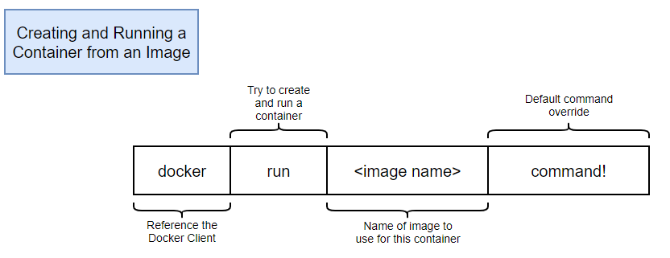
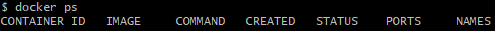

# 03. 도커 명령어(Docker cli)
도커의 기본 명령어들과 의미를 알아보자!


## 1. docker run



- docker: 도커 클라이언트 언급
- run: 컨테이너 생성 및 실행
- 이미지 이름: 컨테이너를 위한 이미지
- command: 해당 명령어를 호출함.(ls... 등)

ex)

```dockerfile
docker run hello-world ls
```

물론 hello-world 이미지는 디렉토리가 없어 제대로 동작하지 않는다!


**작동순서**

1. 도커 클라이언트에 명령어 입력후 도커 서버로 보냄
2. 도커 서버에서 컨테이너를 위한 이미지가 캐싱되어 있는지 확인
   - 없으면 도커 허브에서 다운 받아온다.
   - 있으면 그 이미지로 컨테이너 생성


## 2. docker ps

docker ps 는 **process status** 즉, 현재 실행중인 컨테이너 목록을 불러온다.



- CONTAINER ID: 컨테이너의 고유한 아이디 해쉬값
  - 일부분만 표시
- IMAGE: 컨테이너 생성시 필요한 도커 이미지
- COMMAND: 컨테이너 시작시 실행될 명령어
- CREATED: 컨테이너 생성시간
- STATUS: 컨테이너의 상태
  - Up: 실행중
  - Exited: 종료
  - Pause: 일시정지
- PORTS: 컨테이너가 개방한 포트와 호스트에 연결한 포트
- NAMES: 컨테이너의 고유한 이름


아래는 docker ps의 여러 태그들이다.

```dockerfile
docker ps -a
docker ps -all
```

- 가동중지된 컨테이너 목록 포함해서 반환


```dockerfile
docker ps -s
docker ps -size
```

- 컨테이너 사이즈 표시


```dockerfile
docker ps --format "table~~"
```

- 필요한 열만 추출해서 표시


## 3. docker create & start

`docker run` 명령어는 `docker create`와 `docker start`로 나눌 수 있다.

```dockerfile
docker create hello-world // 컨테이너 생성
docker start hello-world // 컨테이너 실행
```


**-a 태그**

```
docker start -a 컨테이너ID
```

a 태그는 attach의 약어로 실행결과를 표시해준다.


## 4. docker stop & kill 

```dockerfile
docker stop 중지할 컨테이너 아이디/이름
docker kill 중지할 컨테이너 아이디/이름
```

`docker stop`

- SIGTERM signal을 보낸 후, **10초 뒤**에 SIGKILL signal을 보내어 컨테이너를 죽임

`docker kill`

- SIGKILL signal을 보내 컨테이너를 죽임


## 5. docker rm

```dockerfile
docker rm 컨테이너 아이디/이름
```

실행 중인 컨테이너를 삭제하는 명령어다.

- 먼저 중지한 후에 삭제 가능


```
docker -rm 'docker ps -a -q'
```

모든 컨테이너를 삭제한다.


```dockerfile
docker rmi 이미지id
```

이미지를 삭제한다.


```
dorker system prune
```

한번에 컨테이너, 이미지, 네트워크를 삭제한다.

- 실행 중인 컨테이너에는 영향을 끼치지 않음.


## 6. docker exec

```dockerfile
docker exec 컨테이너ID
```

`docker exec`는 **이미 실행 중**인 컨테이너에 명령어를 전달해준다.

```dockerfile
docker exec -it 컨테이너ID sh
```

- `-it` 태그를 적어야 명령어를 실행하고 나서 계속 명령할 수 있다.
- `sh`는 컨테이너를 쉘 환경에서 접근하도록 해준다.
  - ctrl+D로 빠져나올 수 있음


> 참고: [2oneweek님 블로그](https://2oneweek.dev/)

