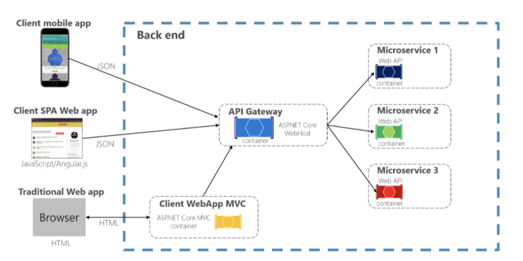

# 04.API Gateway
이전 포스팅에 이어, MSA에서의 `API Gateway` 를 알아보겠습니다. `API Gateway`의 종류에는 `Spring Cloud Gateway` 와 `Spring Cloud zuul` 등이 있지만 그에 따른 차이는 추후 다루겠습니다.

## ☄API Gateway

### 1. 개요

다수의 서비스로 구성된 MicroService 들에서 각 서비스들의 IP와 PORT 번호들에 대한 단일화된 엔드포인트를 제공한다. 그렇다면 API Gateway를 사용해야 하는 이유는 무엇일까?

- 각각의 서비스마다 인증/인가 등 공통된 로직을 구현해야하는 번거로움
- 수많은 API 호출 관리의 필요성

### 2. 장점

- **인증 및 인가**
  - 중복되는 코드들의 공통화
  - 인증: 사용자가 누구인지 확인
  - 인가: 접근 권한 확인

- **Request들의 통합**
  - 여러 서비스들의 Request를 단일 Request로 대체
- **Routing**
  - 적절한 서비스에 라우팅 가능

### 3. 단점

- API Gateway가 병목지점이 되어 성능저하가 있을 수 있음.
  - 유연한 Scale-Out 필요
- API Gateway라는 추가적인 계층이 만들어지는 것이기 때문에, 그만큼 네트워크 `latency`가 증가

> reference
>
> https://docs.microsoft.com/ko-kr/dotnet/architecture/microservices/architect-microservice-container-applications/direct-client-to-microservice-communication-versus-the-api-gateway-pattern
>
> https://velog.io/@tedigom/MSA-%EC%A0%9C%EB%8C%80%EB%A1%9C-%EC%9D%B4%ED%95%B4%ED%95%98%EA%B8%B0-3API-Gateway-nvk2kf0zbj

