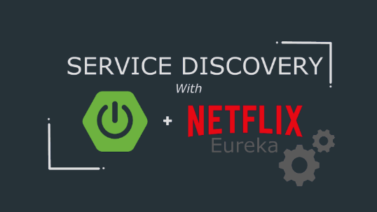

# 03.Service Discovery - Eureka
이전 포스팅에 이어, `Service Discovery` 인 `Eureka`에 대해 다뤄보겠습니다.


## ☄Service Discovery

Micro Service를 구성하는 서비스들의 목록과 위치(IP, Port)가 **동적으로 변하는 환경**(오토 스케일링, 컨테이너 기반의 배포 등) 하에서 서비스들을 효율적으로 관리하기 위함.


## ⛏Eureka

### 1. 개요



- Java로 개발된 Netflix OSS 기반 라이브러리

- Spring Cloud의 Library와 통합되어 Spring Cloud – Eureka로 적용됨


### 2. Server Side Service Discovery

- `Eureka Server`: Eureka Service가 자기 자신을 등록(Service Registration)하는 서버이자 Eureka Client가 가용한 서비스 목록 (`Service Registry`)을 요청하는 서버

#### 2-1. Eureka Server 적용

1. dependency 추가
   - `compile('org.springframework.cloud:spring-cloud-starter-netflix-eureka-server')`
2. Application Main에 `@EnableEurekaServer` 추가
3. application.yml에 설정 추가

```yaml
eureka:
  server: 
	response-cache-update-interval-ms: 1000 #기본값은 30초이나 개발 편의를 위해 1초로 설정 
	enableSelfPreservation: false # 개발모드 
  client: 
  	register-with-eureka: false # 개발모드 
  	fetch-registry: false # 개발모드
  	service-url: defaultZone: http://localhost:8761/eureka  #기본값설정
  instance: 
  	prefer-ip-address: true # 각 서버별 접근을 IP로 하겠다는 의미
```


### 3. Client Side Service Discovery

- `Eureka Client`: 서비스들의 위치 정보를 Eureka Server로부터 fetch하는 서비스

#### 3-1. Eureka Client 적용

1. dependency 추가
   - `compile('org.springframework.cloud:spring-cloud-starter-netflix-eureka-client)`
2. Application Main에 `@EnableEurekaServer` 추가
3. application.yml에 설정 추가

```yaml
spring: 
  application: 
  	name: service-B # 이 이름으로 Eureka에 등록
  	
eureka:
  instance: 
  	prefer-ip-address: true # Eureka Server에 IP로 서비스 등록
  client:
  	service-url:
  	  defaultZone: http://127.0.0.1:8761/eureka  # Eureka Server 주소 입력
```

4. 만약 Ribbon 설정이 있다면 삭제하기
   - Eureka를사용하면 Ribbon 의존성과 설정 항목을 삭제
