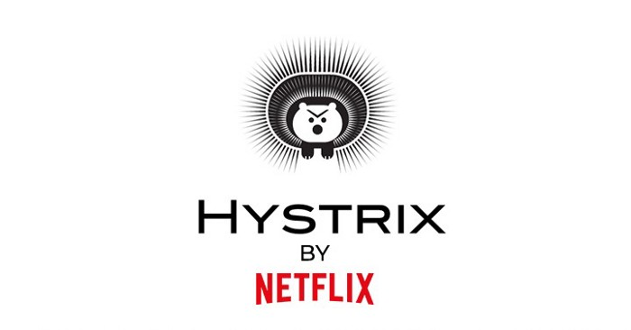

# 01.Circuit Breaker - Hystrix
MSA 전환 프로젝트에서 사용하는 기술을 정확히 알고자 정리해 보았습니다. 첫번째는 서킷브레이커인 Hystrix에 대해 다뤄보겠습니다.


## ☄Circuit Breaker 란

- 서킷브레이커는 전기 기기에서 과부하나 과전류가 들어왔을 때 메인 기기를 보호하기 위해 흔히 쓰는 회로 차단기를 의미함.
- 주가 등락 폭이 심하게 요동칠 때도 시장 과열을 방지하기 위해 서킷 브레이커를 가동해 거래를 중지 시킬때도 사용
- **MSA에서 서킷브레이커는 특정MSA 서비스의 장애로 인해 다른 MSA 서비스에도 장애를 일으킬 수 있는 가능성을 방지**하기 위해 사용


## 🛠Hystrix

### 1. 개요



- MSA(MicroService Architecture)로 가장 유명한 Netflix가 Amazon AWS에서 MSA 시스템을 구축 할 때 개발한 Software 기반 Circuit Breaker
  - Java로 구성되어 동작
- Spring Cloud Hystrix는 Netflex OSS 기반의 Hystrix Library를 Spring Cloud에 적용 할 수 있는 Library로 변형한 것


### 2. 기능

- Container(Tomcat 등)의 **thread를 직접 사용하지 못하게 한다.**
- Queue로 대기열을 사용하지 않고 **빠르게 실패**하게 한다.
- 실패로부터 서비스를 보호하기 위해 **fallback을 제공**한다.
- circuit-breaker 같은 **isolation 기술을 이용하여 외부 장애의 영향을 최소화**
- 실시간에 가까운 모니터링 및 경고 시스템을 통해 실시간 운영 수정을 수행할 수 있도록 한다.
- 네트워크뿐만 아니라 전체 종속성 Client 실행의 장애로부터 보호한다.


### 3. 적용 방법

```java
@HystrixCommand(fallbackMethod = "doFallbackProcess")
public String getOtherServiceMessage(String param) {
        return this.restTemplate.getForObject(url, String.class);
}
...
public String doFallbackProcess() { 
    return “Do your fall back process”; 
}
```


1. spring-cloud-starter-netflix-hystrix 라이브러리 추가
   - gradle e.g.) `implementation('org.springframework.cloud:spring-cloud-starter-netflix-hystrix')`
2. Main Application에 `@EnableCircuitBreaker` annotation 추가
3. Circuit Break를추가하고자 하는 메소드에 `@HystrixCommand` annotation추가


> reference: https://github.com/Netflix/Hystrix/wiki