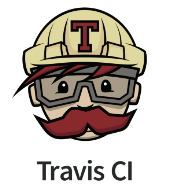
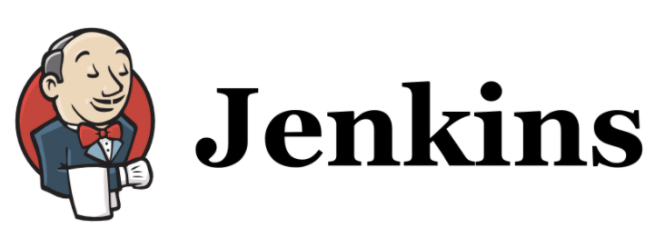

# Travis CI vs Jenkins

## 0. CI의 목표
CI(Continuous Intgretion, 지속적 통합)는 코드를 공유 저장소에 자주 통합하는 것을 기반으로 하는 소프트웨어 개발 방식이다. 그 목표는 개발 과정에서 발생할 수 있는 문제를 보다 빠르고 쉽게 식별하는 것이다.
- 디버깅 소요시간 감소
- 코드 품질 향상

## 1. Travis CI

깃헙 소유의 Ruby 기반 CI 서비스이다.

**장점**
- 클라우드 기반
  - 전용서버 불필요
- 테스트 실행을 위한 도커 지원
- 깃헙과의 쉬운 연동
- YAML 파일을 통한 설정

**단점**
- 유료요금제의 경우 가격이 높음.
- 플러그인 수가 적음
  - 사용자 직접정의🔼

## 2. Jenkins

즉시 실행할 수 있는 독립형 Java 기반 프로그램이고, 가장 많이 사용하는 CI 서비스이다.

**장점**
- 무료
- 수많은 플러그인
- 시스템 전체 제어가능
- 다양한 IDE 지원

**단점**
- 전용서버 필요
  - 관리비용 추가발생