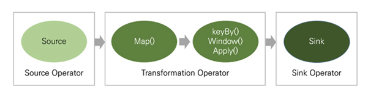

# 아파치 플링크란?
플링크(Flink)는 독일어로 민첩함을 뜻하는 단어로 베를린 TU대학교에서 시작된 아파치 프로젝트이다. Exactly-once의 이벤트 처리를 보장하는 [네이티브 스트림](https://bottleh.netlify.app/devops/%EC%8A%A4%ED%8A%B8%EB%A6%BC%ED%94%84%EB%A1%9C%EC%84%B8%EC%8B%B1%EC%9D%B4%EB%9E%80/)방식으로, 지연 발생이 적고 처리량은 높으며 비교적 사용하기 쉬운 이점이 있다.일괄처리 기능도 제공하지만 스트림 프로세싱을 목적으로 주로 사용한다.

## 플링크의 특징과 차별점

1. **네이티브 스트림(Native Stream)**
   - 플링크는 일괄처리도 지원하지만 스트림 프로세싱을 주목적으로 사용한다. 
   - 경량의 분산 스냅샷을 구현하여 오버헤드는 낮으면서도 Exactly-once의 이벤트 처리를 보장할 수 있다.
2. **인메모리(In-Memory)**
   - 자바 애플리케이션으로 JVM(Java Virtual Machine)에서 실행되지만 **JVM GC(Garbage Collector)에 전적으로 의존하지 않는다.**
   - 대신 커스텀 메모리 매니저를 구현하여 안정적인 메모리 사용량을 유지하면서 성능 향상을 꾀하고 있다.
3. **낮은 지연과 높은 처리량(Throughput)**
   - 경쟁 제품에 비하여 지연과 처리량에서 우수한 성능을 보인다.
   - 플링크는 데이터를 처리하는 과정에서 변경된 부분만 재처리하도록 설정하여 처리 속도를 더 높일 수도 있다.
4. **손쉬운 설정과 사용 그리고 강력한 부가 기능**
   - 스파크는 파라미터 설정이 복잡하지만 플링크는 별다른 설정 없이 사용할 수 있다.
   - 입력되는 이벤트 스트림에 개별로 접근할 수 있고, 강력한 윈도우 연산자를 사용하여 분석을 수행할 수 있다.
   - 고급 분석용 API부터 상세한 제어가 가능해지는 상태 저장 이벤트 기반 애플리케이션 수준까지 계층에 따른 API를 제공한다.

## 플링크의 흐름

플링크에서 데이터는 소스(Source)로 시작해 싱크(Sink)로 끝난다.

- **소스**는 데이터 입력을 정의하는 단계로 원천시스템의 로그, 클릭 이벤트, IoT 장치 등에서 발생하는 데이터를 실시간 이벤트 스트림이나 데이터베이스, 파일, 키-밸류 스토어(Key-Value Store) 따위의 매체로부터 수신한다.
- **트랜스포메이션**은 데이터를 가공하는 작업
  - 스트림 처리 시스템의 기본 개념인 윈도우(Window) 관련 기능도 제공

- **싱크**는 처리한 스트림을 출력·저장하는 단계
  - 플링크는 계산의 결과 값이 필요할 때까지 계산을 늦추어 불필요한 연산을 피하는 느긋한 계산법(Lazy Evaluation) 방식을 채택하고 있다. 따라서 싱크 단계를 수행함에 따라 처리 결과를 소비할 애플리케이션, 이벤트 로그 또는 데이터베이스 등으로 출력하게 됨.

> 참고: https://www.samsungsds.com/kr/insights/flink.html